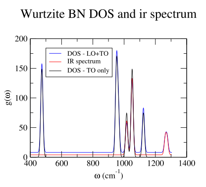
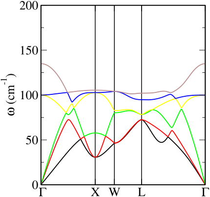

Additional tools and programs are available to help automate
post-processing analysis and plotting of the results of phonon
calculations.

Two programs `dispersion.pl` and `dos.pl` are supplied as part of the
CASTEP source distribution to analyse and plot the results. Both of them
read the phonon information from the `.castep` or `.phonon` files and
can generate plots of phonon dispersion curves across the Brillouin
Zone, and of phonon densities of states respectively [^17]. These
programs are written in the PERL language which is almost universally
available on modern operating systems. Generation of the plots is
handled by either of the
[xmgrace](http://plasma-gate.weizmann.ac.il/Grace/) or
[gnuplot](http://gnuplot.info/) graphics programs (the perl programs
generate an xmgrace script and invoke it automatically). [^18]

[^17]: `dispersion.pl` and `dos.pl` are also able perform very similar
    analysis and plotting of *electronic* eigenvalues from `.castep` or
    `.bands` files and generate band structure and electronic DOS plots.

[^18]: On linux systems xmgrace can usually be found as a contributed
    package and installed using the system package manager. Xmgrace is
    also available for Microsoft Windows systems as part of the “cygwin”
    suite of programs (<http://www.cygwin.com>) along with shells, the
    PERL interpreter and an X-windows server (Xmgrace is an X-windows
    program and requires a running X server to display).

### dos.pl {#sec:dos-pl}

The `dos.pl` program can read any of a `.castep`, a `.phonon`, or a
`.phonon_dos` file and generate a phonon density of states plot.
Arguments are given in “unix style” following a minus sign (dash). The
command

> `dos.pl -xg -w 10 <seedname>.phonon`

will generate a phonon density of states using a Gaussian broadening
with a FWHM of 10 cm$^{-1}$, and invoke `xmgrace` to generate the plot.
If a `.phonon` file is specified the DOS is constructed as a weighted
average over all q-points present in the file. Alternatively an
adaptively-weighted dos computed by CASTEP is read from a `.phonon_dos`
file if given as command-line argument.

The options `-np`, `-ps`, `-eps` change the default output and write an
xmgrace file, a PostScript or Encapsulated PostScript file respectively.
These files are written to standard output so use a shell redirect ($>$)
to name your plot file. The option `-ir` option weights the computed DOS
by the computed infra-red intensity in the `.castep` or `.phonon` file.
This simple algorithm is not a fully realistic model of an infrared
powder spectrum, and should be regarded as a simple approximation only.
[^19] Likewise the `-raman` option extracts Raman intensities and
computes the weighted spectrum. The computed spectrum does include the
frequency-dependent and Stokes thermal factors, and is therefore a more
realistic model spectrum than in the infrared case. The `-lorentz`
option switches from Gaussian to a Lorentzian broadening and the
`-temp T` option sets the temperature for the Stokes thermal population
term in Kelvin.

Figure [[bn-dos-ir]](Plotting-and-analysis-tools.md#fig:bn-dos-ir) shows an example derived from
the output produced by using `dos.pl` on the example run of
figure [[example-gamma-out]](Running-phonon-calculations.md#fig:example-gamma-out).



: **Figure 8** Example output from dos.pl based on the run of
figure [[example-gamma-out]](Running-phonon-calculations.md#fig:example-gamma-out). Infrared
spectrum and DOS curves based on just the TO modes or TO plus LO have
been combined into into one plot with a slightly shifted baseline,
scaled, and legends added.     
{#fig:bn-dos-ir}

[^19]: A more sophisticated model of infra-red spectra was introduced by
    Balan and Mauri (([Balan et al. 2001](Bibliography.md#ref-BalanSMC01); [Kendrick
    and Burnett 2016](Bibliography.md#ref-KendrickB16)) and subsequent works).
    Modelling of inelastic neutron spectra is discussed by Fair ([Fair
    et al. 2022](Bibliography.md#ref-FairJVJLRP22)), Ramirez-Cuesta ([Ramirez-Cuesta
    2004](Bibliography.md#ref-RamirezCuesta04); [Cheng and Ramirez-Cuesta
    2020](Bibliography.md#ref-ChengRC20))

### dispersion.pl {#sec:dispersion-pl}

The `dispersion.pl` program can read either a `.castep` or a `.phonon`
file and generate a dispersion curve plot using xmgrace. Unlike the
behaviour of `dos.pl` there is an important difference between the
behaviour when reading these two different output files concerning the
detection of branch crossings. A high-quality dispersion plot requires
that phonon branches are drawn as continuous lines even when two
branches cross in between the computed wavevectors. Dispersion.pl
contains an algorithm based on matching of eigenvectors at adjacent
points to determine branch connectivity. Only the `.phonon` file
contains eigenvector information, so only in this case is crossing
detection enabled. The algorithm can be time consuming and take several
minutes to complete in large cases, so patience is sometimes required.
The `-nj` option (“no-join”) disables the crossing detection even when
the input file is a `.phonon` one.

The options `-np`, `-ps`, `-eps` behave exactly as for `dos.pl`. One
useful output option is `-symmetry <symm>` which attempts to label the
high symmetry points using the conventional Brillouin zone notation of
Bradley and Cracknell. The symmetry keywords `cubic`, `fcc`, `bcc`,
`tetragonal`, `tetragonal`, `tetragonal-I`, `orthorhombic`, `hexagonal`,
`trigonal`, `trigonal-h` (and minor variants) are understood.

Figure [[rbbr-dispersion]](Plotting-and-analysis-tools.md#fig:rbbr-dispersion) demonstrates the
effect of the flags and the branch joining algorithm. The plots were
produced from a Fourier interpolation calculation of fcc RbBr using the
commands

> `dispersion.pl -xg -symmetry fcc RbBr.phonon`

and

> `dispersion.pl -xg -symmetry fcc -nj RbBr.phonon`

respectively.

|                         |                       |
|:-----------------------:|:---------------------:|
|  |  |

: **Figure 9** Phonon dispersion curve plots of RbBr generated using the
`dispersion.pl` script and xmgrace. The Brillouin zone labelling is
generated using the `-symmetry fcc` option. The left-hand plot was
generated using the default branch crossing detection algorithm, which
was disabled using the `-nj` option for the right-hand plot. The
algorithm has discriminated between modes which do cross and the four
genuine avoided crossings in the left-hand plot.     
{#fig:rbbr-dispersion}

### mode_follow

`mode_follow` is one of the Fortran tools suite in the CASTEP source,
which is compiled using the command `make tools`. As the name implies
its function is to generate new “frozen phonon” configurations based on
perturbation by a mode generated from a previous phonon calculation,
which it outputs by writing one or more new `.cell` files. In fact it
has two modes of operation.

1.  To generate a sequence of `.cell` files perturbed by the a frozen
    phonon at a range of amplitudes, which may be used to explore the
    energy profile along the mode it is invoked as

    > `mode follow -mode` *mode_num* `-namp` *num_amplitudes* `-amp`
    > *max_amplitude* `-qpoint` *qx qy qz*
    > $<$*seedname*$>$`|`$<$*seedname*$>$`.phonon`

    which reads the `.phonon` and corresponding `.cell` files and
    generates a sequence of $N+1$ files *seedname*`-`i`.cell` containing
    structures perturbed by the selected eigenvector scaled by a
    non-dimensional amplitude factor $f=A i/N, i=0 .. N$. The arguments
    are

    *mode_num*

    :   is the integer index number selecting which mode to use (default
        1)

    *qx qy qz*

    :   is the q-point to extract from the `.phonon` file (default
        (0,0,0))

    *max_amplitude*

    :   is $A$ the non-dimensional scale of the eigenvectors used to
        create the (largest) displacement

    *num_amplitudes*

    :   is $N$, one less than the number of configurations to generate
        (default 2).

    *seedname*

    :   is the seed name of a previous, successful phonon run.

    The file *seedname*`.phonon` must exist and be readable. If
    `mode_follow` is invoked without the `.phonon` extension, it will
    also attempt to read *seedname*`.cell` file if it exists and will
    copy most other cell parameters and settings to its output `.cell`
    files.

    As an alternative to specifying the arguments on the command line
    `mode_follow` will also attempt to read them from a file named
    *seedname*`.mode-param` if it exists. This file should contain a
    Fortran namelist named `freeze`, whose entries are the identical to
    the command-line argument names. For example

    > ```
    > &freeze
    > mode=4
    > num_amplitudes=5,
    > /
    > ```

    To produce a frozen phonon configuration for a nonzero
    ${\mathbf{q}}$-vector it is also necessary to generate a supercell
    which is commensurate with a frozen phonon at wavevector
    ${\mathbf{q}}$. This supercell may be specified in the `.cell` file
    using the usual `phonon_supercell_matrix` block, or by the entry
    `SUPERCELL` in namelist `freeze` in the `.mode-param` file. (There
    is no corresponding command line argument). For example a
    `.mode-param` file requesting a zone-boundary phonon might contain

    > ```
    > &freeze
    > mode=4
    > num_amplitudes=5,
    > qpoint=0,0.5,0
    > supercell=1,0,0,0,2,0,0,0,1
    > /
    > ```

2.  `Mode_follow`’s second mode of operation is to generate output files
    with the structure perturbed by a frozen phonon at the same
    amplitude but a progressive sequence of phases, which could be used
    for an animation of the mode. In that case the `num_amplitudes`
    argument should be omitted, and the alternative `nframes` argument
    given instead (either on the command line or in the `.mode-param`
    file). This will generate a sequence of $N$ frames with phases
    separated by $2 \pi/N$. Otherwise the arguments and behaviour are
    identical.

    One of the scripts in the `cteprouts` package, *e.g.* `cell2xtl`,
    `cell2pdb`, `cell2xyz` may be then be used to convert the `.cell`
    files to a form suitable for visualisation.

### phonons {#sec:phonons-tool}

The program `phonons`, one of the CASTEP tools suite is a general
purpose phonon post-processing tool. It can read all of the dynamical
matrix or force constant matrix data from a `.check` or `.castep_bin`
file generated in any phonon calculation and re-generate the final
phonon output with changes to one or several “finalisation” options,
without needing to repeat the expensive “electronic” DFPT or supercell
parts of a lattice dynamics calculation. For example, an acoustic
sum-rule correction may be applied to a calculation where this was not
chosen initially.

`phonons` is invoked exactly as is CASTEP and reads a `.cell` and a
`.param` file exactly as CASTEP does. These may be identical to or near
copies of the original calculation, but the `.param` file must contain
the `continuation` keyword which must point to the `.check` or
`.castep_bin` file which contains the dynamical matrix data. If the run
is successful it will write a log file with the extension `.phonon_out`
and a new `.phonon` file. In this respect a run of `phonons` on a
continuation deck is very similar to re-running `castep` on the same
deck. However it will not attempt to perform any “electronic”
calculation and will ignore any attempt to try. For example, if the
parameter `elec_energy_tol` was changed `castep` would discard the saved
dynamical matrix data and restart from the beginning. `phonons` will
ignore this and process the saved data as a continuation run.

This post-processing can be used for a number of tasks, including

- Turning on or off or modifying an acoustic sum-rule correction by
  changing the parameters keywords `phonon_sum_rule` or
  `phonon_sum_rule_method`.

- turning on or off the inclusion of LO/TO splitting terms by changing
  parameters keyword `phonon_calc_lo_to_splitting` or changing the set
  of directions for ${\mathbf{q}}\rightarrow 0$ by adding or changing
  cell `%block PHONON_GAMMA_DIRECTIONS`.

- adding or omitting the low-frequency ionic term in an E-field
  calculation by changing parameter `efield_calc_ion_permittivity`. Note
  that an attempt to turn this on will only succeed if there result of a
  $\Gamma$-point phonon calculation is already stored in the `.check`
  file. `phonons` will not attempt the electronic calculation necessary
  to compute this if it is not.

- changing the set of fine phonon k-points used as the target of a
  supercell or interpolation calculation by adding or changing
  `%block PHONON_FINE_KPOINT_LIST`, `%block PHONON_FINE_KPOINT_PATH`,
  `phonon_fine_kpoint_mp_grid` or similar in the `.cell` file. This
  permits the calculation of *both* a set of dispersion curves *and* a
  DOS from the same electronic run (DFPT/Interpolation or supercell).

- taking the result of a phonon calculation on a Monkhorst Pack grid of
  standard (not fine) phonon kpoints and performing Fourier
  interpolation as a post-processing step.

- switching interpolation methods between spherical and anisotropic
  schemes.

All of the above could also be performed using `castep` rather than
`phonons` provided care is taken not to change any parameters which
control the properties of the “electronic” part of the calculation.
However `phonons` can also perform some additional processing which
`castep` can not, most notably isotopically substituted lattice dynamics
calculations.

