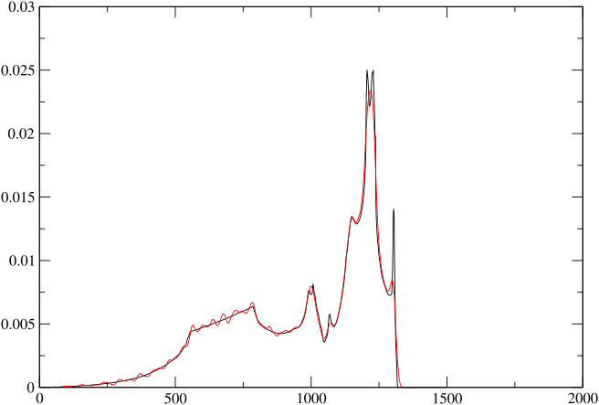

CASTEP contains implementations of several methods for computing the
electronic response orbitals and the dynamical matrix ([Refson, Tulip,
and Clark 2006](Bibliography.md#ref-Refson2006)). There are implementation restrictions
and the choice of the most suitable one depends on the type of
calculation, the Hamiltonian, and the property calculations required.
See table [[captable]](Running-phonon-calculations.md#tbl:captable) for details. For
straightforward semi-local DFT calculations (LDA, PBE etc.) the
*density-functional perturbation theory method* (DFPT) method is
preferred (section [[dfpt-gamma]](Running-phonon-calculations.md#sec:dfpt-gamma)), as this is
not only the most efficient, but also allows the calculation of infra
red and Raman intensities for modelling of spectra. DFPT is not yet
implemented for ultrasoft pseudopotentials, or for Hubbard U or some
dispersion-corrected DFT methods (as of release 24.1), and in these
cases the *finite displacement* method should be used
(section [[fd]](Running-phonon-calculations.md#sec:fd)). If a density of states or finely
sampled dispersion curve along high symmetry directions is needed, then
either the DFPT method with *Fourier interpolation*
(section [[ddos]](Running-phonon-calculations.md#sec:ddos)) is the most suitable or the
*finite-displacement supercell*
(section [[supercell]](Running-phonon-calculations.md#sec:supercell); if ultrasoft
pseudopotentials are required). A summary of the recommended approach
for various property calculations is given in
table [[method-selection]](Running-phonon-calculations.md#tbl:method-selection).

|                         | DFPT (Phonon) | DFPT (E-field) | FD (Phonon) |
|:------------------------|:-------------:|:--------------:|:-----------:|
| USP                     |       ✘       |       ✘        |      ✓      |
| NCP                     |       ✓       |       ✓        |      ✓      |
| LDA, GGA                |       ✓       |       ✓        |      ✓      |
| MGGA                    |       ✘       |       ✘        |      ✓      |
| DFT+U                   |       ✘       |       ✘        |      ✓      |
| NCM/SOC                 |       ✘       |       ✘        |      ✓      |
| PBE0, Hybrid XC         |       ✘       |       ✘        |      ✓      |
| DFT+D: TS, D2           |       ✓       |       ✓        |      ✓      |
| DFT+D: D3,D4, MBD\*,XDM |       ✘       |       ✓        |      ✓      |

: **Table 1:** CASTEP phonons implementation matrix. In general DFPT is avalable for
semilocal DFPT, but not other Hamiltonians. The combination of DFPT and
USPs is not implemented.  
{#tbl:captable}

| Target Property | Preferred method |
|:---|:---|
| IR spectrum | DFPT at q=0 with NCP potentials *(section. [[dfpt-gamma]](Running-phonon-calculations.md#sec:dfpt-gamma))* |
|  | FD at q=0 with NCP potentials and DFPT e-field *(section. [[fd]](Running-phonon-calculations.md#sec:fd))* |
|  | FD at q=0 with USP potentials and Berry Phase $Z^{*}$ *(section. [[berry-fd]](Running-phonon-calculations.md#sec:berry-fd))* |
| Raman spectrum | DFPT at q=0 with NCP potentials (2n+1 theorem) *(section. [[raman]](Running-phonon-calculations.md#sec:raman))* |
| Born Effective Charges ($Z^{*}$) | DFPT E-field using NCP potentials *(section. [[efield]](Dielectric-properties.md#sec:efield))* |
|  | FD at q=0 with USP potentials and Berry Phase $Z^{*}$  *(section. [[berry-fd]](Running-phonon-calculations.md#sec:berry-fd))* |
| Dielectric Permittivity ($\epsilon_\infty$) | DFPT E-field using NCP potentials *(section. [[efield]](Dielectric-properties.md#sec:efield))* |
| Nonlinear optical susceptibility ($\chi^{(2)}$) | DFPT E-field (2n+1 theorem) using NCP potentials *(section. [[nlo]](Dielectric-properties.md#sec:nlo))* |
| Phonon dispersion or DOS | DFPT plus interpolation with NCP potentials *(section. [[ddos]](Running-phonon-calculations.md#sec:ddos))* |
|  | FD plus interpolation using USP or NCP potentials *(section. [[ndsc]](Running-phonon-calculations.md#sec:ndsc))* |
|  | FD with supercell using USP or NCP potentials *(section. [[supercell]](Running-phonon-calculations.md#sec:supercell))* |
| Vibrational Thermodynamics | same as DOS *(section. [[thermodynamics]](Thermodynamic-properties.md#sec:thermodynamics))* |

: **Table 2:** Available and recommended methods for different property
calculations.  
{#tbl:method-selection}

### A DFPT phonon calculation at the $\Gamma$-point {#sec:dfpt-gamma}

Many of the principles of setting up and running phonon calculations can
be illustrated in the simplest case - computing phonon frequencies at
the $q=(0,0,0)$, often referred to as the $\Gamma$ point. This is a very
common calculation, as it forms the basis of modelling of infra-red or
Raman spectra and group theoretical analysis and assignment of the
modes.

#### Input files {#sec:input-basic}

The setup for a CASTEP phonon calculation requires a few additional
keywords in the *seedname*`.cell` file. Like any type of calculation,
the unit cell must be specified using either of `%block LATTICE_ABC` or
`%block LATTICE_CART`, and the atomic co-ordinates using
`%block POSITIONS_FRAC` or `%block POSITIONS_ABS`. Figure
[[example-gamma]](Running-phonon-calculations.md#fig:example-gamma) shows a complete input file
for a calculation on boron nitride in the hexagonal Wurtzite structure.
The additional keywords. `phonon_kpoint_list` is used to specify that a
single phonon wavevector (0,0,0) is to be computed[^4]. More wavevectors
could be specified using additional lines in this block.[^5]

[^4]: In general phonon wavevectors ${\mathbf{q}}$ are specified using
    one of the variants of the `phonon_kpoint_*` cell keywords for
    lists, grids or paths. The example given uses a list of length 1 to
    specify a single point.

[^5]: This example will use the DFPT method which is the default if
    `phonon_method` is not present.

```
%block LATTICE_ABC
   2.536000   2.536000     4.199000  ! a, b, c
  90.000000  90.000000   120.000000  ! alpha, beta, gamma
%endblock LATTICE_ABC

%block POSITIONS_FRAC
  B   2/3   1/3    0.000000  ! Atom co-ordinates in crystallographic
  N   2/3   1/3    0.374536  ! fractional system.
  B   1/3   2/3    0.500000
  N   1/3   2/3    0.874536
%endblock POSITIONS_FRAC

%block SPECIES_POT
B   B_00.recpot              ! File names of pseudopotential to use for B
N   N_00.recpot
%endblock SPECIES_POT

kpoints_mp_spacing 0.07      ! Generate MP grid of electronic k-points.
symmetry_generate            ! Find symmetry operations of crystal structure

%block PHONON_KPOINT_LIST
    0.0   0.0   0.0    1.0   ! Wavevector of phonon(s) to compute ( qx qy qz, weight)
%endblock PHONON_KPOINT_LIST

```

```
task             : PHONON    ! Choose a phonon calculation
xc_functional    : LDA
opt_strategy     : SPEED     ! Optimise for speed over memory saving
cut_off_energy   : 700.0 eV  ! Plane-wave cutoff for this system
elec_method      : DM        ! Use fast DM solver even for insulating system
phonon_sum_rule  : TRUE      ! Enforce acoustic sum rule on calculated D
```

: **Figure 1:** Annotated example cell and parameter files for BN in the Wurtzite
structure. Note that `phonon_method` defaults to `DFPT`.    
{#fig:example-gamma}

#### Reading the output {#sec:output-gamma}
Figure [[example-gamma-out]](Running-phonon-calculations.md#fig:example-gamma-out) shows part of
the phonon-relevant output extracted from the `.castep` file obtained by
running the input files of the previous section. There are several
blocks of output, one per direction chosen for
${\mathbf{q}}\rightarrow 0$ in the LO-TO splitting terms. Note that
CASTEP has added a calculation without LO-TO splitting (the first
block), even though this was not explicitly requested. Within each block
frequencies are listed one per line. Also on the line are (a) a label
indicating the irreducible representation of the mode from a group
theory analysis, (b) the computed absorptivity of the mode in a powder
(or otherwise orientationally averaged) infrared experiment, (c) whether
the mode is IR active, (d) the Raman activity (if computed) and (e)
whether the mode is Raman active.

```
 ==============================================================================
 +                           Vibrational Frequencies                          +
 +                           -----------------------                          +
 +                                                                            +
 + Performing frequency calculation at  1 wavevector  (q-pt )                 +
 + ========================================================================== +
 +                                                                            +
 + -------------------------------------------------------------------------- +
 +  q-pt=    1 (  0.000000  0.000000  0.000000)     1.0000000000              +
 + -------------------------------------------------------------------------- +
 +  Acoustic sum rule correction <   8.094974 cm-1 applied                    +
 +     N      Frequency irrep.    ir intensity active            raman active + 
 +                (cm-1)         ((D/A)**2/amu)                               + 
 +                                                                            +
 +     1      -0.049170   a          0.0000000  N                       N     + 
 +     2      -0.034768   b          0.0000000  N                       N     + 
 +     3      -0.034768   b          0.0000000  N                       N     + 
 +     4     475.116083   c          0.0000000  N                       Y     + 
 +     5     475.116083   c          0.0000000  N                       Y     + 
 +     6     952.000075   c          0.0000000  N                       Y     + 
 +     7     952.000075   c          0.0000000  N                       Y     + 
 +     8     963.032787   d          0.0000000  N                       N     + 
 +     9    1016.312039   a         28.5895083  Y                       Y     + 
 +    10    1051.124801   b         25.8079204  Y                       Y     + 
 +    11    1051.124801   b         25.8079204  Y                       Y     + 
 +    12    1123.472590   d          0.0000000  N                       N     + 
 + .......................................................................... +
 +        Character table from group theory analysis of eigenvectors          +
 +                           Point Group =  25, C6v                           +
 + .......................................................................... +
 +  Rep  Mul |    E   6   3   2 m_v m_v                                       +
 +           | ------------------------                                       +
 + a A1    2 |    1   1   1   1   1   1                                       +
 + b E1    2 |    2   1  -1  -2   0   0                                       +
 + c E2    2 |    2  -1  -1   2   0   0                                       +
 + d B1    2 |    1  -1   1  -1  -1   1                                       +
```

: **Figure 2** Output in the .castep file generated by the preceding input files for
wurtzite BN. The columns show the mode frequencies, a letter labelling
of the irreducible representation of the mode, the infrared absorptivity
and Raman activity, and whether or not the mode is Raman and/or IR
active. Not all of these are present in every calculation depending on
the use of symmetry and input options.    
{#fig:example-gamma}

```
 + -------------------------------------------------------------------------- +
 +  q-pt=    1 (  0.000000  0.000000  0.000000)     0.0000000000              +
 +  q->0 along (  0.000000  0.000000  1.000000)                               +
 + -------------------------------------------------------------------------- +
 +  Acoustic sum rule correction <   8.094974 cm-1 applied                    +
 +     N      Frequency irrep.    ir intensity active            raman active + 
 +                (cm-1)         ((D/A)**2/amu)                               + 
 +                                                                            +
 +     1      -0.037851   a          0.0000000  N                       N     + 
 +     2      -0.034768   b          0.0000000  N                       N     + 
 +     3      -0.034768   b          0.0000000  N                       N     + 
 +     4     475.116083   c          0.0000000  N                       Y     + 
 +     5     475.116083   c          0.0000000  N                       Y     + 
 +     6     952.000075   c          0.0000000  N                       Y     + 
 +     7     952.000075   c          0.0000000  N                       Y     + 
 +     8     963.032787   d          0.0000000  N                       N     + 
 +     9    1051.124801   b         25.8079204  Y                       Y     + 
 +    10    1051.124801   b         25.8079204  Y                       Y     + 
 +    11    1123.472590   d          0.0000000  N                       N     + 
 +    12    1262.933291   a         28.5895083  Y                       Y     + 
 + .......................................................................... +
 +        Character table from group theory analysis of eigenvectors          +
 +                           Point Group =  25, C6v                           +
 + (Due to LO/TO splitting this character table may not contain some symmetry +
 +  operations of the full crystallographic point group.  Additional          +
 +  representations may be also be present corresponding to split LO modes.   +
 +  A conventional analysis can be generated by specifying an additional null +
 +  (all zero) field direction or one along any unique crystallographic axis  +
 +  in %BLOCK PHONON_GAMMA_DIRECTIONS in <seedname>.cell.)                    +
 + .......................................................................... +
 +  Rep  Mul |    E   6   3   2 m_v m_v                                       +
 +           | ------------------------                                       +
 + a A1    2 |    1   1   1   1   1   1                                       +
 + b E1    2 |    2   1  -1  -2   0   0                                       +
 + c E2    2 |    2  -1  -1   2   0   0                                       +
 + d B1    2 |    1  -1   1  -1  -1   1                                       +
 ==============================================================================
```

 **Figure 2** Run output (continued): If the LO-TO-splitting calculation is active the
$\Gamma$ point frequency table is repeated, both without and including
the non-analytic contribution which generates the LO/TO splitting in one
or more directions (See Gonze and Lee ([Gonze and Lee
1997](Bibliography.md#ref-GonzeL97))). (The group theory analysis for LO modes is less
useful than might be wanted and is likely to be the subject of future
developments.)     
{#fig:example-gamma-out}

As with other calculations the amount of information written to the
`.castep` file is controlled by the value of the parameter `iprint`. The
levels of output are

`iprint : 0`

:   Minimal output as in
    figure [[example-gamma-out]](Running-phonon-calculations.md#fig:example-gamma-out). No
    progress info.

`iprint : 1`

:   As for `iprint : 0` but including a reassuring progress report of
    q-points and perturbations.

`iprint : 2`

:   More detailed output including details of k-points and symmetry for
    each perturbation, cycle-by cycle DFPT minimiser report, printing of
    dynamical matrices (and force constant matrices).

In addition to the user-readable output in the `.castep` file[^6], every
phonon calculation generates an additional output file with the suffix
`.phonon` which is intended for postprocessing analysis by other
programs. This includes not only the frequencies but also the
eigenvectors ${\mathbf{\varepsilon}_{m{\kappa,\alpha}{\mathbf{q}}}}$
resulting from diagonalising the dynamical matrix. These eigenvectors
are orthonormal and the relationship between the eigenvectors and atomic
displacements is given by

$$u_{\kappa,\alpha,a} = \frac{1}{\sqrt{M_{\kappa}}} Q_{m} {\mathbf{\varepsilon}_{m{\kappa,\alpha}{\mathbf{q}}}}\exp(i ({\mathbf{q}}\cdot {\mathbf{R}}_{\kappa,\alpha}(a) - \omega_m t))$$

where $Q_M$ is the amplitude of mode $m$ and the other notation is as
set out in the introduction.

[^6]: Further optional output writing to `.castep` of the dynamical
    matrixes and force constant matrices is enabled at any iprint level
    by the parameters `phonon_write_dynamical` and
    `phonon_write_force_constants` respectively.

#### Raman activity calculations {#sec:raman}

In addition to the infrared absorptivity computed as a default part of a
$\Gamma$-point phonon calculation, CASTEP is also capable of computing
the Raman activity tensors in the case of non-resonant scattering for an
insulating system[^7]. This calculation uses an extension of DFPT known
as the “2n+1 theorem” ([Baroni et al. 2001](Bibliography.md#ref-BaroniDDG01); [Miwa
2011](Bibliography.md#ref-Miwa2011)) which requires substantially more computational
effort than a bare phonon calculation and is therefore not enabled by
default. To compute Raman activity set

> `calculate_raman : TRUE`

in the `.param` file, which calculates and prints the Raman atomic
susceptibility tensors and the mode susceptibility tensors to the
`.castep` file. These may be extracted for use when modelling the Raman
scattering in a polarised single-crystal geometry.[^8]

As with the Born effective charges and dynamical matrices, there is a
sum rule on the values of the atomic polar tensors, which may not be
well satisfied because of numerical approximations. A correction will be
applied if parameter

> `raman_sum_rule : TRUE`

is set.

A 3d-average Raman activity (see Porezag and Pedersen ([Porezag and
Pederson 1996](Bibliography.md#ref-PorezagP:96))) is computed from the susceptibility
tensors and printed as an additional column in the usual frequency
output given in
figure [[example-gamma-out]](Running-phonon-calculations.md#fig:example-gamma-out). This may be
used for simple modelling of a powder spectrum, for example using the
dos.pl tool (see section [[dos-pl]](Plotting-and-analysis-tools.md#sec:dos-pl)).

[^7]: The Placzek theory applies to the case of insulators only, and no
    general formulation to compute the activity for Raman scattering of
    conducting systems is available

[^8]: If the parameter `raman_method : FINITEDISPLACEMENT` is set the
    calculation uses an older, finite-difference implementation (see
    section [[fd]](Running-phonon-calculations.md#sec:fd)) to compute the mode displacement
    derivatives of the polarizability tensor
    (section [[efield]](Dielectric-properties.md#sec:efield)) using the approach of
    Porezag and Pedersen ([Porezag and Pederson
    1996](Bibliography.md#ref-PorezagP:96)). The first stage is to perform a full
    phonon calculation at ${\mathbf{q}}=0$, to determine the mode
    eigenvectors and identify the Raman-active modes. Then CASTEP loops
    over the active modes only computing the Raman tensor, activity and
    depolarization for each. This method is deprecated as obsolete and
    computationally expensive.

### Dispersion and density of states {#sec:ddos}

Phonons of a nonzero wavevector play an important role in the
thermophysical properties of crystalline solids and the physics of many
solid-state phase transitions. Proving the mechanical stability of a
crystal structure by testing for real frequencies requires a vibrational
calculation over the full Brillouin Zone. And dispersion curves and
densities of states are frequently required for comparison with
inelastic neutron and X-ray scattering experiments.

One of the benefits of density functional perturbation theory is that
CASTEP can calculate vibrational modes at ${\mathbf{q}}\ne \mathbf{0}$
as easily as at ${\mathbf{q}}= \mathbf{0}$ (but at the cost of an
increase in CPU time due to the decreased symmetry). It is possible to
perform this calculation simply by providing a list of q-points in the
`.cell` file ( using one of the blocks `%block PHONON_KPOINT_LIST`, or
`%block PHONON_KPOINT_PATH` or keyword `phonon_kpoint_mp_grid`). However
to generate a reasonable quality dispersion plot or density of states
will usually require hundreds or thousands of q-points. The time
required by such a calculation would be several hundred times that for a
single-point energy and therefore infeasibly large.

Fortunately there is a way to achieve the same result at a far smaller
computational cost. This method exploits the fact that the interatomic
interactions in a solid have a finite range and decay rapidly to zero.
Specifically, the elements of the force constant matrix in
Eq. [[fcmat]](Introduction.md#eq:fcmat) decrease as $1 / r^{5}$ with interatomic
distance. Consequently the dynamical matrix defined by
Eq. [[dmat]](Introduction.md#eq:dmat) and its eigenvalues
$\omega^{2}({\mathbf{q}})$ are smoothly varying with wavevector
${\mathbf{q}}$. Fourier interpolation is used to generate dynamical
matrices on an arbitrarily fine grid or linear path in reciprocal space
from a set of DFPT calculations on a much coarser grid. For a full
description of the method see references ([Baroni et al.
2001](Bibliography.md#ref-BaroniDDG01); [Giannozzi et al. 1991](#ref-GianozziGPB91);
[Gonze and Lee 1997](Bibliography.md#ref-GonzeL97)).

A complication arises in the case of polar solids where the
dipole-dipole interaction generated upon displacing an atom leads to a
longer ranged force constant matrix which decays only as $1 / r^{3}$.
CASTEP models this term analytically using Born effective charges and
dielectric permittivity calculated using an electric field response DFPT
calculation (see section [[efield]](Dielectric-properties.md#sec:efield) and Ref. ([Gonze
and Lee 1997](Bibliography.md#ref-GonzeL97))). It is therefore able to perform the
Fourier interpolation for only the part of the force constant matrix
which varies as $1 / r^{5}$, and does not require a finer grid than in
the case of non-polar solids.

#### Setting up an interpolation calculation {#sec:interpolation-setup}

In the `.cell` file choose the q-points of the coarse grid of points at
which to perform DFPT calculations. This may be specified as a
`%block PHONON_KPOINT_LIST` containing the reduced set of points in the
irreducible Brillouin Zone, but is is almost always more straightforward
to use the alternative keywords

> `phonon_kpoint_mp_grid` : *p q r*  
> `phonon_kpoint_mp_offset` : `INCLUDE_GAMMA`

to specify the grid parameters and offset[^9]. The grid parameters *p*,
*q* and *r* should normally be chosen to give a roughly uniform sampling
of reciprocal space taking length of the reciprocal lattice vectors into
account, and should be compatible with the symmetry of the simulation
cell. Alternatively a grid may be specified using the minimum spacing,
for example

> `phonon_kpoint_mp_grid_spacing 0.1 1/ang`

Normally the grid should be chosen to contain the $\Gamma$ point, which
usually gives better convergence properties of the interpolation
(*i.e.*convergence at smaller *p,q,r*) than otherwise. This is the
opposite behaviour to electronic k-point sampling (see Ref. ([Probert
and Payne 2003](Bibliography.md#ref-ProbertP03))). The special keyword value
`phonon_kpoint_mp_offset : INCLUDE_GAMMA` avoids the need to work out
the offset explicitly.

The choice of grid parameters *p*, *q* and *r* is governed by three
considerations:

- For a 3-dimensional crystal, *p,q,r* *should obey the crystallographic
  symmetry*, so for a cubic or rhombohedral crystal you should set
  $p = q = r$. In the case of a uniaxial crystal, such as tetragonal or
  hexagonal we have $p = q \neq r$ (assuming that $c$ is the unique
  axis) and for lower symmetry there is no constraint.

- The value in any of the directions limits the *range of the force
  constant matrix* in much the same way as the supercell multiplier does
  in a finite-difference/supercell calculation
  (Section [[supercell]](Running-phonon-calculations.md#sec:supercell)). Exactly how large this
  should be depends on the nature of the chemical bonding. Ionically
  bonded systems tend to have fairly short-ranged force-constant
  matrices and need relatively coarse grids for convergence. For sodium
  chloride in the rocksalt structure with a primitive lattice parameter
  3.75Å a $4 \times 4 \times 4$ grid is reasonably close to convergence.
  This corresponds to a truncation of the force constant matrix at a
  distance of approximately $7$Å ($\approx p \times 2 \pi / a$). On the
  other hand covalent systems tend to have fairly long-ranged
  force-constant matrices and need finer grids for convergence. Silicon
  is a good example of this. The primitive lattice parameter is similar
  to sodium chloride at $3.81$Å, but the dispersion curve is not fully
  converged until an $8 \times 8 \times 8$ grid is used. A more detailed
  examination of this point may be found in reference ([Ackland, Warren,
  and Clark 1997](Bibliography.md#ref-AcklandWC97)).

- While there is no essential physics relationship between the grid
  sizes for phonon ${\mathbf{q}}$-points and that required for
  electronic ${\mathbf{k}}$-point sampling [^10], there is a technical
  connection resulting from the implementation of density-functional
  perturbation theory and the requirement to generate and use
  ground-state Kohn-Sham wavefunctions on grids containing both
  $\{{\mathbf{k}}\}$ and $\{{\mathbf{k}}+ {\mathbf{q}}\}$ (See
  ref. ([Gonze 1997](Bibliography.md#ref-Gonze97)) for the mathematical details). For
  best performance and stability of the DFPT calculation the *phonon*
  grid parameters should be *commensurate* with the *electronic* grid
  with an exact divisor as the simplest case. For example, in an
  elemental metal with an hcp structure such as Mg, an electronic
  ${\mathbf{k}}$-point sampling of $21 \times 21 \times 12$ and a phonon
  ${\mathbf{q}}$-point sampling of $7 \times 7 \times 6$ might be most
  effective. This is not a hard requirement and CASTEP will attempt to
  work with whatever grids are specified, but in some cases there may be
  a performance advantage to rounding up one or other of the grids to
  meet the commensurability criterion.

Additional keywords in the `.param` file control the interpolation. Most
importantly

> `phonon_fine_method : INTERPOLATE`

instructs CASTEP to perform the Fourier interpolation step following the
usual DFPT calculation.

The target set of wavevectors for the interpolation is set up using
additional keywords or blocks in the *.cell* file. Either

> `phonon_fine_kpoint_mp_grid` *p q r*  
> `phonon_fine_kpoint_mp_offset` *o$_1$ o$_2$ o$_3$*

or

> `phonon_fine_kpoint_mp_spacing 0.03 1/ang` .

will perform interpolation onto a regular (possibly offset) grid. In
fact only the points in the irreducible wedge of the Brillouin Zone are
included, and a suitable weight is computed so that the weighted average
is identical to a uniform sampling of the BZ. This is the usual method
for computing a phonon density of states.

If a set of dispersion curves along high symmetry directions is
required, an empty cell keyword block

> `%block PHONON_FINE_KPOINT_PATH`  
> `%endblock PHONON_FINE_KPOINT_PATH`

will internally generate a list of ${\mathbf{q}}$-points sampling a
default path through the Brillouin-Zone according to the symmetry of the
calculation. Alternatively a list of ${\mathbf{q}}$-points explicitly
specifying the vertices of the path may be input as

> ```
> %block PHONON_FINE_KPOINT_PATH
> 0.0 0.0 0.0
> 0.5 0.5 0.0
> 0.5 0.5 0.5
> break
> 0.0 0.0 0.0
> 0.5 0.5 0.5
> ...
> %endblock PHONON_FINE_KPOINT_PATH
> ```

which traverses the directions between the vertices specified, except in
the presence of the `break` keyword where the path jumps without
including any intermediate points. The fineness of sampling along the
path is set by an additional keyword

> `phonon_fine_kpoint_path_spacing : 0.03 1/ang` .

As a final alternative, a simple list of points can be directly input to
model any sampling you choose using

> ```
> %block PHONON_FINE_KPOINT_LIST
> 0.0 0.0 0.0
> 0.1 0.2 0.3
> ...
> %endblock PHONON_FINE_KPOINT_LIST
> ```

This is the approach used for files generated by Accelrys Materials
Studio.

The same keywords are used in the closely related method of a finite
difference calculation; see the example `.cell` file of
figure [[al-sc-cell]](Running-phonon-calculations.md#fig:al-sc-cell).

[^9]: The offset may be specified as three fractions of the grid
    spacing, so $1/2p \; 1/2q \; 1/2r$ shifts the grid exactly half a
    subdivision in each of the three directions. As of release 24.1 the
    `INCLUDE_GAMMA` keyword will automate this calculation and in fact
    is the default so that omitting `phonon_kpoint_mp_offset` entirely
    will do the right thing.

[^10]: The latter is governed by the effective range of electronic
    interactions which bears no relationship to the elastic range of the
    atomic displacements as required for the force constants.

#### Continuation {#sec:continuation}

CASTEP stores the results of all phonon calculations - dynamical
matrices and force constant matrices - in the binary *seedname*`.check`
file written at the end of a successful run. This can be used to change
some values of parameters relating to interpolation, and to change or
indeed replace the entire fine phonon k-point set *without* any need to
repeat the expensive DFPT (or supercell) part of the calculation. In
fact a single calculation of the force constant matrix is sufficient to
compute a DOS at a variety of sampling densities plus arbitrarily smooth
dispersion curves.

Setting up a continuation calculation is simple. Just add the
continuation keyword in the usual way to a renamed copy of the param
file

> `continuation` *orig-seedname*`.check`

and make any changes to the fine phonon k-point sampling parameters in a
copy of the *seedname*`.cell` file. It is recommended that you work with
renamed copies to avoid overwriting the original and valuable
*seedname*`.check` file. Running CASTEP on the new set of input files is
exactly the same as running a new calculation, except that the result
will be generated much more quickly.

When setting up a continuation run, take care not to change the standard
phonon k-point set, the electronic k-point set or any electronic
structure parameters such as `elec_energy_tol`. If a mismatch is
detected with the values stored in the checkpoint file, CASTEP will
discard the saved dynamical matrix data and restart the full calculation
from the beginning.

Continuation calculations are also used in conjunction with
*checkpointing* where a partially complete calculation is written to a
file, also in `.check` format and which may be used to restart an
interrupted calculation. See
section [[checkpointing]](Running-Large-Calculations.md#sec:checkpointing) for a description.

#### Control of interpolation scheme {#sec:interpolation-control}

The final representation of the force constant matrix derived from the
dynamical matrices is actually a periodic representation and is
equivalent to the ${\mathbf{q}}=0$ dynamical matrix of a (fictitious)
$p \times q \times r$ supercell. (See
section [[supercell]](Running-phonon-calculations.md#sec:supercell) for more explanation.)
CASTEP must determine a mapping between elements of the periodic
dynamical matrix and aperiodic force constant matrix using a
minimum-image convention for ionic site pairs and impose a cutoff scheme
in real space to exclude (supercell-) periodic images. In fact CASTEP
implements two distinct schemes.

The cumulant scheme  ([Parlinski, Li, and Kawazoe
1997](Bibliography.md#ref-ParlinskiLK97)) includes all image force constants with a
suitable weighting to avoid multiple counting of images. This is
achieved by including image force constants in any direction if they lie
within half the distance to the nearest periodic repeat of the
fictitious supercell lattice in that direction. If an atom-atom pair
vector lies *exactly* half way to the supercell repeat so that image
force constants occur, for example, at both $\mathbf{L}$ and
$-\mathbf{L}$, all images at the same distance are included with a
suitable weighting factor to preserve the symmetry of the cumulant force
constant matrix. (See Refs. ([Parlinski, Li, and Kawazoe
1997](Bibliography.md#ref-ParlinskiLK97)) and ([Ye et al. 2004](#ref-YeLWH04)) for a
more detailed explanation). This scheme is selected by specifying the
param file keyword

> `phonon_fine_cutoff_method CUMULANT`

and is in fact the default method in CASTEP.

CASTEP also implements a simple spherical cutoff, controlled by the
parameter $R_c$ and specified by parameter

> `phonon_force_constant_cutoff 10.0 ang`

The value $R_c$ should be chosen to satisfy
$2 R_c < min(p L_1,q L_2,r L_3) L$ where $L_n$ is the cell edge of the
simulation cell and $p,q,r$ are the (coarse) grid of phonon wavevectors.
It is usually easiest to specify a value of zero, in which case CASTEP
chooses the largest allowable value automatically. This scheme is most
suitable for bulk materials of cubic symmetry. The spherical scheme is
chosen using keyword

> `phonon_fine_cutoff_method SPHERICAL` .

Within the default method a smaller cutoff volume can be decreased by a
radius scaling factor, *e.g.*

> `phonon_force_constant_cut_scale : 1.0` .

This may be useful for testing the effect of long-ranged contributions
to the IFC matrix. However any departure of this parameter’s value from
1 does not preserve the superior convergence properties of the cumulant
scheme and will in general require a larger supercell than the exact
cumulant method.

#### Acoustic Sum Rule correction {#sec:asr}

The vibrational Hamiltonian is invariant to a uniform translation of the
system in space. This symmetry is the origin of the well-known result
that any crystal has three acoustic vibrational modes at
${\mathbf{q}}=0$ with a frequency of zero. This leads to the so-called
*acoustic sum rule* (or ASR) ([Ackland, Warren, and Clark
1997](Bibliography.md#ref-AcklandWC97); [Pick, Cohen, and Martin 1970](#ref-Pick1970))
which has mathematical expressions for the force constant and
$\Gamma$-point dynamical matrices     
{#eq:asr}

$$\begin{aligned}
 \sum_{\kappa,a} {\Phi^{\kappa,\kappa^\prime}_{\alpha,\alpha^\prime}(a)}&= 0\\
 \sum_{\kappa} {D^{\kappa,\kappa^\prime}_{\alpha,\alpha^\prime}(\mathbf{q}=0)}&= 0 
\end{aligned}$$

In plane-wave calculations the translational invariance is broken as
atoms translate with respect to the fixed FFT grid, so the sum rule is
never exactly satisfied. Consequently it is sometimes observed even in
an otherwise apparently very well converged calculation that the three
acoustic modes at $\Gamma$ depart significantly from zero frequency.
Depending on the XC functional[^11] these frequencies may reach or
exceed 50 cm$^{\text{-1}}$. One solution is simply to increase number of
grid points of CASTEP’s “fine” FFT grid used for densities and
potentials by increasing `fine_grid_scale`[^12]. (N. B. This is distinct
from `grid_scale` which controls the FFT grid used to represent
wavefunctions.) However this can be very costly in computer time and
memory.

Provided that the amplitude of the symmetry violation is not too large,
it is possible to apply a transformation to the computed dynamical or
force constant matrix so that it exactly satisfies the ASR. CASTEP
implements a scheme which projects out the acoustic mode eigenvectors
and adjusts their frequency to zero, while having minimal impact on the
optic mode frequencies. This scheme is controlled by parameters (in the
`.param` file)

> `phonon_sum_rule_method : REAL / RECIP / REAL-RECIP / NONE`

The first of these simply activates or deactivates the correction. The
second chooses which of the variants of the ASR in
equation [[asr]](Running-phonon-calculations.md#eq:asr) to enforce, the real-space force constant
matrix, the reciprocal-space dynamical matrix, or both.
(`phonon_sum_rule_method : NONE` is a synonym for
`phonon_sum_rule : FALSE`). The real-space method is only applicable to
interpolation or supercell/finite displacement calculations, but the
reciprocal-space method can be used for any type of phonon calculation.

Both variants change the acoustic mode frequencies away from but near
${\mathbf{q}}=0$, the realspace method implicitly, and the reciprocal
space method explicitly, by determining the correction to
${D^{\kappa,\kappa^\prime}_{\alpha,\alpha^\prime}(\mathbf{q}=0)}$ and
subtracting it from
${D^{\kappa,\kappa^\prime}_{\alpha,\alpha^\prime}(\mathbf{q})}$ as
suggested by Gonze ([Gonze and Lee 1997](Bibliography.md#ref-GonzeL97)). This usually
results in acoustic mode behaviour which is indistinguishable from a
very well converged calculation using a very fine FFT grid[^13].

In addition to the sum rule on frequencies there is another for the Born
effective charges (see section [[efield]](Dielectric-properties.md#sec:efield))

$$\sum_{\kappa} {Z^{*}_{\kappa,\beta,\alpha} }= 0$$

which is activated by parameter

> `born_charge_sum_rule : TRUE`

The default behaviour of CASTEP is that neither sum rule is enforced. If
this was not requested in the original run, then it may be added in
post-processing fashion in a continuation run, as per
section [[continuation]](Running-phonon-calculations.md#sec:continuation). Only the raw
dynamical and/or force constant matrices are stored in the checkpoint
file *without* the effect of ASR enforcement, which is only applied at
the printout stage. Therefore the effect can be turned off, or altered
by a post-processing calculation as well as turned on.

[^11]: The effect is usually small for LDA, intermediate for PBE and
    largest for PW91, as the gradient terms are most sensitive to the
    ASR violation.

[^12]: (or `fine_gmax` or `fine_cut_off_energy`

[^13]: There is one known case where the reciprocal-space ASR correction
    fails to give the correct behaviour. Two-dimensional planar or
    layered systems with weak inter-layer bonding such as graphene or
    graphite exhibit a quadratic behaviour of an acoustic mode near
    $\Gamma$. The reciprocal space scheme fails to reproduce the
    correct, quadratic behaviour and linearises the dispersion. The
    realspace method generates correct behaviour in these cases.

#### Density of States

The definition of the phonon density of states requires an integration
of the calculated frequencies $\omega_{i{\mathbf{q}}}$ over the
Brillouin-Zone     
{#eq:dos}

$$g(\omega) = \int_{\text{BZ}}d^3{\mathbf{q}}\sum_i \delta(\omega -
\omega_{i{\mathbf{q}}})  .$$

A simple computational approximation would be to compute
$\omega_{i{\mathbf{q}}}$ on a regular, discrete grid of ${\mathbf{q}}$,
replace the integral with a sum over the grid and convolute the result
with some peak shape function $h(\omega)$ such as a Gaussian     
{#eq:broadendos}

$$g(\omega) \approx \int d\omega^{\prime} h(\omega - \omega^{\prime}) \sum_{{\mathbf{q}}} \sum_i \delta(\omega^{\prime} -
\omega_{i{\mathbf{q}}})  .$$

In the CASTEP toolset, this is implemented by performing a Fourier
interpolation calculation onto a suitably fine ${\mathbf{q}}$-point set,
specifying either `phonon_fine_kpoint_mp_grid` or
`phonon_fine_kpoint_mp_spacing`. The resulting `.phonon` file may then
be analysed using the `dos.pl` tool (see
section [[dos-pl]](Plotting-and-analysis-tools.md#sec:dos-pl)) which implements
equation [[broadendos]](Running-phonon-calculations.md#eq:broadendos).

However the broadening smooths out any sharp features of the DOS, and
fails to reproduce the smoothly-curved or sharply peaked segments
typical of theoretical densities-of-states. This is discussed in more
detail in references ([Yates et al. 2007](Bibliography.md#ref-YatesWVS07)) and
 ([Pickard 1997](Bibliography.md#ref-Pickard97)). A more faithful rendering may be
obtained using the so-called *adaptive broadening* approach of Yates et.
al ([Yates et al. 2007](Bibliography.md#ref-YatesWVS07)) which uses the *gradients* of
the phonon branch dispersion to narrow or widen the broadening for flat
or steep branches respectively. It is activated by the parameters
keyword

> `phonon_calculate_dos : TRUE`

which computes an adaptively-broadened DOS during the Fourier
interpolation stage of the calculation and writes an output file named
`<seedname>.phonon_dos` containing the tabulated DOS, plus the
per-atomic-species resolved DOS in additional columns. The `dos.pl`
script is able to read and present `.phonon_dos` files just as with
`.phonon`.

The range and resolution may be modified using additional parameters,
for example

> `phonon_dos_spacing : 0.01 THz`  
> `phonon_dos_limit : 10.0 THz`

Example output for the phonons of diamond is shown in
figure [[c2-pdos]](Running-phonon-calculations.md#fig:c2-pdos).



: **Figure 3** Phonon DOS for Diamond, with an $18^3$ fine grid comparing Gaussian
broadened (red) vs adaptively broadened (black) methods. Artefactual
wiggles are clearly visible in the Gaussian-broadened case, and the
height of the sharp peaks is not well reproduced.     
{#fig:c2-pdos}

### Finite Displacement {#sec:fd}

In addition to the DFPT method of computing force constants, CASTEP
implements schemes based on numerical differentiation of forces when
atoms are displaced by a small amount from their equilibrium positions.
This method is useful for cases where DFPT has not been implemented,
which as of CASTEP release 24.1 includes ultrasoft pseudopotentials,
Hubbard U and exact exchange and hybrid functionals, and some of the
newer classes of dispersion correction.

There are three variants of this scheme.

#### Primitive Cell Finite Displacement

The basic finite displacement method is selected by setting parameter

> `phonon_method : FINITEDISPLACEMENT`

In contrast to DFPT such displacements are necessarily periodic with the
simulation cell, and therefore only ${\mathbf{q}}=0$ phonons are
commensurate with this condition. As in the case of DFPT lattice
dynamics the phonon wavevectors are specified by
`%block PHONON_KPOINT_LIST`, `%block PHONON_KPOINT_PATH` or
`phonon_kpoint_mp_grid` in the `.cell` file but only the $\Gamma$ point,
$(0,0,0)$ is meaningful. CASTEP will print a warning in the output file
and ignore any non-zero value in the list.

CASTEP proceeds by shifting each atom by a small amount, then performing
a SCF calculation to evaluate the forces on the perturbed configuration.
Both positive and negative displacements are performed in each direction
so that the corresponding force constants can be evaluated using the
accurate “central difference” method of numerical differentiation.     
{#eq:finite-diff}

$$\frac{d^{2} E_{0}}{d u_{\kappa,\alpha}
        d u_{\kappa^{\prime},\alpha^{\prime}}} = \frac{d F_{\kappa,\alpha}}{d u} \approx \frac{F^{+}_{\kappa,\alpha} - F^{-}_{\kappa,\alpha}}{2 u} \;.$$

Equation [[finite-diff]](Running-phonon-calculations.md#eq:finite-diff) demonstrates that a
single pair of displaced calculation yields an entire row of the
dynamical matrix. As with DFPT calculations, only the minimal set of
perturbations is performed and the space-group symmetry is used to build
the complete dynamical matrix.

The SCF calculations on the perturbed configuration are efficient,
typically taking only only a few cycles in CASTEP 5.0 or later. This
efficiency is achieved by first making a good guess for the electron
density of the perturbed system based on the ground state of the
unperturbed system, and applying a displacement of an atomic-like
density of the pseudo-atom in question. Second, the SCF is started using
the Kohn-Sham orbitals of the unperturbed state as the initial guess for
the perturbed configuration. To exploit this efficiency it is essential
to use the density-mixing (Davidson) minimiser, selected by
`elec_method : DM` in the `.param` file. (As the all-bands method has no
means of initialising the density).

The default displacement used is $0.01$ bohr This can be changed if
necessary by setting a parameter,

> `phonon_finite_disp : 0.02 ang`

in the `.param` file. Except for the differences discussed above, input
and output formats are the same as for DFPT calculations.

#### Born Charges, Permittivity and LO/TO splitting with FD

FD phonon calculations are useful where atomic-displacement response
DFPT is not implemented, notably for ultrasoft pseudopotentials (USPs)
and post-DFT exchange and correlation including LDA+U, SOC, hybrid
functionals (see table [[captable]](Running-phonon-calculations.md#tbl:captable)). However
properties including IR spectral intensity, LO/TO splitting and the
effectiveness of Fourier interpolation of dynamical matrices depend on
the Born effective charges and dielectric permittivity (see
section [[efield]](Dielectric-properties.md#sec:efield)), whose calculation by electric
field response DFPT is not implemented.

In some cases it may be convenient to read in externally computed or
approximate values of Born charges and permittivity to be used to
calculate IR spectra, LO/TO splitting etc. For example, a DFT+U,
meta-GGA, or hybrid calculation might make use of values calculated
using PBE-DFPT and NCPs as a fair approximation, or even computed using
a different DFT code.

This may be accomplished by specifying the name of an external file
containing the values (in this case `BORN.DAT`) in the `.param` file

> ```
> %block DEVEL_CODE
> PHONON:READ_EXTERNAL_BORN=BORN.DAT:ENDPHONON
> %endblock DEVEL_CODE
> ```

The file should be formatted as for the Phonopy code
(<https://phonopy.github.io/phonopy/input-files.html#born-optional>). A
file of this format may be written at the end of a DFT, NCP E-field
response calculation by

> ```
> %block DEVEL_CODE
> PHONON:WRITE_EXTERNAL_BORN=BORN.DAT:ENDPHONON
> %endblock DEVEL_CODE
> ```

##### Born charges from Berry Phase Polarization {#sec:berry-fd}

As of CASTEP release 25.1, it will be possible to calculate Born
effective charges (but not dielectric permittivity) using a
finite-difference numerical differentiation of the Berry-phase
polarization. This is performed as an adjunct to the FD phonon
calculation, and will be automatically selected in the case of an FD
phonon calculation with USPs. This works for any compatible Hamiltonian,
including DFT+U, mGGAs such as rSCAN as well as hybrid XC functionals.

#### Finite Displacement using non-diagonal supercells {#sec:ndsc}

As with the DFPT method, calculation of phonon dispersion and DOS using
the finite displacement method is achieved using Fourier interpolation
of dynamical matrixes. First, an approximation of the full
force-constant-matrix
${\Phi^{\kappa,\kappa^\prime}_{\alpha,\alpha^\prime}}$ is calculated by
explicitly computing a set of
${D^{\kappa,\kappa^\prime}_{\alpha,\alpha^\prime}(\mathbf{q})}$ with
${\mathbf{q}}$ sampling a coarse grid of ${\mathbf{q}}$ and using the
inverse Fourier relation to equation [[dmat]](Introduction.md#eq:dmat). Then
equation [[dmat]](Introduction.md#eq:dmat) is used to generate the dynamical
matrices at all of the (fine) phonon wavevectors required.

The key step of computing every
${D^{\kappa,\kappa^\prime}_{\alpha,\alpha^\prime}(\mathbf{q})}$ on the
“coarse” regular grid is achieved by constructing a list of supercells
commensurate with each of the coarse ${\mathbf{q}}$-points in turn (so
that ${\mathbf{q}}\cdot T_{\text{SC}} = 2 n \pi$ where $T_{\text{SC}}$
is a lattice vector of that supercell). This ${\mathbf{q}}$ maps to a
$\Gamma$ point calculation on the corresponding supercell despite being
incommensurate with the primitive cell, and
${D^{\kappa,\kappa^\prime}_{\alpha,\alpha^\prime}(\mathbf{q})}$ for the
primitive cell at ${\mathbf{q}}$ may be extracted using
equation [[dmat]](Introduction.md#eq:dmat). It was shown by Lloyd-Williams and
Monserrat ([Lloyd-Williams and Monserrat 2015](Bibliography.md#ref-LWM15)) that by
using so-called non-diagonal supercells such a set need contain only the
least common multiple of the coarse grid subdivisions ($p, q, r$).
Consequently the number of distinct supercell calculations requires is
much smaller than the number of ${\mathbf{q}}$-vectors of the grid, and
most importantly increases with the linear dimension of the grid instead
of the product.

A non-diagonal supercell calculation is selected by setting the
parameters

> `phonon_method : FINITEDISPLACEMENT`  
> `phonon_fine_method : INTERPOLATE`,

the cell keywords

> `phonon_kpoint_mp_grid : p q r`

and one of the specifications of `phonon_fine_kpoints` exactly as in the
case of a DFPT calculation. When the phonon calculation begins, CASTEP
generates a list of supercells using the algorithm of Lloyd-Williams and
Monserrat ([Lloyd-Williams and Monserrat 2015](Bibliography.md#ref-LWM15)). For each of
these, CASTEP generates the corresponding supercell and performs a
finite-displacement phonon calculation. The dynamical matrices
${D^{\kappa,\kappa^\prime}_{\alpha,\alpha^\prime}(\mathbf{q})}$ are then
extracted for each ${\mathbf{q}}$ on the coarse KPOINT grid, and the
calculation proceeds exactly as if the DFPT method has been used.

The choice of coarse ${\mathbf{q}}$-point sampling set by
`phonon_kpoint_mp_grid` requires one additional consideration compared
to the DFPT case to give best computational performance. The
supercell-generation algorithm of Lloyd Williams and Monserrat
guarantees that the largest supercell in the generated list contains
$N_\text{SC} = \text{LCM}  (p, q, r)$ replications of the primitive
cell. For example, an $4 \times 4 \times 4$ sampling of a cubic cell
gives $N_\text{SC} = 4$. However a $2 \times 3 \times 4$ sampling of an
orthorhombic primitive cell yields $N_\text{SC} = 12$, the LCM of 4 and
3. In that case it might be more efficient to use a $2 \times 4
\times 4$ sampling which only requires $N_\text{SC} = 8$ for the largest
of the generated supercells.

As well as the ${\mathbf{q}}$-point sampling, FD interpolation
calculations require one further parameter choice, namely to select the
*electronic* k-point sampling for the supercell calculations. This may
most conveniently be set using the cell keyword

> `supercell_kpoint_mp_spacing : 0.1 1/ang`.

An explicit setting of grid sampling divisions with
`supercell_kpoint_mp_grid` would be inappropriate as the correct choice
will be different for each supercell, and unknown until run-time. By
default CASTEP chooses a default spacing which is consistent with the
primitive cell spacing, in an attempt to achieve a consistent level of
convergence across supercells.

Apart from the above two considerations, the setting up and execution of
the FD interpolation follows exactly the same lines as with DFPT. In
particular sum-rule, DOS and thermodynamics calculations and
interpolation scheme tweaks apply identically.

#### Legacy Finite Displacement/Supercell {#sec:supercell}
The limitation of the primitive-cell finite displacement approach to
${\mathbf{q}}=0$ may also be overcome by combining the method with the
use of a supercell. This method, sometimes known as the “direct
method” ([Kunc and Martin 1982, sec. 19.2](Bibliography.md#ref-KuncM82)) relies on the
short-ranged decay of the force constant matrix with interatomic
distance and makes the assumption that force constants for separations
larger than some value, $R_c$ are negligibly small and can be treated as
zero. A supercell can be constructed to contain an imaginary sphere of
radius $R_c$ beyond which force constants may be neglected. Then the
*dynamical matrix* of a supercell satisfying $L > 2 R_{c}$ is identical
to the *force constant matrix*, *i.e.*
${C^{\kappa,\kappa^\prime}_{\alpha,\alpha^\prime}(\mathbf{q}=0)}= {\Phi^{\kappa,\kappa^\prime}_{\alpha,\alpha^\prime}}$.
Therefore complete knowledge of the force constant matrix to a
reasonable approximation may be derived from a single calculation of the
${\mathbf{q}}=0$ dynamical matrix of a supercell containing several
primitive cells. From this set of force constants the dynamical matrices
at any phonon wavevector may be computed using
equation [[dmat]](Introduction.md#eq:dmat) in exactly the same way as used in an
interpolation calculation.

**Note:** This method is mostly superceded by the non-diagonal
supercell/finite displacement approach of
section [[ndsc]](Running-phonon-calculations.md#sec:ndsc). That method gives an equivalent
calculation of the force constant matrix, usually with a smaller
computational cost, because of its superior scaling with cell size.

```
%block LATTICE_CART
          0     2.02475      2.02475
    2.02475           0      2.02475
    2.02475     2.02475            0
%endblock LATTICE_CART

%block POSITIONS_ABS
Al          0       0       0
%endblock POSITIONS_ABS

%block SPECIES_POT
Al Al_00.usp
%endblock SPECIES_POT

kpoint_mp_grid           14 14 14
supercell_kpoint_mp_grid  2  2  2

symmetry_generate

%block PHONON_FINE_KPOINT_PATH
0.0 0.0 0.0
0.5 0.5 0.0
1.0 1.0 1.0
0.5 0.5 0.5
0.5 0.5 0.0
0.5 0.75 0.25
0.5 0.5 0.5
%endblock PHONON_FINE_KPOINT_PATH

%block PHONON_SUPERCELL_MATRIX
-3  3  3
 3 -3  3
 3  3 -3
%endblock PHONON_SUPERCELL_MATRIX
```

: **Figure 4** Example cell file for aluminium supercell phonon calculation. This
calculation computes a set of dispersion curves along high-symmetry
directions. Note that this calculation is not fully converged with
supercell size - there is a noticeable change in frequency on some of
the branches on increasing the supercell matrix entries from 3 to 4.
    
{#fig:al-sc-cell}

```
task                            : PHONON
phonon_fine_method              : SUPERCELL
phonon_calc_lo_to_splitting     : FALSE
phonon_sum_rule                 : TRUE
calculate_born_charges          : FALSE
phonon_force_constant_ellipsoid : 1.0

cut_off_energy    : 150 eV
elec_method       : DM
smearing_width    : 0.04 eV
nextra_bands      : 4
spin_polarized    : FALSE

opt_strategy      : SPEED
num_dump_cycles   : 0
xc_functional     : LDA
```

: **Figure 5** Example param file for aluminium supercell phonon calculation. It is not
strictly necessary to turn off the LO/TO splitting calculation - CASTEP
will warn that this is not possible and turn it off anyway. The explicit
request for a non-spin polarized calculation is necessary for fcc Al,
because CASTEP chooses spin-polarized by default due to the odd number
of electrons.     
{#fig:-sc-paramal}

In a CASTEP calculation the supercell must be chosen and explicitly
specified in the input files. It is defined by a matrix, which
multiplies the ordinary simulation cell vectors and is specified as a
$3\times3$ matrix in the `.cell` file of the form

> ```
> %block PHONON_SUPERCELL_MATRIX
>  4  0  0
>  0  4  0
>  0  0  4
> %endblock PHONON_SUPERCELL_MATRIX
> ```

This typical example using a diagonal matrix creates a supercell
expanded along each lattice vector **a**, **b** and **c** by factor of
4.

The supercell to be used in a phonon calculation needs to be chosen with
care.

- It must be large enough to contain a sphere of radius $R_c$, the
  typical range of a force constant matrix. In a simple metal a value of
  $R_c$ as small as 6Å may be satisfactory, but more complex and
  structured systems will need a larger value[^14]. In a covalent
  semiconductor the required $R_c$ may be 10Å or larger.

- However a supercell can quickly grow to generate a very large
  calculation indeed. For example a $4 \times 4 \times 4$ supercell of
  even a 2 atom primitive cell contains 128 atoms. Consequently it is
  rarely feasible to use this method on a uniprocessor or desktop
  computer, and a substantial parallel computer is usually required.

- The *shape* of the supercell should usually be as near cubic as
  possible, irrespective of the shape of the primitive cell, to optimise
  the supercell size/$R_c$ ratio. This can be achieved using an
  off-diagonal supercell matrix, as in the example input files of
  figure [[al-sc-cell]](Running-phonon-calculations.md#fig:al-sc-cell) where a cubic supercell
  containing 108 atoms ($3 \times 4 = 12$ unit cells) is generated from
  the rhombohedral primitive cell of aluminium containing a single atom.

- If the system is highly anisotropic, perhaps a slab model of a surface
  then a uniform supercell is clearly not appropriate and a suitable
  supercell must be designed from a consideration of the exact nature of
  the model.

The electronic Brillouin-Zone integrals for the supercell calculation
use the special k-points method, which are specified in the .`cell` file
using an separate but analogous set of keywords to those pertaining to
the primitive cell sampling. Specifically,

- `%block SUPERCELL_KPOINT_LIST` allows an exact specification of
  k-points and weights

- `supercell_kpoint_mp_grid_spacing d` chooses a Monkhorst-Pack grid
  with the specified spacing.

- `supercell_kpoint_mp_grid p q r ` (and optionally
  `supercell_kpoint_mp_offset` ) allow an exact specification of a
  Monkhorst-Pack grid.

- Finally if no supercell kpoint keywords or blocks are given, a grid is
  chosen to generate a similar sampling density to the primitive cell
  calculation.

Once the force constant matrix has been calculated using the supercell,
the remainder of the lattice dynamics proceeds exactly as in the case of
a Fourier interpolation calculation. The keywords controlling the
interpolation scheme and cutoff radius, the fine phonon kpoint set and
the acoustic sum rule enforcement work in exactly the same way. See
section [[interpolation-setup]](Running-phonon-calculations.md#sec:interpolation-setup) for
details.

[^14]: A non-negligible force constant at longer range may also occur in
    a metallic system in the presence of a Kohn anomaly.

### Convergence {#sec:convergence}

Phonon and dielectric response calculations give rise to a number of
issues with convergence, in addition to those encountered in
ground-state calculations, and a systematic and step-by-step approach is
necessary to achieve well-converged results. CASTEP assists the user by
setting default values for many convergence parameters based on the
particular task which incorporate the experience of many calculations.
Therefore it is a good practice not to specify convergence parameters
explicitly unless specific convergence test results are known -
otherwise a well-chosen default could be overridden with an untested
value. (The example input of
figure [[example-gamma]](Running-phonon-calculations.md#fig:example-gamma) contains no
phonon-specific convergence parameters.)

It was emphasised previously (section [[geometry]](Introduction.md#sec:geometry))
that a well-converged geometry optimisation is a prerequisite for a
phonon calculation. In turn this mandates a reasonably high level of
convergence of plane-wave cutoff, SCF convergence and electronic k-point
sampling. It is typical to run phonon calculations at a
`basis_precision : FINE` level of plane-wave cutoff, (The header of each
`.usp` or `.recpot` pseudopotential file contains a translation into eV
units.) DFPT electric field response calculations can require finer
electronic k-point sampling than suffices for a ground state
calculation, so the effect of the `kpoint_mp_grid` on the dielectric
permittivity should be tested.

#### Convergence of DFPT solver

The second stage of a phonon or E-field calculation is the variational
DFPT solver, and there are a number of associated parameters to control
the convergence. Parameters

> `phonon_energy_tol 1.0e-5 eV/ang**2`

and

> `efield_energy_tol 1.0e-5 ang**3`

govern the exit criterion for the DFPT self-consistency loop. The above
default values are usually sufficient for frequencies converged to
$< 1 \text{cm}^{-1}$ and permittivities to two or three decimal places
and rarely need to be changed.

However the converged results depend not only on the DFPT SCF
calculation, but also, and rather strongly on the degree of convergence
of the *ground state* electron density and wavefunctions. These enter
the DFPT equations both directly and as a consequence of the
orthogonality condition between ground-state and first-order response
orbitals ([Refson, Tulip, and Clark 2006](Bibliography.md#ref-Refson2006); [Gonze and
Lee 1997](Bibliography.md#ref-GonzeL97)).

To generate sufficiently accurate ground-state wavefunctions, the value
of `elec_energy_tol` should be much lower than needed for an SCF or
geometry optimuzation calculation. CASTEP sets a default value of
roughly `phonon_energy_tol` squared and it is wise to rely on this and
*not* to set `elec_energy_tol` explicitly in a phonon calculation. [^15]

[^15]: Specifically, the error in the second-order energy or force
    constants is variational, and therefore depends *quadratically* on
    the error in the DFPT first-order response orbitals. However it is
    *non-variational* and *linear* with respect to the error in the
    ground-state orbitals. The practical consequence is that there is an
    error in DFPT results which varies as the *square root* of the
    ground-state convergence parameter `elec_energy_tol` which therefore
    must be very small for good accuracy. A heuristic rule of thumb is
    that `elec_energy_tol` $\approx$ `phonon_energy_tol`$^2$ is
    necessary to converge the second order energy to the value of
    `phonon_energy_tol`.

#### Convergence of finite displacement forces

The criteria for choosing the “ground-state” convergence parameters for
a finite-displacement phonon calculation (in either primitive or
supercell mode) are naturally almost identical to those governing DFPT
calculations. In this case there is no additional self-consistent
electronic calculation; instead there is a sequence of additional
ground-state calculations at displaced geometries.

Finite-displacement calculations require very well converged *forces* to
be computed in the ground state SCF calculation. This is because the
numerical evaluation of the second derivative depends on differences
between the (small) forces at perturbed configurations
(equation [[finite-diff]](Running-phonon-calculations.md#eq:finite-diff)). Clearly the numerical
derivative has lower relative precision than the argument (the forces),
which must therefore be evaluated to a rather high precision. Unlike the
ground-state *energy*, which is variational with respect to the
orbitals, the forces are not and the error in the forces is linear in
the error in the orbitals. The main parameter governing their accuracy
is again

> `elec_energy_tol`

which is again set by default from the value of `phonon_energy_tol`$^2$.

It is normally sufficient to use the default value of `elec_energy_tol`
chosen as the default in a phonon calculation. However there is also a
way of *directly* achieving the requested force tolerance, by setting
parameter

> `elec_force_tol 1e-3 eV/ang` .

This is not used by default as it adds some overhead to the SCF
calculation resulting in longer run times. However it does guarantee
that the forces really are converged to the required accuracy, unlike
setting `elec_energy_tol`.

#### Convergence of Interpolation and Supercell

Fourier interpolation and supercell calculations add yet another
criterion which must be satisfied to achieve well-converged results -
the range of the force-constant matrix in real space.
Sections [[interpolation-setup]](Running-phonon-calculations.md#sec:interpolation-setup)
and [[supercell]](Running-phonon-calculations.md#sec:supercell) discuss some of the criteria
applicable to these types of calculation.

Unfortunately convergence testing of the size of the supercell for
FD/supercell calculations can be prohibitively expensive as the the
volume and number of atoms increase as the cube of the linear dimension
under test. Consequently the CPU time will increase with the sixth power
or higher! There is no easy solution to this problem and the reader is
cautioned not to necessarily take on trust that FD/supercell phonon
calculations published in the literature are fully converged!

However some progress may be made by performing a calculation using the
largest feasible supercell. If

> `phonon_fine_cutoff_method : SPHERICAL`

is selected, it is then possible to vary the cutoff radius using
parameter

> `phonon_force_constant_CUTOFF`

to lower values than the maximum of half the largest box size. These
tests may be performed using the “continuation” method
(section [[continuation]](Running-phonon-calculations.md#sec:continuation)) or the “phonons”
utility (section [[phonons-tool]](Plotting-and-analysis-tools.md#sec:phonons-tool)) without
repeating the expensive supercell calculation.

Another convergence test is automatically performed if the spherical
cutoff method is selected. The frequencies resulting from the
interpolation with the spherical cutoff are compared to those from an
“exact” interpolation at wavevectors commensurate with the supercell.
The results are written to the `.castep` file. This provides a
quantitative measure of the interpolation error.

A similar cutoff scaling test might be possible for the
`phonon_fine_cutoff_method : DEFAULT` case, although it is considerably
less useful. Parameter

> `phonon_force_constant_cut_scale 0.9`

will scale the range of the cutoff by the factor specified. However the
default value of 1.0 is “special” in including constants separated by
exactly half the supercell Wigner Seitz cell. Consequently convergence
is not smooth in this parameter and while 0.95 might be underconverged,
1.0 could be very well converged. (This is also the reason for its
superior convergence performance over the spherical cutoff scheme.)

