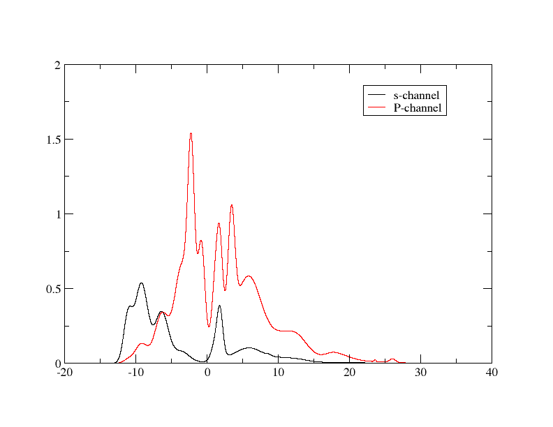

# Projected Density of States

In this tutorial, we will using Optados to calculate the electronic density of states of 2 atoms of crystalline silicon projected onto LCAO basis states. It may be helpful to have gone through the [previous tutorial on calculating the DoS](DOS.md).

We will use the `cell` file

*Si.cell*
```
%BLOCK LATTICE_CART
2.73  2.73 0.00
2.73  0.00 2.73
0.00  2.73 2.73
%ENDBLOCK  LATTICE_CART

%BLOCK POSITIONS_FRAC
Si 0.0     0.0     0.0
Si 0.25    0.25    0.25
%ENDBLOCK POSITIONS_FRAC

SYMMETRY_GENERATE

KPOINTS_MP_GRID 10 10 10  
SPECTRAL_KPOINTS_MP_GRID 2 2 2
```

and the `param` file

*Si.param*
```
TASK                   : SPECTRAL
%BLOCK devel_code
spectral: check_output: true :endspectral
%ENDBLOCK devel_code

SPECTRAL_TASK          : DOS
PDOS_CALCULATE_WEIGHTS : TRUE
CUT_OFF_ENERGY         : 200
IPRINT                 : 1
```

Run castep. Then, run Optados with the Optados input file

*Si.odi*
```
TASK              : pdos

# Decompose into angular momentum channels
# (also try species_ang, species, sites)
PDOS : angular

# Or choose the projectors by hand...

# The DOS on Si atom 1 and the DOS on the s-channel
# of Si atom 2 (2 proj)
#PDOS : Si1;Si2(s)
# The sum of the s-channels on the two Si atoms (1 proj)
#PDOS : sum:Si1-2(s)
# The p-channel on each Si atom 1. (1 proj)
#PDOS : Si1(p)

# Recalculate the Fermi energy using the new DOS
# (discasrd the CASTEP efermi)
EFERMI            : optados

# Sample the DOS at 0.1 eV intervals
DOS_SPACING       : 0.1

# The broadening used, (also try linear, or fixed)
BROADENING        : adaptive # Default

# The broadening parameter, A, when using adaptive smearing,
# set by eye to be similar to the linear smearing method
ADAPTIVE_SMEARING : 0.4      # Default

# The Gaussian broadening parameter for fixed smearing,
# in electron Volts
FIXED_SMEARING    : 0.3      # Default

# Set the Fermi energy to zero on the output plots
SET_EFERMI_ZERO : true       # Default

# Normalise the DOS with the volume of the simulation
# cell
DOS_PER_VOLUME  : false      # Default

# Perform numerical integration of the DOS, instead of
# semi-analytic (useful to compare with LinDOS)
NUMERICAL_INTDOS      : false  # Default

# When performing numerical integration of the DOS make
# sure that no Gaussians are smaller than the dos_spacing.
# (Should always be true, but useful for comparison with
# LinDOS)
FINITE_BIN_CORRECTION : true  # Default

```

Note the line `TASK : pdos` - this is what allows us to calculate the PDoS. We have chosen to decompose the DOS into angular momentum channels with the line `PDOS : angular`, and as in the [previous example](DOS.md), we choose to recalculate the Fermi level using the calculated DOS, rather than use the Fermi level suggested by Castep.

The output can be found in `Si2.pdos.dat` - it contains the header below to tell us what each column represnts.

```
################################################################
#
#                  O p t a D O S   o u t p u t   f i l e
#
#  Generated on 13 Feb 2012 at 10:15:10
################################################################
#+-------------------------------------------------------------+
#|                    Partial Density of States -- Projectors  |
#+-------------------------------------------------------------+
#| Projector:    1 contains:                                   |
#|           Atom            AngM Channel                      |
#|          Si   1                 s                           |
#|          Si   2                 s                           |
#+-------------------------------------------------------------+
#| Projector:    2 contains:                                   |
#|           Atom            AngM Channel                      |
#|          Si   1                 p                           |
#|          Si   2                 p                           |
#+-------------------------------------------------------------+
#| Projector:    3 contains:                                   |
#|           Atom            AngM Channel                      |
#|          Si   1                 d                           |
#|          Si   2                 d                           |
#+-------------------------------------------------------------+
#| Projector:    4 contains:                                   |
#|           Atom            AngM Channel                      |
#|          Si   1                 f                           |
#|          Si   2                 f                           |
#+-------------------------------------------------------------+
```

This shows that there are four projectors described below - each one corresponding to a column in the actual data. The 1st contains the s-channels of both silicon atoms, the 2nd the p-channels etc. The values correspond to the sums of the values of both Si atoms.

You can change which projectors you will gain by changing the line `PDOS : ANGULAR`. Changing the value to `SPECIES_ANG` will give you only the first 2 projectors. `SPECIES` will yield the sum of all the orbitals and atoms. `SITES` will give you 1 projector of the sum of all orbitals of Si atom 1, and 1 of atom 2 (note that they're identical). You can also make custom projectors - write down the element, number and orbital in brackets, with columns separating adjacent projectors if you want multiple. For example, `Si1(s):Si2(p)` will give you 1 column of the PDoS of the s orbital on silicon atom 1, and a column of the p orbital on silicon atom 2.

!!! note
    Using custom projectors won't save the data in `Si.pdos.dat`, but a file named based on the projectors chosen - in the example above, it'd be saved in `Si.pdos.proj-0001-0002.dat`.

The output is easily plotted by using xmgrace on the `dat` file. To plot multiple bits of data, it is easiest to use a batch file - this is the plot of the s and p channels:

{width="50%"}

This can be obtained by running `xmgrace -batch pdos_plot.bat` on the batch file

*pdos_plot.bat*
```
READ BLOCK "Si.pdos.dat"

BLOCK XY "1:2"
S0 LEGEND "s-channel"

BLOCK XY "1:3"
S1 LEGEND "P-channel"
```

This plot `DOS_SPACING : 0.001` gives a high quality plot, as shown in the figure below.

|  |
|:--:|
| <b>Density of States of Silicon generated by adaptive broadening projected onto LCAO momentum states</b>|

* Other projections to try are:
	* `PDOS : Si1;Si2(s)`  -- Output the PDOS on Si atom 1 and the PDOS on the s-channel of Si atom 2. (Resulting in two projectors)
	* `PDOS : sum:Si1-2(s)`  --  Output the sum of the s-channels on the two Si atoms. (Resulting in one projector)
	* `PDOS : Si1(p)` -- Output the p-channel on Si atom 1. (Resulting in one projector)
