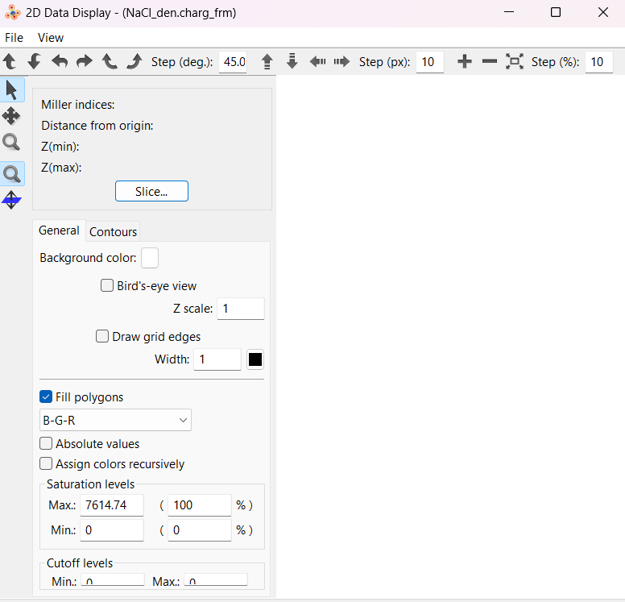
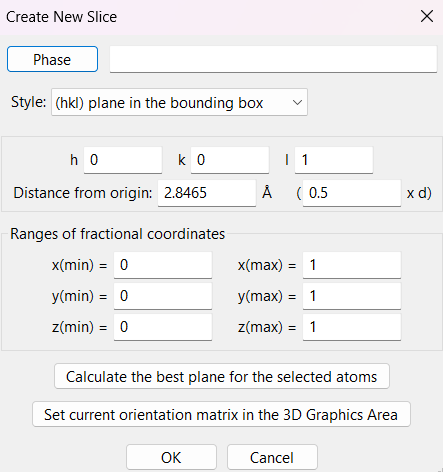
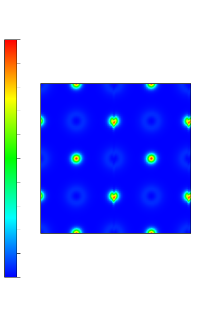
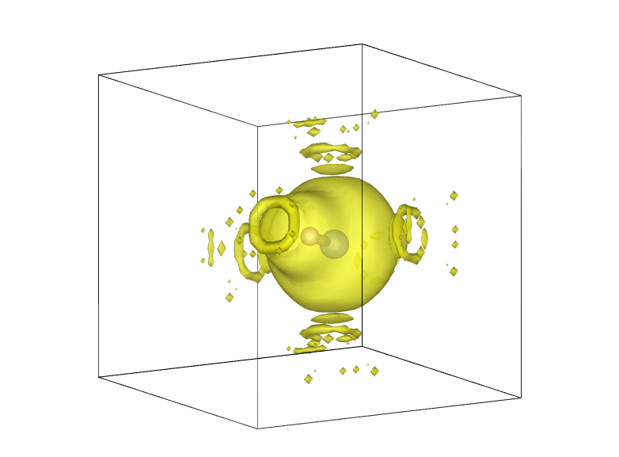
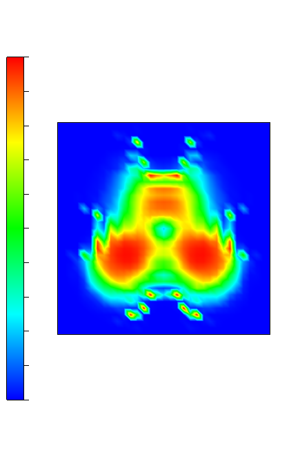
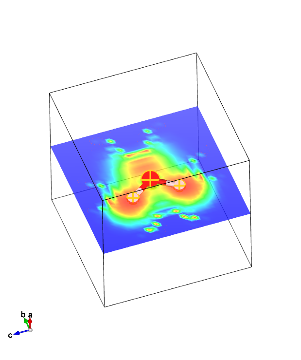
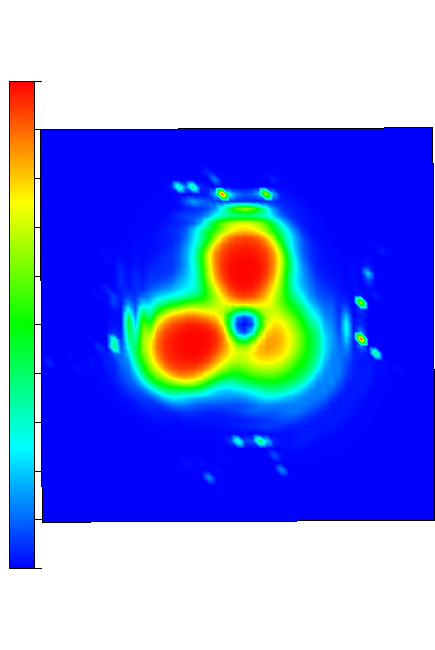

[ELF](../../documentation/Groundstate/ELF.md) (Electron Localization Function) measures how "local" electrons are - the higher the value, the more likely electrons are to make opposite-spin pairs and generally be more "fixed" in place. We will use it to examine ionic, covalent and metallic bonding, and finally use it to examine lone pairs (and hydrogen bonding).

## NaCl

We will start by looking at how electrons in an NaCl crystal behave - to understand it properly, we will look at both the ELF and standard electron density results.

For both calculations we will use the `cell` file
*NaCl.cell*
```
%block lattice_cart
5.693 0.000 0.000
0.000 5.693 0.000
0.000 0.000 5.693
%endblock lattice_cart

%block positions_frac
Na 0.0 0.0 0.0
Na 0.0 0.5 0.5
Na 0.5 0.0 0.5
Na 0.5 0.5 0.0
Cl 0.5 0.5 0.5
Cl 0.5 0.0 0.0
Cl 0.0 0.5 0.0
Cl 0.0 0.0 0.5
%endblock positions_frac
```
and the `param` file
*NaCl.param*
```
xc_functional : LDA
cutoff_energy : 500 eV
spin_polarised : false
WRITE_FORMATTED_DENSITY : TRUE
CALCULATE_ELF : TRUE
WRITE_FORMATTED_ELF : TRUE
```
Running castep will yield 2 files of interest: `NaCl.elf_fmt` and `NaCl.den_fmt`. We will want to compare the 2 outputs, so let's make 2 copies of the `cell` file by copying `NaCl.cell` as `NaCl_elf.cell` and `NaCl_den.cell`, and copying `NaCl.elf_fmt` to `NaCl_elf.charg_frm` and `NaCl.den_fmt` to `NaCl_den.charg_frm`. In both `.charg_frm` files remove the header, so they both start similarly to

```
1     1     1            0.000000
2     1     1            0.000000
3     1     1            0.000000
4     1     1            0.000000
5     1     1            0.000000
```

Now download the 4 new files.

!!! note
    If you wish to move the files around, make sure that the `.charg_frm` file is located in the same directory as its respective `cell` file - so `NaCl_elf.charg_frm` should be next to `NaCl_elf.cell` for example

We will first look at the density output. Open it in Vesta, and, at the top (same row as where the `Files` tab is), go to `Utilities -> 2D Data Display`. It should open a window looking like

{width="40%")}

There, click `Slice` - this will open another window

{width="40%"}

You should keep the `hkl` (lattice Miller indices) as `001`, but make a 2x2 supercell but changing `x(min)`, `y(min)` and `z(min)` to `-1`. Click `Ok` and you should get an output looking like

{width="50%"}

This is what we'd expect of an ionic crystal: a regular pattern where dot with a low relative electron density (the cation) is next to one with a high electron density (the anion).
## HF

For HF we will use the `cell` file:

*HF.cell*
```
%block lattice_abc
6 6 6
90 90 90
%endblock lattice_abc

%block positions_abs
H 3 3 3
F 3.92 3 3
%endblock positions_abs

kpoints_mp_grid 4 4 4

```
and `param` file:

*HF.param*
```
xc_functional : LDA
cutoff_energy : 500 eV
spin_polarised : false
CALCULATE_ELF : TRUE
WRITE_FORMATTED_ELF : TRUE
```

!!! note
    For this tutorial we will simply assume that everything here is converged and stick to the LDA functional

When you run castep on HF you will get an output file `HF.elf_fmt`. The top should look a little like

```
BEGIN header

          Real Lattice(A)               Lattice parameters(A)    Cell Angles
  6.0000000   0.0000000   0.0000000     a =    6.000000  alpha =   90.000000
  0.0000000   6.0000000   0.0000000     b =    6.000000  beta  =   90.000000
  0.0000000   0.0000000   6.0000000     c =    6.000000  gamma =   90.000000

  1                            ! nspins
 32    32    32                ! fine FFT grid along <a,b,c>
END header: data is "<a b c> chi"

    1     1     1            0.000000
    2     1     1            0.000000
    3     1     1            0.000000
    4     1     1            0.000000
    5     1     1            0.000000
...
```

First, we rename (or copy + rename) it to `HF.charg_frm`, changing the file type. Then we delete the top lines (the header) so that the file starts with

```
1     1     1            0.000000
2     1     1            0.000000
3     1     1            0.000000
4     1     1            0.000000
5     1     1            0.000000
...
```

Next we will visualise this data using Vesta. There is more detail on how that is done in an [earlier tutorial](charge_density.md), including a [YouTube walkthrough](https://www.youtube.com/watch?v=_c2Hk4jxmm4). We simply download both the original `cell` file and newly created `charg_frm` file (if you wish to move the files around, make sure they're in the same directory), and open the `charg_frm` file on vesta.

What you should immediately see is something like this :



You'll be able to see it more properly by rotating it around yourself, but the yellow represents the electron cloud, and there are 2 atoms in the middle (naturally the small one is hydrogen and large one is fluorine) which are surrounded by said cloud.

We can already see evidence of lone pairs/hydrogen bonding : the 'circles' of yellow outside the big cloud even visually resemble lone pairs, while chunks going even further away could potentially hint at them trying to form hydrogen bonds with adjacent cells.

We can visualise this better by clicking `Utilities -> 2D Data Display` in Vesta. That'll open up a new window - in it, click `Slice...` and select the miller indices to be 001. Apply that and you should get an image like this :

{width="30%"}

This gives us an interesting picture: the small regions of high electron density look even more like what we'd expect of lone pairs. The nitrogen has 3 around it (as expected), yet the hydrogen also has 1 - this is not what we'd expect. However, considering that this will be interacting with adjacent cells, this is a good indication that it has formed a hydrogen bond.

## Water and ammonia

The procedure for H~2~O and NH~3~ is almost identical. We use exactly the same `param` file as above, and perform the same procedures following the `elf_fmt` output. The `cell` files we use are:

*H2O.cell*
```
%block lattice_abc
5 5 5
90 90 90
%endblock lattice_abc

%block positions_abs
O 2.5 2.5 2.5
H 2.5 1.95 3.29
H 2.5 1.95 1.72
%endblock positions_abs
```

for water and

*NH3.cell*
```
%BLOCK LATTICE_ABC
8 8 8
90 90 90
%ENDBLOCK LATTICE_ABC

%BLOCK POSITIONS_ABS
N 4 4 4
H 4 4 5
H 4.95 4 3.67
H 3.53 3.18 3.67
%ENDBLOCK POSITIONS_ABS


```

For ammonia.

From then, we again go to `2D display data` and `Slice...`. This is where the procedure might be a bit different: by shift clicking on all the atoms in H~2~O (and the atoms within the plane you wish to look at in NH~3~) and clicking `Calculate the best plane for the selected atoms` it'll give us the plane that we may be most interested in. In the case of water it is a simple (100), but for NH~3~ you may wish to play around with it by selecting different combinations - alternatively manually choose a plane in which you are interested

!!! note
    In VESTA, plane selection may work a bit differently from how you'd expect. In this example, since you're cutting through the middle you'd normally call it a (200) plane. However, here it is considered a (100) plane 2.5$\mathring{\text{A}}$ (or 0.5d - since the unit cell lengths are 5$\mathring{\text{A}}$) from the origin

The result for water in the (100) plane should look like:

{width=30%}

An alternative way of getting a similar result is by clicking `Edit -> Lattice Planes`, after which you can click `New` to either manually add whatever lattice planes you wish to examine, or again `Calculate the best plane for the selected atoms` after selecting the atoms by shift-clicking 3 of them. This provides the advantage of seeing precisely which plane you're looking at, as well as having the option of seeing where the atoms are in the electrical distribution. By following this procedure for H~2~O we get this:

{width=30%}

!!! note
    Don't forget you can turn off `Show isosurfaces` and `Show sections` under `Volumetric data` - if you're going to be looking at the cell itself this may obscure what you're trying to look at

Lastly, let's take a quick look at the NH~3~ result. Selecting the best plane containing 2 hydrogens and a nitrogen should give a result looking like:

{width=30%}

Like in the previous examples, you should be able to see evidence of lone pairs/hydrogen bonding - it is important to note, however, this may not be the case for all planes. Even when selecting 2 hydrogens and a nitrogen, even picking 2 different hydrogens may yield different results.
