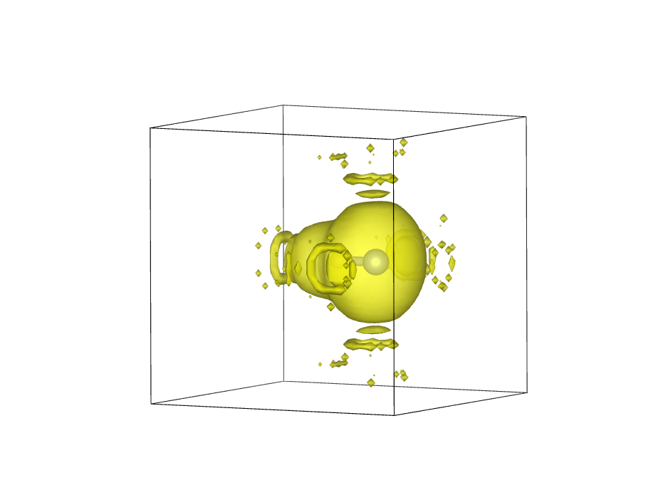

[ELF](../../documentation/Groundstate/ELF.md) (Electron Localization Function) is another way to measure electron density. In this tutorial, we will use it to roughly demonstrate lone pairs/hydrogen bonding in HF, H~2~O and NH~3~.

## HF

For HF we will use the `cell` file:

*HF.cell*
```
%block lattice_abc
6 6 6
90 90 90
%endblock lattice_abc

%block positions_abs
H 3 3 3
F 3.92 3 3
%endblock positions_abs

kpoints_mp_grid 4 4 4

```
and `param` file:

*HF.param*
```
xc_functional : LDA
cutoff_energy : 500 eV
spin_polarised : false
CALCULATE_ELF : TRUE
WRITE_FORMATTED_ELF : TRUE
```

!!! note
    For this tutorial we will simply assume that everything here is converged and stick to the LDA functional

When you run castep on HF you will get an output file `HF.elf_fmt`. The top should look a little like

```
BEGIN header

          Real Lattice(A)               Lattice parameters(A)    Cell Angles
  6.0000000   0.0000000   0.0000000     a =    6.000000  alpha =   90.000000
  0.0000000   6.0000000   0.0000000     b =    6.000000  beta  =   90.000000
  0.0000000   0.0000000   6.0000000     c =    6.000000  gamma =   90.000000

  1                            ! nspins
 32    32    32                ! fine FFT grid along <a,b,c>
END header: data is "<a b c> chi"

    1     1     1            0.000000
    2     1     1            0.000000
    3     1     1            0.000000
    4     1     1            0.000000
    5     1     1            0.000000
...
```

First, we rename (or copy + rename) it to `HF.charg_frm`, changing the file type. Then we delete the top lines (the header) so that the file starts with

```
1     1     1            0.000000
2     1     1            0.000000
3     1     1            0.000000
4     1     1            0.000000
5     1     1            0.000000
...
```

Next we will visualise this data using Vesta. There is more detail on how that is done in an [earlier tutorial](charge_density.md), including a [YouTube walkthrough](https://www.youtube.com/watch?v=_c2Hk4jxmm4). We simply download both the original `cell` file and newly created `charg_frm` file (if you wish to move the files around, make sure they're in the same directory), and open the `charg_frm` file on vesta.

What you should immediately see is something like this :


