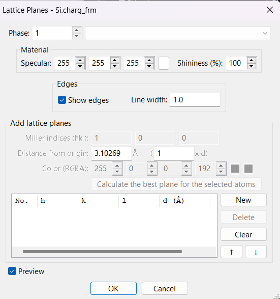

[ELF](../../documentation/Groundstate/ELF.md) (Electron Localization Function) measures how "local" electrons are - the higher the value, the more likely electrons are to make opposite-spin pairs and generally be more "fixed" in place. We will use it to examine ionic and covalent bonding, and then use it to examine lone pairs (and hydrogen bonding) in HF, H~2~O and NH~3~ molecules.

A lot of the steps on examining the data are the same as in [Plotting Charge Density](charge_density.md) - if you prefer, you may use that (and its accompanying [video tutorial](https://www.youtube.com/watch?v=_c2Hk4jxmm4&feature=youtu.be)), though the cells and planes used are slightly different. For visualising the results, this tutorial will use [Vesta](https://jp-minerals.org/vesta/en/), but feel free to use another software if you prefer. 

## NaCl

We will start by looking at how electrons in an NaCl crystal behave - to illustrate what ELF exactly does and doesn't do, we will compare it to the results of a standard population analysis.

For both calculations we will use the `cell` file

*NaCl.cell*
```
%block lattice_cart
5.693 0.000 0.000
0.000 5.693 0.000
0.000 0.000 5.693
%endblock lattice_cart

%block positions_frac
Na 0.0 0.0 0.0
Na 0.0 0.5 0.5
Na 0.5 0.0 0.5
Na 0.5 0.5 0.0
Cl 0.5 0.5 0.5
Cl 0.5 0.0 0.0
Cl 0.0 0.5 0.0
Cl 0.0 0.0 0.5
%endblock positions_frac
```
and the `param` file

*NaCl.param*
```
xc_functional : LDA
cutoff_energy : 500 eV
spin_polarised : false
WRITE_FORMATTED_DENSITY : TRUE
CALCULATE_ELF : TRUE
WRITE_FORMATTED_ELF : TRUE
```
Running castep will yield 2 files of interest: `NaCl.elf_fmt` and `NaCl.den_fmt`.

We will want to compare the 2 outputs, so:

1. Make 2 copies of the `cell` file by copying `NaCl.cell` to `NaCl_elf.cell` and `NaCl_den.cell`. 2. Copy `NaCl.elf_fmt` to `NaCl_elf.charg_frm`
3. Copy `NaCl.den_fmt` to `NaCl_den.charg_frm`.
4. In both `.charg_frm` files remove the header.
Following this, they should look like:

```
1     1     1            0.000000
2     1     1            0.000000
3     1     1            0.000000
4     1     1            0.000000
5     1     1            0.000000
```

Now we will be able to visualise the results.

!!! note
    If you wish to move the files around, make sure that the `.charg_frm` file is located in the same directory as its respective `cell` file - for example, `NaCl_elf.charg_frm` should be with `NaCl_elf.cell`.

We will first look at the density output. Open it in Vesta, and, at the top-bar, go to `Utilities -> 2D Data Display`.

It should open a window which looks like:

{width="50%")}

There, click `Slice` - this will open another window

{width="40%"}

You should keep the `hkl` (lattice Miller indices) as `001`, but make a 2x2 supercell and change `x(min)`, `y(min)` and `z(min)` to `-1`.

Click `Ok` and you should get an output which looks like:

{width="50%"}

This is what we'd expect of a the charge density in an ionic crystal: a regular pattern where a region with a low relative electron density (the cation) is adjacent to one with a high electron density (the anion).

Now let's follow the exact same procedure, except this time with `NaCl_elf` for the ELF result. This is the outcome:

{width="50%"}

This is rather interesting: though the electron density around the Na^+^ cation is very low, the electrons are much more localised around it - the opposite is true for Cl^-^ : the ELF is high where density is low and vice versa. While both, in the simplest model, have full outer shells and thus should both be highly localised (in fact they are both localised, Na^+^ just moreso), Cl^-^ simply has larger orbitals and has a full valence shell (rather than core), leading to lower localisation. This helps illustrate the key difference between ELF and population analysis: ELF is purely a measure of how localised the electrons are in space, and doesn't always correspond to a higher density.

## Covalent bonding - Si

We will now use ELF to demonstrate covalent bonding in diamond-silicon. We will use the `cell` file

*Si.cell*

```

%block lattice_abc
3.8 3.8 3.8
60 60 60
%endblock lattice_abc

%block positions_frac
Si 0.00 0.00 0.00
Si 0.25 0.25 0.25
%endblock positions_frac
```

Run castep with an identical `param` file (you may remove `WRITE_FORMATTED_DENSITY : TRUE` if not you're not interested in the charge density). Follow the exact same procedure as above (though again you can ignore anything to do with the charge density). After opening it in Vesta, rather than taking a slice, click `Edit -> Lattice planes`, which will open the window below:

{width="30%"}

1. Click `New` and use the `100` plane as before.
2. Then click `Ok`.
3. Create a supercell.
4. This time click `Boundary...` on the left side of the main window.
5. Make a 2x2 supercell as before.
6. Rotate the cell around until you see what's happening.

You should see something like:

{width="40%"}

You can uncheck `Show models` to see it better without the atoms

{width="40%"}

This tells us a rather interesting story - the atoms are highly localised along the covalent Si-Si bonds, but relatively delocalised near the atoms themselves. They are especially delocalised in regions where is no bonding or atoms.

If you wish to also examine and compare the charge density, this is covered in [another tutorial](charge_density.md)

## HF

Now that we have a good understand of what ELF actually does, let's use it for a more interesting purpose: to demonstrate lone pairs and hydrogen bonding. Lone pairs are by their nature highly localised, pairing up with each other and being held largely in place by strong repulsions to any negative charges (including other lone pairs) and strong attractions to positive ones (such as adjacent dipoles - this leads to hydrogen bonding)

For HF we will use the `cell` file:

*HF.cell*
```
%block lattice_abc
6 6 6
90 90 90
%endblock lattice_abc

%block positions_abs
H 3 3 3
F 3.92 3 3
%endblock positions_abs

kpoints_mp_grid 4 4 4

```
and again the same `param` file. Following the exact same steps as with NaCl, slicing the (010) plane (with the distance from the origin, set in the same slice window, set as 0.5d - 0.5 * the size of the side lengths) we get an output looking like:

{width="30%"}

This gives us an interesting picture: the small regions of high electron locality look like what we'd expect of lone pairs. The fluorine has 3 around it (as expected), yet the hydrogen also has 1. Considering that this will be interacting with adjacent cells, which is inevitable given that this is calculated with periodic boundaries, this is a good indication that it has formed a hydrogen bond.

## Water and ammonia

The procedure for H~2~O and NH~3~ is almost identical. We use exactly the same `param` file as above, and perform the same procedures following the `elf_fmt` output. The `cell` files we use are:

*H2O.cell*
```
%block lattice_abc
5 5 5
90 90 90
%endblock lattice_abc

%block positions_abs
O 2.5 2.5 2.5
H 2.5 1.95 3.29
H 2.5 1.95 1.72
%endblock positions_abs
```

for water and

*NH3.cell*
```
%BLOCK LATTICE_ABC
8 8 8
90 90 90
%ENDBLOCK LATTICE_ABC

%BLOCK POSITIONS_ABS
N 4 4 4
H 4 4 5
H 4.95 4 3.67
H 3.53 3.18 3.67
%ENDBLOCK POSITIONS_ABS


```

For ammonia.

From then, we again go to `2D display data` and `Slice...`. This is where the procedure might be a bit different: by shift clicking on all the atoms in H~2~O (and the atoms within the plane you wish to look at in NH~3~) and clicking `Calculate the best plane for the selected atoms` it'll give us the plane that we may be most interested in. In the case of water it is a simple (100), but for NH~3~ you may wish to play around with it by selecting different combinations - alternatively manually choose a plane in which you are interested.

!!! note
    In VESTA, plane selection may work a bit differently from how you'd expect. In this example, since you're cutting through the middle you'd normally call it a (200) plane. However, here it is considered a (100) plane 2.5$\mathring{\text{A}}$ (or 0.5d - since the unit cell lengths are 5$\mathring{\text{A}}$) from the origin

The result for water in the (100) plane should look like:

{width=30%}

Alternatively, to better see which bonds/atoms are corresponding to the regions of high/low electron locality, use the `Lattice planes` method so you can see the cell along with the ELF map. You can again `Calculate the best plane for the selected atoms` like we did for ammonia with slicing. Feel free to also select different planes and look at how it looks in them.

{width=30%}

!!! note
    Don't forget you can turn off `Show isosurfaces` and `Show sections` under `Volumetric data` - if you're going to be looking at the cell itself this may obscure what you're trying to look at

Lastly, let's take a quick look at the NH~3~ result. Selecting the best plane containing 2 hydrogens and a nitrogen should give a result looking like:

{width=30%}

Here we see evidence of lone pairs on both of the hydrogens in the plane (as both can form hydrogen bonds - and so can the third if you look at that one). This is rather unexpected - in the classical view, NH~3~ has a nitrogen with 1 lone pair that simply forms a single hydrogen bond with a hydrogen in an adjacent NH~3~. However, because every hydrogen is capable of forming a hydrogen bond, ELF registers them as having regions of high locality near them. The same applies to nitrogen - though it should classically only have 1 pair near it, it is seen as having 2 as it is capable of making 2 hydrogen bonds in that plane.

!!! warning
    The results will likely look different depending on which 2 hydrogens you pick along with the nitrogen. This can be mostly explained due to how adjacent ammonia molecules are aligned relative to it, which is defined by the cell.
