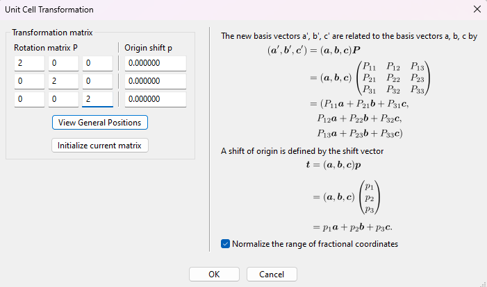

# Coreloss

## Calculation of core-loss spectra for cBN

Core-loss calculations effectively calculate the probability of an electron being excited from a core state into the conduction band. This is useful for calculating the core-loss (ionisation edge) peaks - by performing these calculations, you can get a simulation of what you would see in an experimental [EELS](https://en.wikipedia.org/wiki/Electron_energy_loss_spectroscopy) or [XANES](https://en.wikipedia.org/wiki/X-ray_absorption_near_edge_structure) spectrum.

In this tutorial, we will look at the results of such a calculation on cubic boron nitride (cBN), looking at the boron K-edge. In the end, we will compare it to the spectrum in the [EELS Database](https://eelsdb.eu/spectra/cubic-boron-nitride).

We will use the `cell` file

*cbn.cell*
```
%block lattice_abc
2.5 2.5 2.5
60 60 60
%endblock lattice_abc

%block positions_frac
B 0.00 0.00 0.00
N 0.25 0.25 0.25
%endblock positions_frac

kpoints_mp_grid 10 10 10
spectral_kpoint_mp_grid 12 12 12

```


with the `param` file

*cbn.param*
```
task: spectral
spectral_task: coreloss
xc_functional: LDA
opt_strategy: speed
```

Note that there should be a larger number of spectral k-points than the standard ones, and, to test if it is converged, you'd have to look at the whole spectrum (rather than examining a single value/result as in some other convergence tests). It is also important that you do not have `SYMMETRY_GENERATE` on for coreloss calculations.

After running Castep, run Optados with the Optados input file

*cbn.odi*
```
TASK               : core
DOS_SPACING       : 0.01
BROADENING         : adaptive # Default
ADAPTIVE_SMEARING  : 0.4  # Default
CORE_GEOM          : polycrystalline  # Default
CORE_LAI_BROADENING : false  # Default true
LAI_GAUSSIAN_WIDTH : 1.0
```

The line `TASK : core` is what determines that a core-loss calculation will be performed. `CORE_GEOM : polycrystalline` could also be replaced by `core_geom : polarized`, in which case you'd also have to add a line specifying the direction - for example,

`CORE_QDIR : 1 1 1`

would simulate the results of an electron (or X-ray) beam going through a single crystal in the (1 1 1) direction. In this tutorial, we will be looking at the polycrystalline case, where it effectively uses the average of all directions.

Running Optados should generate 2 files of interest: `cbn_B1K1_core_edge.dat` and `cbn_N1K1_core_edge.dat` - these are the results of the core-loss calculations. We will focus on the first `dat` file - let's look at the boron part specifically. The file starts off like

```
-15.720790912312673        0.0000000000000000     
-15.710790160394351        0.0000000000000000     
-15.700789408476030        0.0000000000000000     
```

The 1st column is the energy and the 2nd is the (smeared) core-loss for that energy. Let's try plotting the dat file with xmgrace - the graph should look like

{width="50%"}

Let's now add some experimental broadening to the results, in order to more accurately simulate experiment. You can do so by re-running Optados (no need to re-run Castep) with `CORE_LAI_BROADENING` set to true and the lines

```
LAI_GAUSSIAN_WIDTH : 1.8
LAI_LORENTZIAN_WIDTH : 0.1
LAI_LORENTZIAN_SCALE : 0.1
```

added to the `odi` file. Gaussian broadening is to simulate the instrument used, and is the same for the whole spectrum, while Lorentzian is to simulate the lifetime effects of the experiment, and is energy-dependent.

A Gaussian width of 1.8 is used because we are going to compare it to the spectrum in the [EELS Database](https://eelsdb.eu/spectra/cubic-boron-nitride/), and that experiment had a resolution of 1.8eV - the Gaussian width should match the resolution. The Lorentzian width used depends on the element you are examining, and the value used depends on which element's edge you are examining, and the value used is recommended [here](https://doi.org/10.1006/adnd.2000.0848) (boron is not there, but 0.1 is recommended for carbon, which is close). A Lorentzian scale of 0.1 is a general and commonly-used value.

Re-running it now yields 3 columns in the `dat` file - it now starts like

```
-15.720790912312673        0.0000000000000000        4.6792920824784473E-005
-15.710790160394351        0.0000000000000000        4.7285842629847867E-005
```

The 1st and 2nd columns are the same, and the 3rd column is the lifetime and instrumentation (LAI) broadened core-loss results.

To plot this with xmgrace, it is easiest to run `xmgrace -batch plot.bat` on the batch file

*plot.bat*
```
READ BLOCK "cbn_B1K1_core_edge.dat"

BLOCK XY "1:2"
S0 LEGEND "Unbroadened"

BLOCK XY "1:3"
S1 LEGEND "Broadened"

WORLD XMIN 0
```

This gives the graph below

{width="50%"}

### Including a core-hole

The above was effectively calculating the probability of an electron being able to be excited into the conduction band, corresponding to that same energy being lost from an X-ray/electron and thus XANES/EELs data. However, when calculating that, it was not accounting for the fact that there'd be a core-hole as a result (which naturally will affect energy, DOS and thus probability of occurring): that must be factored in for more realistic results.

This is done rather simply by specifying the missing electron when describing the potential in the `cell` file. If you look at the `cbn.castep` file generated earlier, you may see that the pseudopotential report contains the line

```
"2|1.2|12|14|16|20:21(qc=8)"
```

This tells us what kind of pseudopotential is used for the boron. To specify that there is a 1s electron missing, all you have to do is add `{1s1.00}` at the end: with only 1 electron in the 1s shell, there is a core electron missing: a core hole.

Go into `cbn.cell`, and add the lines

```
%block species_pot
B 2|1.2|12|14|16|20:21(qc=8){1s1.00}
%endblock species_pot
```

to calculate the core edge data factoring in the missing 1s electron.

!!! note
    Your potential may be different, depending on your version of Castep etc. - but don't worry, as the procedure is the same.

Also add the line

`CHARGE : +1`

to the `cbn.param` file - this must be done to maintain charge neutrality.  Next, re-run Castep. Let's have a quick look at the pseudopotential report of boron in `cbn.castep`

```
============================================================                
| Pseudopotential Report - Date of generation 29-07-2024   |                
------------------------------------------------------------                
| Element: B Ionic charge:  4.00 Level of theory: LDA      |                
| Atomic Solver: Koelling-Harmon                           |                
|                                                          |                
|               Reference Electronic Structure             |                
|         Orbital         Occupation         Energy        |                
|            2s              2.000           -0.865        |                
|            2p              1.000           -0.654        |                
|                                                          |                
|                 Pseudopotential Definition               |                
|        Beta     l      e      Rc     scheme   norm       |                
|          1      0   -0.865   1.199     qc      0         |                
|          2      0    0.250   1.199     qc      0         |                
|          3      1   -0.654   1.199     qc      0         |                
|          4      1    0.250   1.199     qc      0         |                
|         loc     2    0.000   1.199     pn      0         |                
|                                                          |                
| Augmentation charge Rinner = 0.838                       |                
| Partial core correction Rc = 0.838                       |                
------------------------------------------------------------                
| "2|1.2|12|14|16|20:21(qc=8){1s1.00}"                     |                
------------------------------------------------------------                
|      Author: Chris J. Pickard, Cambridge University      |                
============================================================
```

You should notice that the energies in the 2s and 2p orbitals are lower, the beta values are all different, and, most importantly, that the pseudopotential used is the one we manually wrote in: the one with only 1 electron in the 1s shell.

Now, re-run Optados. This create the same files as before. Again, let's focus on the boron result. The output file `cbn_B1K1_core_edge.dat` now starts like:

```
-16.879627404257498        0.0000000000000000        4.3418325679994708E-005
-16.869627177952179        0.0000000000000000        4.3433042280034070E-005
```

The columns represent the same information as before. Plotting it with the same batch file yields us this graph:

{width="50%"}

## Supercell

The periodic images of the core-hole will interact with one another.  As this is unphysical, we need to increase the distance between the core-holes. This is done by creating a supercell.  To do this, we will create a 2x2x2 supercell - the larger the supercell the better the simulation (as this reduces the core-hole interaction effect more), but the calculation time also shoots up significantly. There are multiple ways of doing this, but this tutorial will cover how it can be done using [Vesta](https://jp-minerals.org/vesta/en/). First, upload the `cell` file we used to Vesta. From the top of the toolbar, go into `Edit -> Edit Data -> Unit cell...`. This should open up the window below


Click `Transform...`. This opens up a new window



To create the 2x2x2 supercell, the transformation matrix is rather simple: make the diagonal values 2 like in the figure above (so it becomes 2x larger in all directions) and click `Ok`. Select `Search atoms in the new unit-cell and add them as new sites` in the next pop-up window.

Now that the supercell has been generated, we must save it and turn it into a cell file. Click `File -> Export Data` and save it as  `cbn.cif` file (saving it as a `cell` file is not an option). We can use `cif2cell cbn.cif` to get information on how to make the new cell. In the end, we change `cbn.cell` to:

*cbn.cell*
```
%block lattice_abc
5 5 5
60 60 60
%endblock lattice_abc

%block positions_frac
B:exi       0.0000000   0.0000000   0.0000000
B       0.0000000   0.0000000   0.5000000
B       0.0000000   0.5000000   0.0000000
B       0.0000000   0.5000000   0.5000000
B       0.5000000   0.0000000   0.0000000
B       0.5000000   0.0000000   0.5000000
B       0.5000000   0.5000000   0.0000000
B       0.5000000   0.5000000   0.5000000
N       0.1250000   0.1250000   0.1250000
N       0.1250000   0.1250000   0.6250000
N       0.1250000   0.6250000   0.1250000
N       0.1250000   0.6250000   0.6250000
N       0.6250000   0.1250000   0.1250000
N       0.6250000   0.1250000   0.6250000
N       0.6250000   0.6250000   0.1250000
N       0.6250000   0.6250000   0.6250000
%endblock positions_frac

kpoints_mp_grid 5 5 5


%block species_pot
B:exi 2|1.2|12|14|16|20:21(qc=8){1s1.00}
%endblock species_pot

spectral_kpoint_mp_grid 6 6 6
```

With double the size of the supercell, you may also halve the kpoints: this allows it to be calculated faster without losing accuracy. However, it will still take significantly longer to calculate.

Specifying 1 of the boron atoms to be called `B:exi` and making changing the potential block to only affect that means that we simulate only 1 of the boron atoms losing that electron - by doing this we prevent the interaction problem mentioned above.

In the `param` file, also add the line

`NEXTRA_BANDS : 100`

This makes Castep perform the calculation for higher-energy bands, and is necessary to prevent too sudden of a drop in the core-loss values towards the higher energies (you may notice that in the above figures the value drops towards 0 after the peaks, but tends towards a finite non-zero value in experiment).

Re-run Castep and Optados. There will now be 16 output files, rather than just 2 - there is a core edge output for every atom - `cbn_ B 1    K1     B:exi_core_edge.dat` is the core edge result for the boron with the missing 1s electron. The spaces in the file name can be a bit awkward so let's rename it to `cbn_BExi.dat`. Let's plot it the same as we have before


We can see the resemblance to the database spectrum.

## Comparison to Experiment

To get a good comparison to experiment, we will plot the results from the database and our calculation together on the same graph. You may already notice that, though the shape is similar, the x and y-axis values are very different. The y-axis corresponds to intensity (while in our calculation it is more akin to a probability), so we will scale that by just multiplying by a flat value. The x-axis needs to be adjusted by simply adding a fixed value.

We can adjust our results with a simple Python script.

```py
with open('cbn_BExi.dat', 'r') as infile, open('cbn_BExi_ss.dat', 'w') as outfile:
    for line in infile:
        columns = line.split()
        col1 = float(columns[0]) + 180
        col2 = float(columns[2]) * 1000000
        outfile.write(f"{col1} {col2}\n")
```

Now let's plot our Castep and the experimental results together by xmgrace with the batch file

```
READ BLOCK "cbn_BExi_ss.dat"

BLOCK XY "1:2"
S0 LEGEND "Castep"

READ BLOCK "Dspec.60967.1.msa"

BLOCK XY "1:2"
S1 LEGEND "EELS Database"
```

The output should look like this:


They are reasonably similar, but the Optados calculation retains the problem of dropping off faster towards higher energies. 
