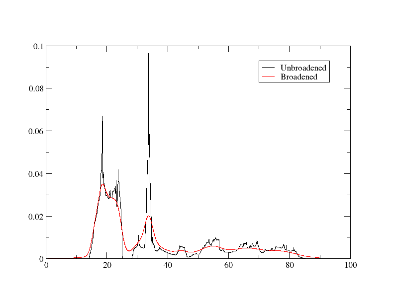

# Coreloss

## Calculation of core-loss spectra for hBN

Core-loss calculations effectively calculate the probability of an electron being excited from 1 state into the conduction band. This is useful for calculating the core-loss (ionisation edge) peaks - by performing these calculations, you can get an approximate simulation of what you would see in an experimental [EELS](https://en.wikipedia.org/wiki/Electron_energy_loss_spectroscopy) or [XANES](https://en.wikipedia.org/wiki/X-ray_absorption_near_edge_structure) spectrum.

In this tutorial, we will look at the results of such a calculation on hexagonal boron nitride (h-BN). We will use the `cell` file

*hbn.cell*
```
%block lattice_abc
2.5 2.5 2.5
60 60 60
%endblock lattice_abc

%block positions_frac
B 0.00 0.00 0.00
N 0.25 0.25 0.25
%endblock positions_frac

kpoints_mp_grid 12 12 12

symmetry_generate


spectral_kpoint_mp_grid 10 10 10
```

with the `param` file

*hbn.param*
```
task: spectral
spectral_task: coreloss
xc_functional: LDA
opt_strategy: speed
```

Note that, for now, the `species_pot` block doesn't change anything - the value inside is the same as the default pseudopotential you'd get. Run castep. After it is done, run Optados on hbn with the Optados input file

*hbn.odi*
```
TASK               : core
DOS_SPACING       : 0.01
BROADENING         : adaptive # Default
ADAPTIVE_SMEARING  : 0.4  # Default
CORE_GEOM          : polycrystalline  # Default
CORE_LAI_BROADENING : true  # Default
LAI_GAUSSIAN_WIDTH : 1.0
```

The line `TASK : core` is what determines that a core-loss calculation will be performed. `CORE_GEOM : polycrystalline` could also be replaced by a different value, such as `TENSOR`, to get other results: here we are finding the results of the polycrystalline (uniform) case. To compare with experiment we can include lifetime and instrument broadening effects - this is done by the lines

```
CORE_LAI_BROADENING : true  # Default
LAI_GAUSSIAN_WIDTH : 1.0
```

which adds some Gaussian broadening to simulate instrument effects.

Running Optados should generate 2 files of interest: `hbn_B1K1_core_edge.dat` and `bn_N1K1_core_edge.dat` - these are the results of the core-loss calculations. We will focus on the first `dat` file - let's look at the boron part specifically. The file starts off like

```
-15.700479247265910        0.0000000000000000        8.6070320322269327E-005
-15.690478675557825        0.0000000000000000        8.6103943275722382E-005
```

The 1st column is the energy, the 2nd is the standard Gaussian-broadened core-loss and the 3rd column is the instrumentation broadened core-loss. Let's try plotting this with xmgrace - you could use `xmgrace -nxy hbn_B1K1_core_edge.dat`, but to easily add legends I'd use `xmgrace -batch plot.bat` on the batch file

<a id="plot_bat"></a>

*plot.bat*
```
READ BLOCK "bn_B1K1_core_edge.dat"

BLOCK XY "1:2"
S0 LEGEND "No Instrumentation Broadening"

BLOCK XY "1:3"
S1 LEGEND "Instrumentation Broadened"

WORLD XMIN 0
```

This creates a graph that looks like:

{width="50%"}

While the instrumentation broadening does make the results more similar to what you'd expect in experiment, it also leads to information being lost from the graph (for example, the peak right after 40eV is completely missing) and the instruments used in practice are likely more realistic than that: let's try adding to the `odi` file

```
LAI_LORENTZIAN_WIDTH : 1
LAI_LORENTZIAN_SCALE : 0.01
```

and rerunning Optados. Plotting the results again yields this graph:

{width="50%"}

In practice, both the instrumentation and adaptive (or linear of fixed) broadening are adjusted until the results are close to experiment.

### Including a core-hole

The above was effectively calculating the probability of an electron being able to be excited into the conduction band, corresponding to that same energy being lost from an X-ray/electron and thus XANES/EELs data. However, when calculating that, it was not accounting for the fact that there'd be a core-hole as a result (which naturally will affect energy, DOS and thus probability of occuring): that must be factored in for more realistic results.

This is done rather simply by specifying the missing electron when describing the potential in the `cell` file. If you look at the `hbn.castep` file generated earlier, you may see that the pseudopotential report contains the lines

```
"2|1.2|12|14|16|20:21(qc=8)"
```

This tells us what kind of pseudopotential is used for the boron. To specify that there is a 1s electron missing, all you have to do is add `{1s1.00}` at the end: with only 1 electron in the 1s shell, there is a core electron missing: a core hole.

Go into `hbn.cell`, and add the lines

```
%block species_pot
B 2|1.2|12|14|16|20:21(qc=8){1s1.00}
%endblock species_pot
```

to calculate the core edge data factoring in the missing 1s electron.
!!! note
    Your potential may be different, depending on your version of Castep etc. - but don't worry as the procedure is the same.

Before we re-run Castep, add the line

`CHARGE : +1`

in the `hBN.param` file - this must be done to maintain charge neutrality.  Next, re-run Castep. Let's have a quick look at the pseudopotential report of boron in `hbn.castep`

```
============================================================                
| Pseudopotential Report - Date of generation 29-07-2024   |                
------------------------------------------------------------                
| Element: B Ionic charge:  4.00 Level of theory: LDA      |                
| Atomic Solver: Koelling-Harmon                           |                
|                                                          |                
|               Reference Electronic Structure             |                
|         Orbital         Occupation         Energy        |                
|            2s              2.000           -0.865        |                
|            2p              1.000           -0.654        |                
|                                                          |                
|                 Pseudopotential Definition               |                
|        Beta     l      e      Rc     scheme   norm       |                
|          1      0   -0.865   1.199     qc      0         |                
|          2      0    0.250   1.199     qc      0         |                
|          3      1   -0.654   1.199     qc      0         |                
|          4      1    0.250   1.199     qc      0         |                
|         loc     2    0.000   1.199     pn      0         |                
|                                                          |                
| Augmentation charge Rinner = 0.838                       |                
| Partial core correction Rc = 0.838                       |                
------------------------------------------------------------                
| "2|1.2|12|14|16|20:21(qc=8){1s1.00}"                     |                
------------------------------------------------------------                
|      Author: Chris J. Pickard, Cambridge University      |                
============================================================
```

You should notice that the energies in the 2s and 2p orbitals are lower, the beta values are all different, and, most importantly, that the pseudopotential used is the one we manually wrote in: the one with only 1 electron in the 1s shell.

Now, re-run Optados. This create the same files as before. Again, let's focus on the boron result. The output file `bn_B1K1_core_edge.dat` now starts like:

```
-0.1658927622868E+02    0.0000000000000E+00    0.0000000000000E+00    0.0000000000000E+00    0.2380874466795E-04    0.2380871874215E-04    0.4761746341010E-04
-0.1657927571493E+02    0.0000000000000E+00    0.0000000000000E+00    0.0000000000000E+00    0.2381712134151E-04    0.2381709540197E-04    0.4763421674348E-04

```

This time, there are 6 columns: the first 2 are the normal broadened data, the 3rd is the sum of those 2, the next 2 are the instrumentation-broadened data and the 6th column is the sum of the previous 2 columns again. We are only interested in the 1st and 4th column (counting energy as the 0th) for this tutorial. Plotting it with the same batch file as [above](Coreloss.md#plot_bat) (with the 2nd block being "1:5" instead of "1:3" to reflect the different column used)  yields us this graph:

{width="50%"}

## Supercell

The periodic images of the core-hole will interact with one another.  As this is unphysical, we need to increase the distance between the core-holes. This is done by creating a supercell.  To do this, we will create a 2x2x1 supercell. There are multiple ways of doing this, but this tutorial will cover how it can be done using [Vesta](https://jp-minerals.org/vesta/en/). First, upload the `cell` file we used to Vesta. From the top of the toolbar, go into `Edit -> Edit Data -> Unit cell...`. This should open up a window that looks like this


Click `Transform...`. This opens up a new window


To create the 2x2x2 supercell, the transformation matrix is rather simple: make the diagonal values 2 like in the figure above (so it becomes 2x larger in all directions) and click `Ok`. Select `Search atoms in the new unit-cell and add them as new sites` in the next pop-up window.

Now that the supercell has been generated, we must save it and turn it into a cell file. Click `File -> Export Data` and save it as  `hbn.cif` file (saving it as a `cell` file is not an option). We can use `cif2cell hbn.cif` to get information on how to make the new cell - we can change the `cell` file to look like this

*hbn.cell*
```
%block lattice_abc
5 5 5
60 60 60
%endblock lattice_abc

%block positions_frac
B:exi       0.0000000   0.0000000   0.0000000
B       0.0000000   0.0000000   0.5000000
B       0.0000000   0.5000000   0.0000000
B       0.0000000   0.5000000   0.5000000
B       0.5000000   0.0000000   0.0000000
B       0.5000000   0.0000000   0.5000000
B       0.5000000   0.5000000   0.0000000
B       0.5000000   0.5000000   0.5000000
N       0.1250000   0.1250000   0.1250000
N       0.1250000   0.1250000   0.6250000
N       0.1250000   0.6250000   0.1250000
N       0.1250000   0.6250000   0.6250000
N       0.6250000   0.1250000   0.1250000
N       0.6250000   0.1250000   0.6250000
N       0.6250000   0.6250000   0.1250000
N       0.6250000   0.6250000   0.6250000
%endblock positions_frac

kpoints_mp_grid 6 6 6

symmetry_generate

%block species_pot
B:exi 2|1.2|12|14|16|20:21(qc=8){1s1.00}
%endblock species_pot

spectral_kpoint_mp_grid 5 5 5
```

With double the size of the supercell, you may also halve the kpoints: this allows it to be calculated faster without losing accuracy. However, it will still take significantly longer to calculate.

Specifying 1 of the boron atoms to be called `B:exi` and making changing the potential block to only affect that means that we simulate only 1 of the boron atoms losing that electron - by doing this we prevent the interaction problem mentioned above. Re-run Castep and Optados. There will now be 16 output files, rather than just 2 - there is a core edge output for every atom - so `bn_B1K1_core_edge.dat` is the core edge result for the boron with the missing 1s electron. Let's plot it on xmgrace, using the same method as before. This is the output:


## Comparison to Experiment


Other things to try include:

* Include the core-hole on the N atom rather than the B
* Compare your simulated spectra to experimental data (the EELS database is a good place to find experimental data)
* Compare to spectra from cubic BN
* Calculating spectra from graphite (graphene) and diamond
