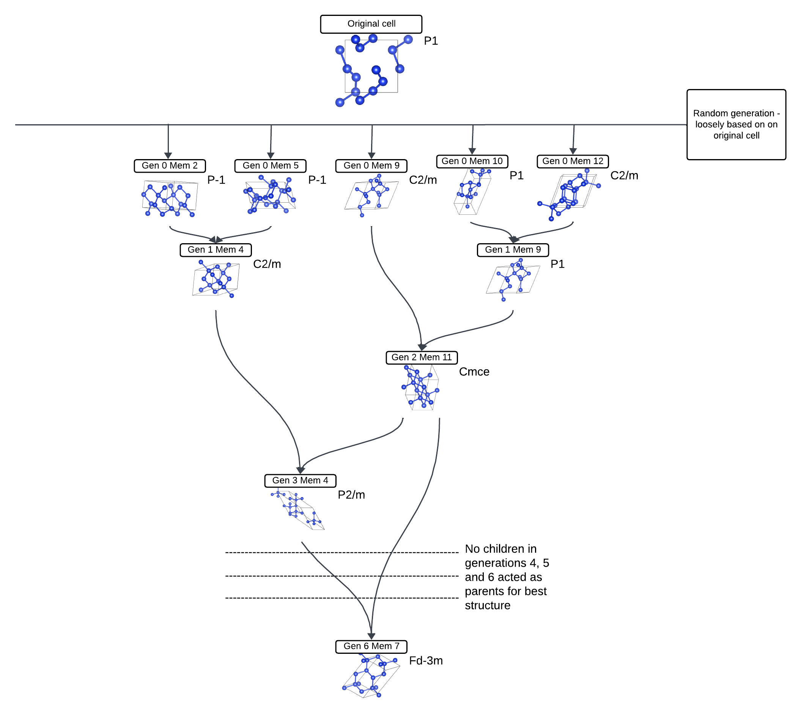

# Introduction

In this tutorial we will look at exactly what castep GA is doing when it is used, examining what the input files do what the output files tell us. We will go through a silicon example to do so - starting from a heavily distorted diamond cell and ending in a diamond structure.


## Input Files

We will use the `cell` file

*Si.cell*

```
%block LATTICE_ABC
ang
5.4 5.4 5.4
90  90  90
%endblock LATTICE_ABC

%block POSITIONS_FRAC
Si  0.2   0.01   0.04
Si  0.21   0.29   0.30
Si  0.59   0.43   0.03
Si  0.9   0.81   0.30
Si  0.53   0.03   0.58
Si  0.72   0.21   0.79
Si  0.04   0.45   0.4
Si  0.28   0.85   0.69
%endblock POSITIONS_FRAC

%BLOCK SPECIES_POT
QC5
%ENDBLOCK SPECIES_POT

symmetry_generate
symmetry_tol : 0.05 ang
```

Note that this is just a heavily distorted version of a ideal diamond silicon cell - `LATTICE_ABC` defines its cubic structure with the lattice parameter that is expected, while the fractional positions of all the Si's are slightly moved from where they'd be expected for diamond - for example the first line

`Si 0.2 0.01 0.04`

is only a bit off from where it'd be in a perfect diamond, which is

`Si 0 0 0`

In a normal castep GA run the positions of all the Si's, and even the starting unit cell, is completely arbitrary, and in most cases it should have little impact on the run. However, in this case we are trying to get it to get to diamond quickly, so that it is easier to analyse what is going on.

For the `param` file we will use

```
task             = genetic algor # Run the GA
ga_pop_size      = 12           # Parent population size
ga_max_gens      = 6            # Max number of generations to run for
ga_mutate_amp    = 0.05          # Mutation amplitude (in Angstrom)
ga_mutate_rate   = 0.1          # Probability of mutation to occur
ga_fixed_N       = true          # Fix number of ions in each member based on input cell

rand_seed        = 129189 # Random seed for replicability


# continuation = Si.xyz

#################################################################
# CASTEP Geomtery Optimisation Parameters		        #
# These will be used for each cells geom opt/fitenss evaluation #
#################################################################

comment          = Si_Convex_hull

#rand_seed        = 100003 # Random seed for replicability
opt_strategy     = SPEED  # Run quick

geom_max_iter    = 211 # Can have a large max iter as using pair potentials

# Don't write most output files for each population member
write_checkpoint = NONE
write_bib        = FALSE
write_cst_esp    = FALSE
write_bands      = FALSE
write_cell_structure = TRUE

######################################
# Any extra devel code options	     #
# & required GA specific devel flags #
######################################

%block devel_code

  # Command used to call castep for each population member
  # If not given this defaults to castep.serial
  CMD: castep.serial :ENDCMD

  GA:

    PP=T   # Using a pair potential
    IPM=M  # Randomly mutated initial population

    CW=24  # Num gens for convergence

    NI=F   # No niching
    FW=0.5 # Fitness weighting

    # Asynchronous running options
    # Required for asynchronous running, without this all geom opts will be run
    # one after another
    AS=T   # Run geometry optimisations asynchronously
    MS=3   # Run 3 geometry optimisations at once

    # Random symmetry children
    NUM_CHILDREN=11
    RSC=T
    RSN=1

    CORE_RADII_LAMBDA=0.8 # Core radii 0.8 pseudopotenital radii

    SCALE_IGNORE_CONV=T   # Ignore convergence in fitness calcualtion

  :ENDGA

  # Use pair potentials in geometry optimisations and perform a final snap to symmetry
  GEOM: PP=T SNAP=T :ENDGEOM

  # Use the Stillinger-Weber pair potential
  PP=T
  PP:
    SW=T
  :ENDPP

%endblock devel_code
```

There is a lot more to discuss here. For more information on all the key words look at the documentation (ADD LINK LATER). However, let's look at the key information here:

- `ga_max_gens` defines the number of generations it will run for. 6 is a very low amount, but it does the job here
- `ga_mutate_amp` describes how severe the mutations are. Again, this is using a low number because we're starting not too far off the final result
- `ga_mutate_rate` tells you the probability of different parts of the cell mutating - 0.1 is a fairly ordinary value to use

A key line for this tutorial is

`rand_seed        = 129189`

This means that you may be able to replicate similar results, though that isn't guranteed [[CHECK IF EVEN TRUE]]

## Running

We can now run castep GA on the Si. This should take about 3 minutes to run, but look at what is happening as it is running - you can use `tail -f Si.castep` to keep track of how the `castep` output file is being generated. Also, refresh your directory regularly to see what's being generated.

The first files to be generated will have the same format as `Si.gen_000_mem_001.cell` and `Si.gen_000_mem_001.param` - this is the 1st member of the 0th generation, which is generated randomly using the `Si.cell` as well as the mutation values specified in the `Si.param` file

!!! note
    I will refer to future files as being `<seed>.file_ending`in the interest of  brevity, specifying details where necessary

You should get a total of 12 members like that, up to `mem_012`. As it's running, the 0th generation will start to get `<seed>.geom` and `<seed>-out.cell` outputs for each member. These are obtained as fast geometry optimisations (ADD LINK) are performed on the randomly generated cells.

After the last member finishes its geometry optimisation, the next generation is generated: you'll get `<seed>.cell` and `<seed>.param` files.

This is the point where the `castep` output file gets interesting. You have a table that starts like

```
GA: gen #  1 parent #  1 enthalpy = -3.940733E+000 eV/atom un-scaled fitness =  0.684242 conv = T member error = F seed = Si.gen_000_mem_001 vol/ion =    19.4307 A**3/atom


 GA: gen #  1 parent #  2 enthalpy = -4.070795E+000 eV/atom un-scaled fitness =  0.791433 conv = T member error = F seed = Si.gen_000_mem_002 vol/ion =    20.4806 A**3/atom
```
and ends with

```
GA: gen #  1 child  # 11 enthalpy = -4.200422E+000 eV/atom un-scaled fitness =  0.868980 conv = T member error = F seed = Si.gen_001_mem_011 vol/ion =    20.7893 A**3/atom

 GA: gen #  1 child  # 12 enthalpy = -3.296903E+000 eV/atom un-scaled fitness =  0.119203 conv = T member error = F seed = Si.gen_001_mem_012 vol/ion =    28.3264 A**3/atom
```

The `parent` rows all using generation 0 members as the seed, and giving them an `un-scaled fitness`. What this means is that all the geometry-optimised cells from generation 0 have their enthalpy and similarity checked - the lower the enthalpy the fitter it is considered, as that is desirable to get the best structure. However, a structure that is similar to another parent will be penalised to encourage diversity.

Those parents then breed together to form the children, which are then mutated and geometry optimised like before. The probability of a parent breeding is based on its fitness evaluation - in the example above, parent 2 is more likely to breed than parent 1 (ADD LINK TO ROULETTE RANDOMNESS)

You may find the ancestry of each individual child by looking for parts of the `castep` file such as

```
GA: Member filename    Si.gen_002_mem_011
 GA: Parent 1 generation            0  and member            9
 GA: Parent 2 generation            1  and member            9
```

Here you see that generation 2 member 11 was made by using the parents generation 0 member 9 and generation 1 member 9.

After the children are generated and geometry optimised, they are treated exactly the same as the parents and every member has their fitness (re)evaluated - the enthalpy is already calculated but similarities must be penalised. This leads to a very similar table labelled

`GA: updated fitnesses with weighted fitness function`

For generation 2 the table starts with

```
GA: gen #  2 parent #  1 enthalpy = -4.225502E+000 eV/atom un-scaled fitness =  0.866683 conv = T member error = F seed = Si.gen_001_mem_006 vol/ion =    19.0994 A**3/atom

GA: gen #  2 parent #  2 enthalpy = -4.200403E+000 eV/atom un-scaled fitness =  0.839781 conv = T member error = F seed = Si.gen_000_mem_009 vol/ion =    20.7940 A**3/atom
```

 Here you'll notice that there are parents from both generation 0 (2nd line) and generation (1st) - based on their fitness, 12 got eliminated while the other 12 stayed to become parents in the next generation.

 The same exact procedure repeats - parents breed (with fitter ones doing moreso), children mutate and optimise, the parents and children are compared together as equal members and the best ones move on to become parents of the next generation. This is done until generation 6.

## The best structure

Finding the best structure found is fairly simple - if using Linux you may use the command

`grep 'child' Si.castep | sort -k10,10n | head -20`

In my case I got generation 6 member 7 to be the lowest enthalpy. Running

`c2x --int -e=0.1-0.0001 Si.gen_006_mem_007-out.cell`

tells me that it is Fd-3m - diamond (though the lower tolerance structure is R-3m - this was a very short run so it hasn't got the perfect structure still, but it is close). The 'family tree' of that cell looks like this:


