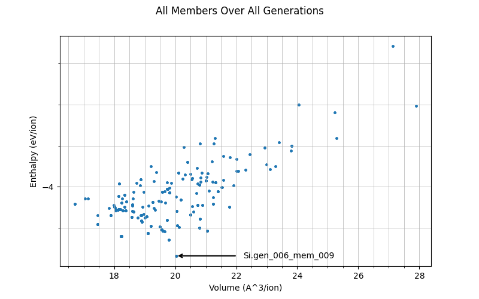
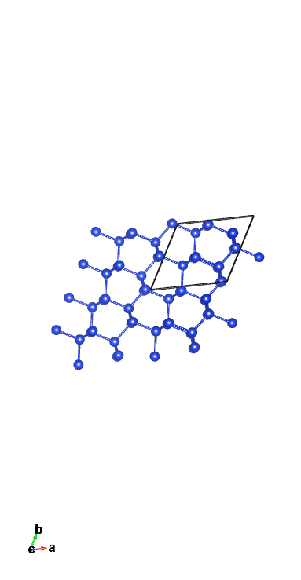
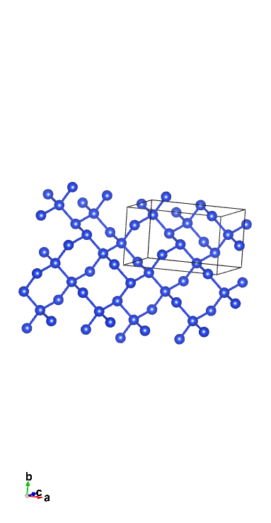

# Castep GA for silicon

Let's assume we don't know the ground state Stillinger-Weber silicon structure and set out to discover it using the CASTEP GA!


## Input Files

We will use the `cell` file
*Si.cell*

```
%block LATTICE_ABC
ang
3.8 3.8 3.8
 90  90  90
%endblock LATTICE_ABC

%block POSITIONS_FRAC
Si  0.203  0.617  0.209
Si  0.844  0.442  0.350
Si  0.964  0.379  0.096
Si  0.762  0.524  0.941
Si  0.544  0.605  0.781
Si  0.238  0.597  0.531
Si  0.728  0.914  0.742
Si  0.209  0.929  0.435
%endblock POSITIONS_FRAC

%BLOCK SPECIES_POT
QC5
%ENDBLOCK SPECIES_POT

symmetry_generate
symmetry_tol : 0.05 ang
```

The definition of the lattice and positions of the atoms is fairly inconsequential to the result you will get: in the 0th generation it gets effectively randomised. The only thing that matters is the amount of Si atoms defined in the `POSITIONS_FRAC` block - here it is 8 so future structures will also have 8 atoms. Another thing worth noting is the QC5 potential being used - it is used due to its speed, which is essential considering how many calculations will be done.

For the `param` file we will use
*Si.param*

```
task             = genetic algor # Run the GA
ga_pop_size      = 12            # Parent population size
ga_max_gens      = 12            # Max number of generations to run for
ga_mutate_amp    = 1.00          # Mutation amplitude (in Angstrom)
ga_mutate_rate   = 0.15          # Probability of mutation to occur
ga_fixed_N       = true          # Fix number of ions in each member based on input cell

rand_seed        = 101213 # Random seed for replicability
opt_strategy     = SPEED  # Run quick

geom_max_iter    = 211 # Can have a large max iter as using pair potentials

# Don't write most output files for each population member
write_checkpoint = NONE
write_bib        = FALSE
write_cst_esp    = FALSE
write_bands      = FALSE
write_cell_structure = TRUE

######################################
# Any extra devel code options	     #
# & required GA specific devel flags #
######################################

%block devel_code

  # Command used to call castep for each population member
  # If not given this defaults to castep.serial
  CMD: castep.serial :ENDCMD

  GA:

    PP=T   # Using a pair potential
    IPM=M  # Randomly mutated initial population

    CW=24  # Num gens for convergence

    NI=F   # No niching
    FW=0.5 # Fitness weighting

    # Asynchronous running options
    # Required for asynchronous running, without this all geom opts will be run
    # one after another
    AS=T   # Run geometry optimisations asynchronously
    MS=3   # Run 3 geometry optimisations at once

    # Random symmetry children
    NUM_CHILDREN=12
    RSC=F

    CORE_RADII_LAMBDA=0.8 # Core radii 0.8 pseudopotenital radii

    SCALE_IGNORE_CONV=T   # Ignore convergence in fitness calcualtion

  :ENDGA

  # Use pair potentials in geometry optimisations and perform a final snap to symmetry
  GEOM: PP=T SNAP=T :ENDGEOM

  # Use the Stillinger-Weber pair potential
  PP=T
  PP:
    SW=T
  :ENDPP

%endblock devel_code
```

It is important to understand what is going on in this file. The line `task = genetic algor` is what tells is to actually run GA. The GA parameters tell the GA how to run- unlike in the previous tutorial (ADD LINK), all of these values are reasonable (the mutation amplitude and rate shouldn't be far off those values in most cases). As you can see, we will have 12 parents in each generation (meaning 12 cells will be chosen to breed), and it will run for 12 generations. `ga_fixed_N` is what ensures that there are fixed 8 ions in the cell (the more information is fixed, the faster it'll get a decent result as it'll have fewer things to try).

There are numerous lines that speed up the GA - with how many calculations are being performed, this is essential to be feasible. `op_strategy = SPEED` and `geom_max_iter = 211` help ensure that the geometry optimisations (of which there are 12 per generation - so 144 in total for this first run!) are fast but reasonably accurate. `AS=T` and `MS=3` allow asynchronous parellisation, where 3 population members will have geom-opts performed at the same time.

The `devel_code` block is a bit more complex. The fact that pair potentials are used are defined in both the `GA` sub-block and `GEOM` sub-block, again necessary for speed. The `CMD` sub-block is there so that geometry optimisations are performed on all members: what happens is `cell` files are generated (initially randomly and in the 1st generation onwards by breeding + mutation), as well as respective `param` files that tell them to geometry optimise, for each member, and then they are run.

A very important thing to note are the lines

```
NUM_CHILDREN = 12
RSC = F
```

This is highly atypical and would not be used in most actual calculations: instead, it would look like this
```
NUM_CHILDREN=11
RSC=T
RSN=1
```

With the general rule that `NUM_CHILREN` + `RSN` = `ga_pop_size` (defined earlier). What that does is, in every generation, it creates 1 child as a random high-symmetry structure (with the other 11, `NUM_CHILDREN`, being bred). The reason this is not used here is because Silicon is a very simple example: it is likely to simply randomly guess that it's diamond, meaning the actual GA was inconsequential and the result is uninteresting.

!!! note
    Though not a gurantee, using an identical `RAND_SEED` makes it likely that you'll get identical results to this tutorial, so you can follow along more easily

## Running and Output

Now we can run castep GA on Si. You may use

`tail -f Si.castep`

If you wish to see what's going on in the `castep` file as it runs (it's explained in more detail in the previous tutorial ADD LINK). Once it is done running, we will use the scripts [get_data.sh](get_data.sh) and [plot_results.py](plot_results.py) - first run

`./get_data.sh`

to get the output file `out.put`, and the run the python script to see that data visually in `all_gens.png`. The graph should look like this



Each dot in this graph is a member, showing the spread of enthalpy against their volume per ion. The lowest enthalpy member (in this generation generation 6, member 9) is highlighted - this is is currently considered the most stable structure found.

You can also find the lowest enthalpy structure by running

`grep 'child' Si.castep | sort -k10,10n | head -20`

This gives the 10 lowest enthalpy members (each one repeats twice - don't worry about that). The output looks a bit like

```

 GA: gen #  6 child  #  9 enthalpy = -4.336393E+000 eV/atom un-scaled fitness =  0.880797 conv = T member error = F seed = Si.gen_006_mem_009 vol/ion =    20.0224 A**3/atom
 GA: gen #  6 child  #  9 enthalpy = -4.336393E+000 eV/atom updated fitness =  0.880797 conv = T member error = F seed = Si.gen_006_mem_009 vol/ion =    20.0224 A**3/atom
 GA: gen # 12 child  #  8 enthalpy = -4.336381E+000 eV/atom un-scaled fitness =  0.880788 conv = T member error = F seed = Si.gen_012_mem_008 vol/ion =    20.0241 A**3/atom
 GA: gen # 12 child  #  8 enthalpy = -4.336381E+000 eV/atom updated fitness =  0.452993 conv = T member error = F seed = Si.gen_012_mem_008 vol/ion =    20.0241 A**3/atom
 GA: gen #  5 child  #  9 enthalpy = -4.336369E+000 eV/atom un-scaled fitness =  0.880797 conv = T member error = F seed = Si.gen_005_mem_009 vol/ion =    20.0230 A**3/atom
 GA: gen #  5 child  #  9 enthalpy = -4.336369E+000 eV/atom updated fitness =  0.880797 conv = T member error = F seed = Si.gen_005_mem_009 vol/ion =    20.0230 A**3/atom
 GA: gen # 11 child  #  6 enthalpy = -4.258665E+000 eV/atom un-scaled fitness =  0.828518 conv = T member error = F seed = Si.gen_011_mem_006 vol/ion =    19.7822 A**3/atom
 GA: gen # 11 child  #  6 enthalpy = -4.258665E+000 eV/atom updated fitness =  0.456619 conv = T member error = F seed = Si.gen_011_mem_006 vol/ion =    19.7822 A**3/atom
 GA: gen #  4 child  # 10 enthalpy = -4.241488E+000 eV/atom un-scaled fitness =  0.880797 conv = T member error = F seed = Si.gen_004_mem_010 vol/ion =    18.2369 A**3/atom
 GA: gen #  4 child  # 10 enthalpy = -4.241488E+000 eV/atom updated fitness =  0.880797 conv = T member error = F seed = Si.gen_004_mem_010 vol/ion =    18.2369 A**3/atom
 GA: gen #  1 child  #  8 enthalpy = -4.240423E+000 eV/atom un-scaled fitness =  0.880797 conv = T member error = F seed = Si.gen_001_mem_008 vol/ion =    18.2175 A**3/atom
 GA: gen #  1 child  #  8 enthalpy = -4.240423E+000 eV/atom updated fitness =  0.880797 conv = T member error = F seed = Si.gen_001_mem_008 vol/ion =    18.2175 A**3/atom
 GA: gen #  9 child  #  3 enthalpy = -4.240415E+000 eV/atom un-scaled fitness =  0.835359 conv = T member error = F seed = Si.gen_009_mem_003 vol/ion =    18.2164 A**3/atom
 GA: gen #  9 child  #  3 enthalpy = -4.240415E+000 eV/atom updated fitness =  0.432991 conv = T member error = F seed = Si.gen_009_mem_003 vol/ion =    18.2164 A**3/atom
 GA: gen #  9 child  #  5 enthalpy = -4.240388E+000 eV/atom un-scaled fitness =  0.835345 conv = T member error = F seed = Si.gen_009_mem_005 vol/ion =    18.2140 A**3/atom
 GA: gen #  9 child  #  5 enthalpy = -4.240388E+000 eV/atom updated fitness =  0.432963 conv = T member error = F seed = Si.gen_009_mem_005 vol/ion =    18.2140 A**3/atom
 GA: gen # 11 child  # 10 enthalpy = -4.225493E+000 eV/atom un-scaled fitness =  0.801207 conv = T member error = F seed = Si.gen_011_mem_010 vol/ion =    19.0956 A**3/atom
 GA: gen # 11 child  # 10 enthalpy = -4.225493E+000 eV/atom updated fitness =  0.420408 conv = T member error = F seed = Si.gen_011_mem_010 vol/ion =    19.0956 A**3/atom
 GA: gen #  1 child  #  9 enthalpy = -4.225480E+000 eV/atom un-scaled fitness =  0.865596 conv = T member error = F seed = Si.gen_001_mem_009 vol/ion =    19.0992 A**3/atom
 GA: gen #  1 child  #  9 enthalpy = -4.225480E+000 eV/atom updated fitness =  0.444351 conv = T member error = F seed = Si.gen_001_mem_009 vol/ion =    19.0992 A**3/atom
```
This further confirms that 6,9 is the most stable member. Now we will examine the structure of it.

Running c2x on it via

`c2x --int -e=0.1-0.0001 Si.gen_006_mem_009`

tells us its approximation of the structure of it. In my case it gives the output

```
Tol=0.1     International symmetry is P6_3/mmc
Tol=0.00316 International symmetry is C2/m
```
From this we can immediately tell that the result is imperfect: the actual structure should be diamond (Fd-3m). Do not worry, however, as looking at a 2x2 supercell in VESTA one can see the resemblance to what we'd expect:



This is promising - though it started off by generating random structures, it has already arrived at one resembling diamond.

Let's see if more generations will improve the results. Change the initial `param` file to have

`ga_max_gens = 18`

and add the line

`continuation = Si.xyz`

This tells it to continue to run, up to 18 generations, using the previous results as its history. Running castep GA on Si again will make it run as before.

After it's done running, if you wish to save the previous graph, simply rename it. Then run the bash, and then python, script again to get a new `all_gens.png` for the continued, longer run. The new image will have more points on the graph, as more members have been examined, and (hopefully) a new minimum enthalpy member. Running the same `grep` command will give this in the top 4

```
GA: gen # 16 child  #  7 enthalpy = -4.336404E+000 eV/atom un-scaled fitness =  0.880797 conv = T member error = F seed = Si.gen_016_mem_007 vol/ion =    20.0237 A**3/atom
GA: gen # 16 child  #  7 enthalpy = -4.336404E+000 eV/atom updated fitness =  0.880797 conv = T member error = F seed = Si.gen_016_mem_007 vol/ion =    20.0237 A**3/atom
GA: gen #  6 child  #  9 enthalpy = -4.336393E+000 eV/atom un-scaled fitness =  0.880797 conv = T member error = F seed = Si.gen_006_mem_009 vol/ion =    20.0224 A**3/atom
GA: gen #  6 child  #  9 enthalpy = -4.336393E+000 eV/atom updated fitness =  0.880797 conv = T member error = F seed = Si.gen_006_mem_009 vol/ion =    20.0224 A**3/atom
```

This is rather interesting: even after 6 * 12 = 72 new members have been generated, the original minimum is still the 2nd lowest enthalpy: it certainly is a good structure. However, 16,7 is now considered the best: let's look at how it improved.

Running c2x on it tells me this

```
Tol=0.1     International symmetry is Fd-3m
Tol=0.0001  International symmetry is P-1
```
According to c2x it is now more similar to diamond (though if you're being very strict with it it, is not - it is still imperfect, though closer). Looking at it on VESTA (again a 2x2 supercell) tells us a similar story



As expected of GA, it has managed to improve the structure through multiple generations. If you wish, you could continue to run it for more generations by keeping the `continuation` line and increasing `ga_max_gens` more - in fact, if using a different seed or if your environment processed said seed differently, you may have to - 6 more generations aren't guranteed to find a new lowest enthalpy structure!


## Analysing the GA Output Files

The GA saves the post geometry optimisation structures from all evaluated population members in the file `<SEED>.xyz` in standard xyz format. We can view a nice animation of all of the structures the GA explored with jmol by opening this xyz file in jmol with

    Jmol.jar Si.xyz

then going to `tools -> animate -> once`.

In order to analyse the structures created by the GA in more detail we could look at just the enthalpy of the structures, where we may be most interested in the lowest enthalpy structure found. The GA always takes the lowest enthalpy cell into the next generation, so we can look at the last generation to find the lowest enthalpy cell with

    grep Si.castep -e "GA: gen # 12" | tail -n 24 | sort -k10,10g

which gives the final generation in order of enthalpy (in eV/ion).

However, we gain a lot of information about the phase space with the other cells the GA finds on the way to the minimum enthalpy cell. To explore this a bit more run

    ./get_data.sh

You may need to make this executable by running `chmod u+x get_data.sh`. This script generates an output file `out.put` that contains a summary of the data for each population member in 9 columns:

1.  Generation number.
2.  Parent or child.
3.  Member number.
4.  Error file detected (T or F).
5.  Geometry optimisation converged (T or F).
6.  Number of ions in the cell.
7.  Enthalpy per ion of converged cell (in eV/ion).
8.  Volume of converged cell (in Angstrom/ion).
9.  Member filename.

We can then plot the population as the enthalpy (per ion) against the cell volume (per ion) by running the python script

    python plot_results.py

This will produce two plots; one is an animation of the population members in each generation, the other is every explored population member over all generations with the lowest enthalpy structure labeled. It will also save these to the current directory.

From this representation we can gain information about the phase space of SW Si, where the lower enthalpy structures represent structures on the energy-volume curve for SW Si. There are also structures found by the GA above the energy-volume curve that are likely unstable.

We can have a look at the structure of the lowest enthalpy cell (as labeled on your graph) with jmol (or your crystal structure viewing program of choice). If using jmol run

    Jmol.jar <SEED>-out.cell

where `<SEED>` is the seed of the lowest enthalpy population member given on the output graph and the `-out.cell` postfix gives us the structure post geometry optimisation (it is important to look at this cell rather than the input cell). For example, for me (though your seed may be different than this) this is

    Jmol.jar Si.gen_006_mem_012-out.cell

It can sometimes be difficult to figure out the exact space group of crystals from a visual inspection. So, we can use `c2x` to find the space group of our lowest enthalpy cell within a tolerance with

    c2x --int -e=0.1-0.0001 <SEED>-out.cell

which for my lowest enthalpy member is

    c2x --int -e=0.1-0.0001 Si.gen_006_mem_012-out.cell

For me this gives the output

    Tol=0.001    International symmetry is Fd-3m

which is the diamond structure space group we would expect for Si.


## GA Continuation (Approx. 2 mins runtime)

It is possible you won't find the $\text{Fd}\overline{3}\text{m}$ structure (or one close to it, remember the GA is a coarse search) as there is some randomness in a GA run and our population size and number of generations is small. But don't worry, it is possible to restart a GA run from exactly where you left off. Let's do this now (even if you did find the $\text{Fd}\overline{3}\text{m}$ structure).

To perform a continuation open the `Si.param` file in your text editor of choice. We then tell CASTEP GA we want to continue from where we left off. We do this by giving the location of the `.xyz` file that contains all explored structures by uncommenting the following in the `Si.param` file

    # continuation = Si.xyz

so it reads

    continuation = Si.xyz

Also, we want to run for more generations, so change the value for `ga_max_gens` from 12 to 18 (to run 6 more generations) *i.e.* in the `Si.param` file change the line

    ga_max_gens      = 12            # Max number of generations to run for

to

    ga_max_gens      = 18            # Max number of generations to run for

**Important: Do not change the `ga_pop_size` as this will cause an error.**

We can then call CASTEP GA as before with

    castep_GA Si

and it will read in the members from generation 12 of our last run and start generation 13 from these. Running for generations 13 to 16 should take approximately 1-2 minutes.

Have a look at the outputs of this run by re-running

    ./get_data.sh

and then plotting with

    python plot_results.py

You may want to have a look at the lowest enthalpy structure with Jmol. You may also want to have a look at some of the other structures that are low on the energy/volume plot (a good way to find their seed names will be from the `out.put` file).
