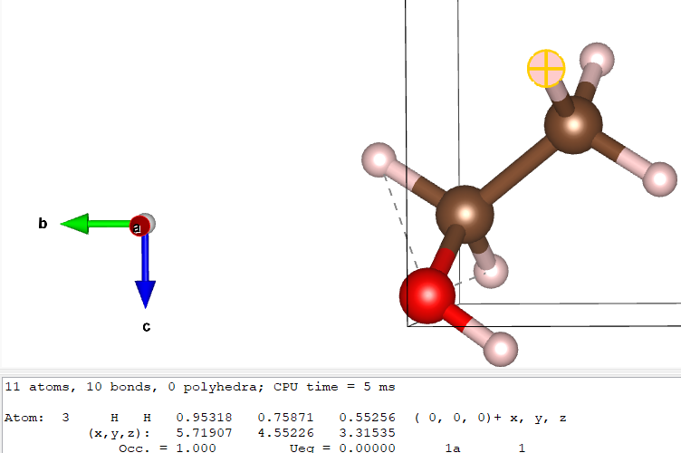
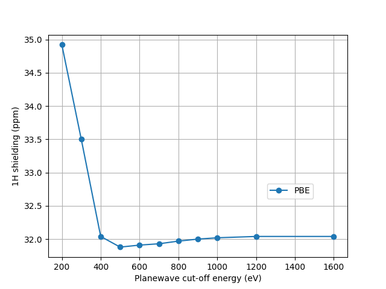

{width="50%"}
<figure style="display: inline-block;">
  <figcaption style="text-align: left;">Fig1. Proton spectrum of ethanol</figcaption>
</figure>


The discovery that one could actually see chemical shifts in hydrogen spectra was made in 1951 at Stanford University by Packard, Arnold, Dharmatti (shown in Fig1.). In this tutorial, we will try to reproduce this result.  


## Getting outputs

This tutorial will go through the calculations for ethanol, using these 2 files:

*ethanol.cell*
```

%BLOCK LATTICE_ABC
6 6 6
90 90 90
%ENDBLOCK LATTICE_ABC

%BLOCK POSITIONS_ABS
H 3.980599 4.178342 3.295079
H 5.033394 3.43043 4.504759
H 5.71907 4.552257 3.315353
H 3.720235 5.329505 5.509909
H 4.412171 6.433572 4.317001
H 5.911611 5.032284 6.242202
C 4.84694 4.350631 3.941136
C 4.603025 5.518738 4.882532
O 5.746254 5.812705 5.6871
%ENDBLOCK POSITIONS_ABS

%BLOCK KPOINTS_LIST
0.25 0.25 0.25 1.0
%ENDBLOCK KPOINTS_LIST
```

*ethanol.param*
```
xcfunctional = PBE
fix_occupancy = true
opt_strate.g.y : speed
task        = magres

cut_off_energy  = 50 ry
```

Look at the [cell](../../documentation/Input_Files/cell_file.md) and [param](../../documentation/Input_Files/param_file.md) files. Note that the only special part of the ***ethanol.param*** file is

`task = magres`

Run a standard castep calculation for ethanol. Look at the ***ethanol.castep*** output file. Towards the end, you should be able to find the isotropic chemical shielding, anisotropy, and asymmetry in a table like this:

 ```
 ====================================================================
 |                      Chemical Shielding Tensor                   |
 |------------------------------------------------------------------|
 |     Nucleus                            Shielding tensor          |
 |  Species            Ion            Iso(ppm)   Aniso(ppm)  Asym   |
 |    H                1               29.45       8.84      0.14   |
 |    H                2               30.10       8.07      0.20   |
 |    H                3               29.94       7.12      0.06   |
 |    H                4               26.83       8.02      0.95   |
 |    H                5               27.24      -7.07      0.90   |
 |    H                6               31.93      13.99      0.46   |
 |    C                1              157.27      33.77      0.70   |
 |    C                2              110.73      69.91      0.42   |
 |    O                1              268.63     -50.78      0.96   |
 ====================================================================

 ```
 Here we are only interested in the isotropic values for the hydrogen ions


You may also find this information (as well as extra detail) in the file ***ethanol.magres***, which contains tables such as
```
============
Atom: H        1
============
H        1 Coordinates      3.981    4.178    3.295   A

TOTAL Shielding Tensor

              30.1276      1.2172      3.7366
               1.9301     27.4802      2.4707
               4.0710      2.2023     30.7511

H        1 Eigenvalue  sigma_xx      26.1030 (ppm)
H        1 Eigenvector sigma_xx       0.3550      0.6810     -0.6405
H        1 Eigenvalue  sigma_yy      26.9119 (ppm)
H        1 Eigenvector sigma_yy       0.6932     -0.6514     -0.3085
H        1 Eigenvalue  sigma_zz      35.3439 (ppm)
H        1 Eigenvector sigma_zz       0.6273      0.3345      0.7033

H        1 Isotropic:       29.4529 (ppm)
H        1 Anisotropy:       8.8365 (ppm)
H        1 Asymmetry:        0.1373
```
for each atom. You can see here that it also gives the same information - the isotropic value for atom 1 is the same (29.45 to 2dp for both). You may note that the isotropic value is the average of the diagonal values in the total shielding tensor, as wall as the average of the diagonal eigenvectors.

You might wish to transfer the ***ethanol.magres*** file back to your desktop to visualise with [MagresView](https://www.ccpnc.ac.uk/magresview/magresview/magres_view.html?JS).

## Analysis

Next we identify which (hydrogen) ion corresponds to which part of the molecule - in the case of ethanol, we find out which ones correspond to CH3~3~ CH~2~ and OH.
This can be done by uploading the cell file to VESTA and clicking each atom.

{width="40%"}

Here you can see that one of the CH~3~ hydrogens is atom 3. If you do the same for all of them, you should find that atoms 1, 2 and 3 are the CH~3~ hydrogens, 4 and 5 are the CH~2~ hyrdogens and 6 is the OH hydrogen.

It is important to check if the results are converged. Running a convergence test plot ranging the
~~~
cut_off_energy = 20
~~~
from 20 to 50 gives the plot

 {width="75%"}


Hence a cut off energy of 50 Ry should indeed be appropriate - it's still relatively fast and should be fairly well-converged.

Next we will note the converged isotropic hydrogen shieldings - in this case we may simply use a cut off energy of 20 since the results are about the same as the more converged 50. We will compare them to experiment. The three methyl (CH~3~) protons undergo fast exchange; they "rotate" faster than the nuclear magnetic moment processes. The magnetic moment will therefore "see" an average chemical shielding. The same is true of the CH~2~ protons.

Then we can average the CH~3~ and CH~2~ chemical shieldings. For example, the CH~2~ hydrogens (atoms 4 and 5) are found in the ***ethanol.castep*** file (shown above) to be 26.83 and 27.24: the average CH~2~ shielding is 27.04. CH~3~, meanwhile, has an average of 29.83. Lastly, the single OH hydrogen has a value of 31.93. We now have 3 unique chemical shieldings (though in your case the values will likely slightly differ)

We now need to convert the chemical shieldings $\sigma_{iso}$; to chemical shifts $\delta_{iso}$ on the experimental scale. We use the relation:  $\delta_{iso}$=$\sigma_{iso}$ - $\sigma$.
A suitable $\sigma_{ref}$ for ^1^H is 30.97ppm.


{width="40%"}

<figure Fig2 style="display: inline-block;">
  <figcaption style="text-align: left;">Fig2. <sup><small>1</small></sup>H NMR spectrum of liquid ethanol</figcaption>
</figure>
 Fig2. shows a modern high-resolution ^1^H spectrum for liquid ethanol. Note that the peaks are split due to J-coupling - the interaction of the ^1^H magnetic moments - but let's ignore that for now. The three peaks are roughly at 1.2ppm, 3.7ppm and 5ppm - in this tutorial the shifts were found to be 1.14 (the CH~3~ shielding), 3.94 (CH~2~) and -0.96 (OH). The OH hydrogen clearly has a very different result while the other 2 roughly agree.
