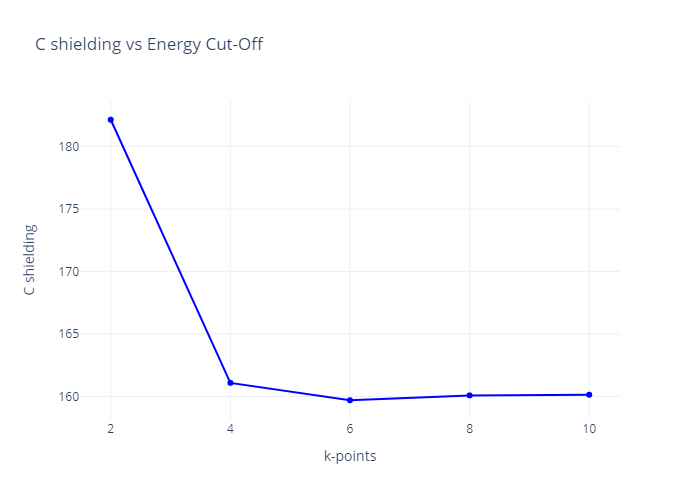

Here we will look more into convergence of chemical shielding calculations, examining what happens as we change the sampling of the Birllouin zone (BZ). We will examine diamond for this purpose.

## Varying k-point grid size

We will use the cell and param files below for our calculations:

*diamond.cell*

```
%block LATTICE_CART
0 1.7 1.7
1.7  0 1.7
1.7 1.7 0
%endblock LATTICE_CART

%block POSITIONS_FRAC
C   0.000000   0.000000   0.000000
C   0.250000   0.250000   0.250000
%endblock POSITIONS_FRAC


kpoints_mp_grid  4 4 4

symmetry_generate
```
*diamond.param*

```
comment         = nmr testing
iprint          = 1
xcfunctional = LDA
task : magres
fix_occupancy = true
opt_strategy : speed
cut_off_energy  =  30 Ry
```
Running castep on these files will lead to the ***diamond.castep*** output file which will contain the table

```
====================================================================
|                      Chemical Shielding Tensor                   |
|------------------------------------------------------------------|
|     Nucleus                            Shielding tensor          |
|  Species            Ion            Iso(ppm)   Aniso(ppm)  Asym   |
|    C                1              164.79      -0.00      N/A    |
|    C                2              164.79      -0.00      N/A    |
====================================================================

```

What we are going to be looking at is isometric shielding tensor of carbon (with both atoms being identical).

While there is nothing particularly special in ***diamond.param***,
!!! note
    We have already done a convergence test of the cut-off energy, which is specified in that file, in [example 1](Example_1-Ethanol.md)


we have specified the k-points in the ***diamond.cell*** file using the keyword

`kpoints_mp_grid 4 4 4`

We will test the convergence of the chemical shielding with varying k-point mesh grid sizes. To do so, we will run castep for a range of k-point meshes (2, 4, 6, 8, 10), and then make a convergence plot of k-point mesh size against  of the chemical shielding of carbon.

  The convergence plot should look like this:


  {width="75%"}

We can see from this that it converges at a k-point grid size of 4, and the converged value is around 160.

## Single k-point test

The computational cost scales linearly with the number of kpoints (i.e. the number of points in the irreducible Brillouin Zone). For a large unit cell (i.e. a small BZ) it may be possible to get converged results using a single k-point, reducing computational cost and increasing speed considerably. But which kpoint should we choose?

For diamond we will look at 3 different k-points (0,0,0), (½,½,½) (¼,¼,¼). First, we delete the line

```
kpoints_mp_grid x x x
```

Then we specify the kpoint we are examining in the ***diamond.cell*** file using
```
%BLOCK KPOINTS_LIST
0 0 0 1.0
%ENDBLOCK KPOINTS_LIST
```
to check (0,0,0) - in my case it resulted in an isometric chemical shielding of about 5798.71 (though, as in previous and future cases, the exact values may be slightly different) Similarly, we can change that block to

```
%BLOCK KPOINTS_LIST
0.5 0.5 0.5 1.0
%ENDBLOCK KPOINTS_LIST
```

to check (½,½,½), which led to 303.21. Lastly,we replace that block with

```
%BLOCK KPOINTS_LIST
0.25 0.25 0.25 1
%ENDBLOCK KPOINTS_LIST
```
to check (¼,¼,¼) - this gave me a value of 164.79, which is by far the closest to the converged value (around 160, as found by the convergence graph).

as the diamond unit cell is rather small the 1 kpoint answer is not too close to converged. However, the observation holds true for all orthorhombic cells
