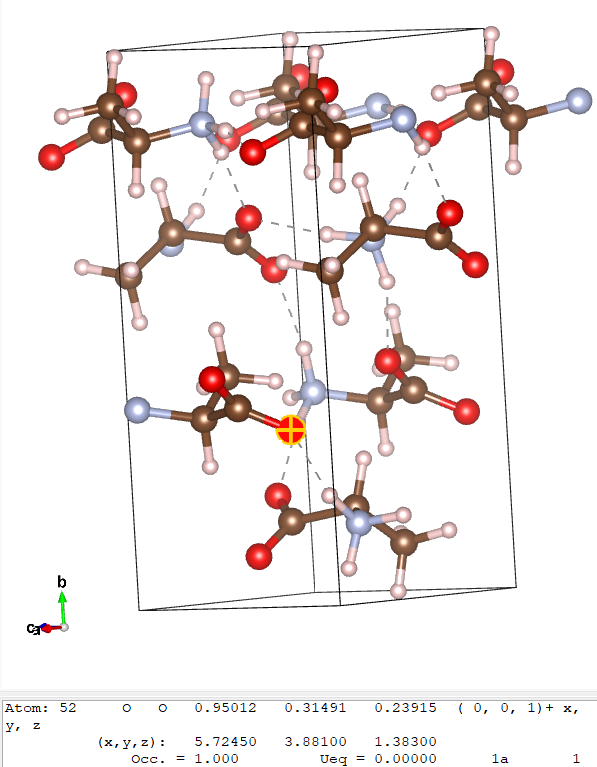
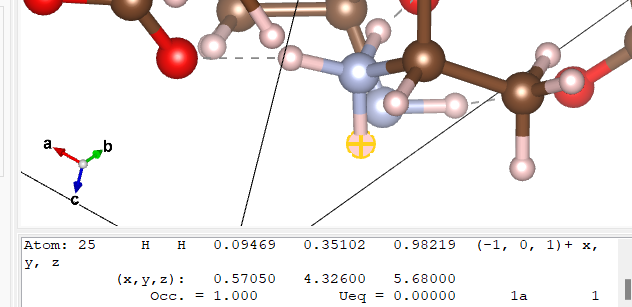

# Examples 3 - Alanine and Silicates</h1>

We now look at some more realistic and complex structures - the amino acid alanine and 2 different silicates: cristoballite and qartz. These are fairly large crystals - to get them
to complete in a short time we will run them on a cluster.
**Use the following number of
CPUs:**

* analine - 4
* cristoballite - 6
* quartz - 13

(these numbers are chosen to give efficient k-point scaling)

We will also perform EFG calculations for the above structures and examine the respective data.

<p style="border-width:3px; border-style:solid;"><i>
<b>Oxygen-17 NMR</b>
<br>
Oxygen is a component of many geological materials. Oxygen is
also important element in organic and biological molecules since it is often intimately involved in hydrogen bonding. Solid State <sup><small>17</small></sup>O NMR should be a uniquely valuable probe as the chemical shift range of <sup><small>17</small></sup>O covers almost 1000 ppm in organic molecules. Furthermore <sup><small>17</small></sup>O has spin I = 5/2 and hence a net quadrupole moment. As a consequence of this the solid state NMR spectrum is strongly affected by the electric
field gradient at the nucleus.

Because the isotopic abundance of <sup><small>17</small></sup>O is very low (0.037%) and the NMR linewidths due to the electric field gradient relatively large, only limited Solid State NMR data is
available. This is particularly true for organic materials. First principles calculations of <sup><small>17</small></sup>O NMR parameters have played a vital role in assigning experimental spectra, and developing empirical rules between NMR  parameters and local atomic structure.</i>
</p>


## Alanine

### Examining input and output
We will use the cell file

[alanine.cell](alanine/alanine.cell)

!!! Note
    Don't worry about how long/complex it is - it is no different from any other [cell file](../../documentation/Input_Files/cell_file.md) - it just simply defines a large cell

and param file ***alanine.param***

```
fix_occupancy = true
opt_strategy : speed
task        = magres
magres_task = nmr
cut_off_energy = 35 ry
xc_functional : PBE
```
Note that the only difference to the [previous](Example_1-Ethanol.md) [files](Example_2-Diamond.md) is the linewidths

```
magres_task = nmr
```

This leads to EFG calculations being performed.

alanine.param](alanine/alanine.param)

You may also want to view the file

[alanine.pdb](alanine/alanine.pdb)

in Materials Studio or another software - this allows better examination of features like hydrogen bonding. This is the original file downloaded from the [Cambridge Crystallographic Database](https://www.ccdc.cam.ac.uk/) (and was used to obtain the ***alanine.cell*** file). The cell structure was obtained experimentally by neutron diffraction.

We will now run castep. The ***alanine.castep*** output file should contain the [table](alanine_table.txt)

This is much like our [previous](Example_1-Ethanol.md) [results](Example_2-Diamond.md), except there are now 2 more columns - $C_Q$ and Eta - these are both because an EFG calculation was now performed.

This result is not fully converged (we will not be testing this in this tutorial, but feel free to check), but the relative shift between some of the sites is converged (again you may verify that if inclined).

### Analysing and comparing to experiment

We will now compare these results with experiment. The figure below is an experimental ^17^O NMR spectrum of L-alanine. It shows 2 peaks, which are very broad due to the quadripolar coupling, and overlap.

{width="40%"}
<figure style="display: inline-block;">
  <figcaption style="text-align: left;">Fig3. Solid-State <sup><small>17</small></sup>O NMR spectrum of L-alanine. (b) is from MAS (magicangle- spinning) (c) is from DOR (double-orientation rotation)</figcaption>
</figure>
 The experimental parameters are given in Table 1 below.

 | | |
 |--|--|
 |$\delta$(A)-$\delta$(B) (ppm)| 23.5|
 |$C_Q$(A) (MHz)| 7.86|
 |$\eta_Q$(A)| 0.28|
 |$C_Q$(B) (MHz)| 6.53|
 |$\eta_Q$(B)| 0.70|
 | **Table 1: Experimental ^17^O NMR parameters for alanine. The two resonances are labeled A and B. Isotropic chemical shift &#948;, quadrupolar coupling C<sub>Q</sub>, and EFG asymmetry $\eta_Q$.**||

From this, we will try to find what A and B are.

To do so, we will look at the ***alanine.castep*** [tensor table table](alanine_table.txt){width="50%"}.

By a quick glance at the table, we see that the the chemical shift of hydrogen ranges from 20-30, carbon around 0, 124 or 159, nitrogen 194 and oxygen 48 or 63. Because of this we can tell that the 2 resonances are going to belong to carbon and oxygen: to get a chemical shift difference of 23.5, oxygen's 48 and a hydrogen (ideally of 24.5) are the only option of coming close to that value.

We see in the oxygen portion of the table

```
===============================================================================
|                Chemical Shielding and Electric Field Gradient Tensors       |
|-----------------------------------------------------------------------------|
|     Nucleus                       Shielding tensor             EFG Tensor   |
|    Species            Ion    Iso(ppm)   Aniso(ppm)  Asym    Cq(MHz)    Eta  |
|    O                  1       48.29     352.85      0.51   7.125E+00   0.25 |
|    O                  2       62.86     255.66      0.71   5.794E+00   0.64 |
|    O                  3       48.29     352.85      0.51   7.125E+00   0.25 |
|    O                  4       62.86     255.66      0.71   5.794E+00   0.64 |
|    O                  5       48.29     352.85      0.51   7.125E+00   0.25 |
|    O                  6       62.86     255.66      0.71   5.794E+00   0.64 |
|    O                  7       48.29     352.85      0.51   7.125E+00   0.25 |
|    O                  8       62.86     255.66      0.71   5.794E+00   0.64 |
===============================================================================

```

 that the chemical shift alternates consistently between 48.29 and 62.86. To examine why this is the case we may look at the ***alinine.cell***  file in Vesta (or the ***alanine.pdb*** file in Materials Studio, or any other option of your choice that shows hydrogen bonding). Similarly to [example 1](Example_1-Ethanol.md), we will examine which atoms correspond to which environment.

 The cell and a purposely highlighted atom are shown below.

 

The oxygens are the red atoms. We see here that there are effectively 2 types of oxygen here - ones with hydrogen bonding (dashed lines joining to a hydrogen(grey atom)) and ones without. Here atom 52 (oxygen ion 8 in the [table](alanine_table.txt); it starts at 44 as there are 44 atoms before it) is selected: this has a chemical shielding value of 62.86, as seen above. When clicking any oxygen with 2 hydrogen bonds it corresponds to an atom number that has a shielding tensor of 62.86, while all the ones with 1 hydrogen bond have a value of 48.29. For this exercise, we have now identified that resonance A comes from a single-hydrogen-bonded oxygen.

There are a lot more hydrogens and thus it is harder to find which specific one A is referring to. Because $\delta$(A) - $\delta$(B) = 23.5, we know that the chemical shielding should have a value of around $48.29 - 23.5 = 24.79$

From the table, we see that the closest value is 24.01, corresponding to atoms 1, 8, 15 and 22. By clicking on hydrogens until one of those is found, we find that

{width="40%"}

all 3 of those hydrogens are bonded to a nitrogen that is also bonded to 2 other hydrogens and a carbon. It is different from the other 2 hydrogens because the oxygen it is hydrogen-bonded to has no other hydrogen bonds: A and B are hydrogen-bonded to each other.

These results are confirmed by the other values provided in the table. To confirm A being oxygen 1 (or 3 or 5... - all the values are identical), $C_Q$ in the [table](alanine_table.txt) is 7.125 compared to the expected 7.86, and $\eta_Q$ is 0.25 compared to the expected 0.28. However, this is not the case for hydrogen - a $C_Q$ of 6.53 and an $\eta_Q$ of 0.7 are expected, but the castep results are 0.21 and 0.06 respectively.

# Silicates - Quartz and Cristoballite

## Files

* [quartz.cell](silicates/quartz.cell)
* [quartz.param](silicates/quartz.param)
* [crist.cell](silicates/crist.cell)
* [crist.param](silicates/crist.param)


## Objectives

1. Compute the chemical shift and Electric field gradient for two silicates.
2. Assign the ^17^O NMR spectrum

## Instructions

1. The ^17^O parameters for two silicates are reported in Table 2. From the values you compute can you tell which one is quartz? (a suitable &#963;<sub>ref</sub> is 263ppm)


| | $\delta$ (ppm) | $C_Q$ (MHz) | $\eta_Q$ |
|---|---|---|---|
|Material A| 37.2 | 5.21 | 0.13 |
|Material B| 40.8 | 5.19 | 0.19 |
| **Table 2: Experimental ^17^O NMR parameters for two silicates. Isotropic chemical shift $\delta$ , quadrupolar coupling $C_Q$, and EFG asymmetry $\eta_Q$.** |
