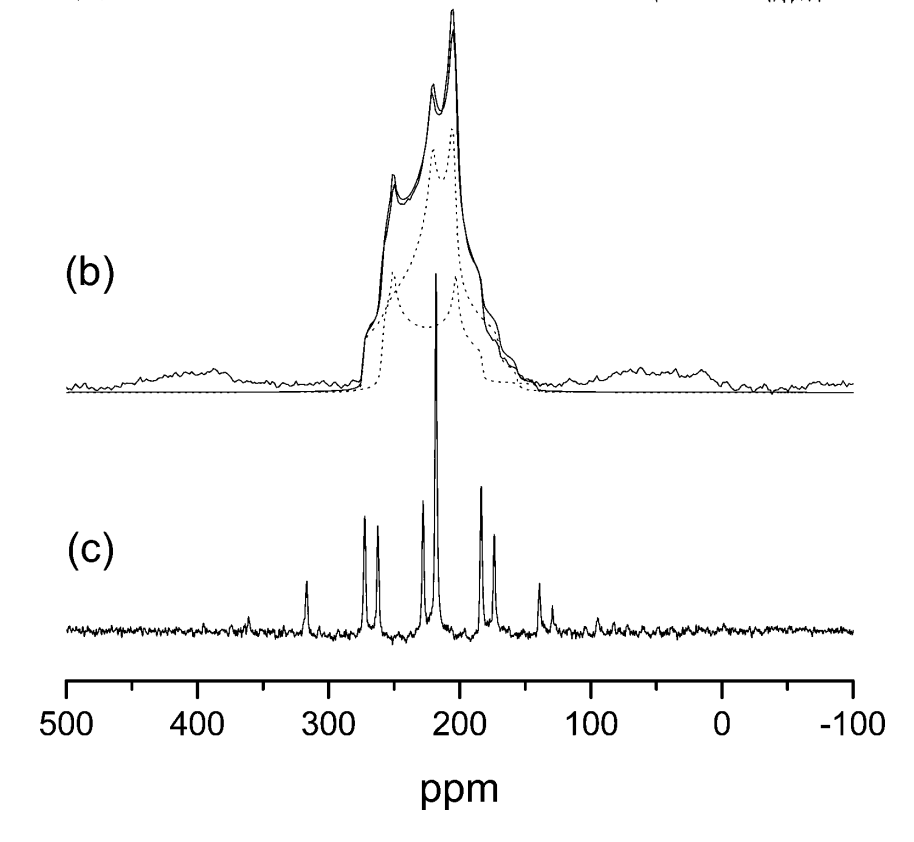

# Examples 3 - Alanine and Silicates</h1>

We now look at some more realistic and complex structures - the amino acid alanine and 2 different silicates: cristoballite and qartz. These are fairly large crystals - to get them
to complete in a short time we will run them on a cluster.
**Use the following number of
CPUs:**

* analine - 4
* cristoballite - 6
* quartz - 13

(these numbers are chosen to give efficient k-point scaling)

We will also perform EFG calculations for the above structures and examine the respective data.

<p style="border-width:3px; border-style:solid;"><i>
<b>Oxygen-17 NMR</b>
<br>
Oxygen is a component of many geological materials. Oxygen is
also important element in organic and biological molecules since it is often intimately involved in hydrogen bonding. Solid State <sup><small>17</small></sup>O NMR should be a uniquely valuable probe as the chemical shift range of <sup><small>17</small></sup>O covers almost 1000 ppm in organic molecules. Furthermore <sup><small>17</small></sup>O has spin I = 5/2 and hence a net quadrupole moment. As a consequence of this the solid state NMR spectrum is strongly affected by the electric
field gradient at the nucleus.

Because the isotopic abundance of <sup><small>17</small></sup>O is very low (0.037%) and the NMR linewidths due to the electric field gradient relatively large, only limited Solid State NMR data is
available. This is particularly true for organic materials. First principles calculations of <sup><small>17</small></sup>O NMR parameters have played a vital role in assigning experimental spectra, and developing empirical rules between NMR  parameters and local atomic structure.</i>
</p>


## Alanine
We will use the cell file

[alanine.cell](alanine/alanine.cell)

!!! Note
    Don't worry about how long/complex it is - it is no different from any other [cell file](../../documentation/Input_Files/cell_file.md) - it just simply defines a large cell

and param file ***alanine.param***

```
fix_occupancy = true
opt_strategy : speed
task        = magres
magres_task = nmr
cut_off_energy = 35 ry
xc_functional : PBE
```
Note that the only difference to the [previous](Example_1-Ethanol.md) [files](Example_2-Diamond.md) is the linewidths

```
magres_task = nmr
```

This leads to EFG calculations being performed.

alanine.param](alanine/alanine.param)

You may also want to view the file

[alanine.pdb](alanine/alanine.pdb)

in Materials Studio or another software - this allows better examination of features like hydrogen bonding. This is the original file downloaded from the [Cambridge Crystallographic Database](https://www.ccdc.cam.ac.uk/) (and was used to obtain the ***alanine.cell*** file). The cell structure was obtained experimentally by neutron diffraction.

We will now run castep. The ***alanine.castep*** output file should contain the [table](alanine_table.txt)

This is much like our [previous](Example_1-Ethanol.md) [results](Example_2-Diamond.md), except there are now 2 more columns - $C_Q$ and Eta - these are both because an EFG calculation was now performed.

This result is not fully converged (we will not be testing this in this tutorial, but feel free to check), but the relative shift between some of the sites is converged (again you may verify that if inclined).

We will now compare these results with experiment. The figure below is an experimental ^17^O NMR spectrum of L-alanine. It shows 2 peaks, which are very broad due to the quadripolar coupling, and overlap.

{width="40%"}
<figure style="display: inline-block;">
  <figcaption style="text-align: left;">Fig3. Solid-State <sup><small>17</small></sup>O NMR spectrum of L-alanine. (b) is from MAS (magicangle- spinning) (c) is from DOR (double-orientation rotation)</figcaption>
</figure>
 The experimental parameters are given in Table 1 below.

 | | |
 |--|--|
 |$\delta$(A)-$\delta$(B) (ppm)| 23.5|
 |$C_Q$(A) (MHz)| 7.86|
 |$\eta_Q$(A)| 0.28|
 |$C_Q$(B) (MHz)| 6.53|
 |$\eta_Q$(B)| 0.70|
 | **Table 1: Experimental ^17^O NMR parameters for alanine. The two resonances are labeled A and B. Isotropic chemical shift &#948;, quadrupolar coupling C<sub>Q</sub>, and EFG asymmetry $\eta_Q$.**||

Assign the two resonances A and B. Do all three computed parameters support this assignment?

# Silicates - Quartz and Cristoballite

## Files

* [quartz.cell](silicates/quartz.cell)
* [quartz.param](silicates/quartz.param)
* [crist.cell](silicates/crist.cell)
* [crist.param](silicates/crist.param)


## Objectives

1. Compute the chemical shift and Electric field gradient for two silicates.
2. Assign the ^17^O NMR spectrum

## Instructions

1. The ^17^O parameters for two silicates are reported in Table 2. From the values you compute can you tell which one is quartz? (a suitable &#963;<sub>ref</sub> is 263ppm)


| | $\delta$ (ppm) | $C_Q$ (MHz) | $\eta_Q$ |
|---|---|---|---|
|Material A| 37.2 | 5.21 | 0.13 |
|Material B| 40.8 | 5.19 | 0.19 |
| **Table 2: Experimental ^17^O NMR parameters for two silicates. Isotropic chemical shift $\delta$ , quadrupolar coupling $C_Q$, and EFG asymmetry $\eta_Q$.** |
