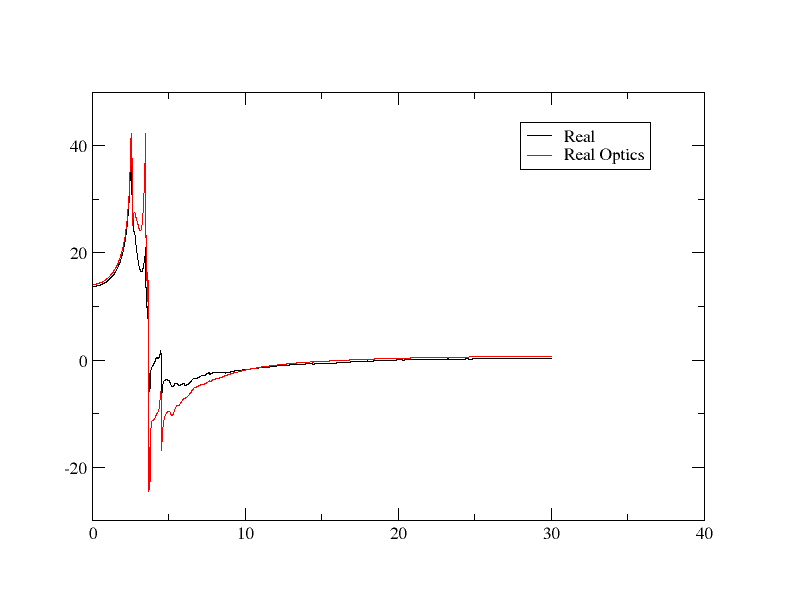
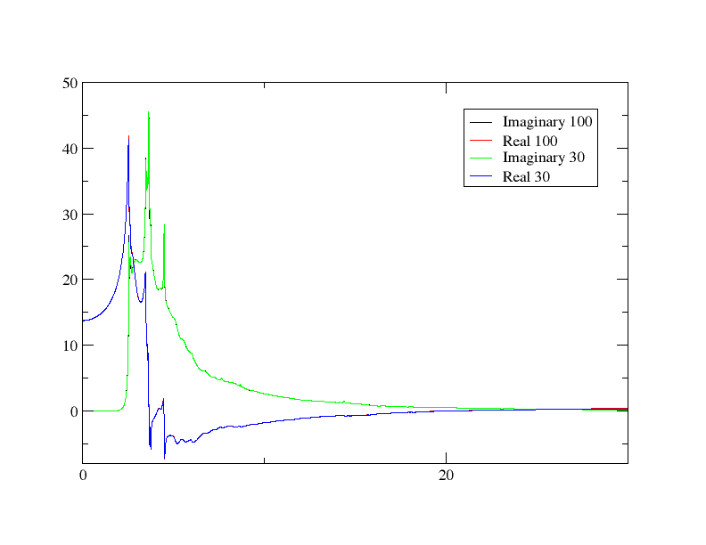
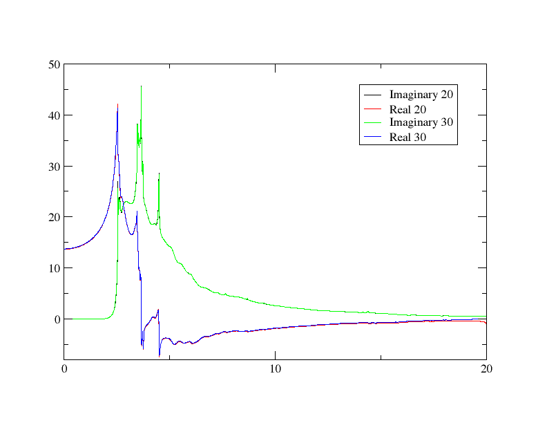
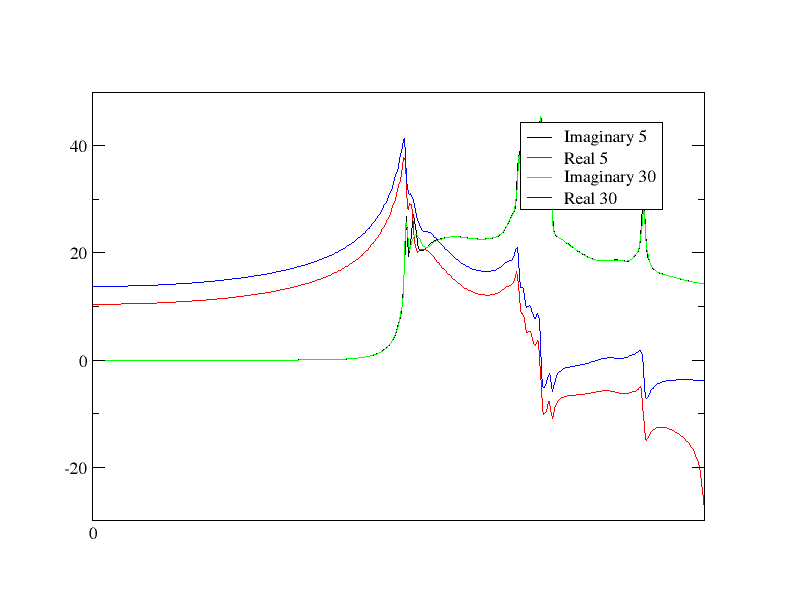

# JDOS

The JDOS (Joint Density of States) is effectively the density of states for an energy range which is equal to the difference between conduction and valence bands - this leads to being able to calculate the probability of an excitation occurring for a given photon energy. One can intuitively understand how this leads to the calculation of optical properties: photons that have energies that correspond to gaps between conduction and valence bands will interact with the material and give rise to its optical properties.

In this tutorial, we will calculate the JDOS for silicon, and then relate that to the imaginary and real part of the dielectric function.

## JDOS Calculation

Let's start by actually getting the JDOS results. Run Castep on the `cell` file

*Si.cell*
```
%BLOCK LATTICE_CART
2.73  2.73 0.00
2.73  0.00 2.73
0.00  2.73 2.73
%ENDBLOCK  LATTICE_CART

%BLOCK POSITIONS_FRAC
Si 0.0     0.0     0.0
Si 0.25    0.25    0.25
%ENDBLOCK POSITIONS_FRAC

SYMMETRY_GENERATE

KPOINTS_MP_GRID 10 10 10  
SPECTRAL_KPOINTS_MP_GRID 10 10 10
```

and `param` file

*Si.param*
```
TASK                   : SPECTRAL
SPECTRAL_TASK          : DOS
PDOS_CALCULATE_WEIGHTS : TRUE
CUT_OFF_ENERGY         : 200
```

Afterwards, run Optados with the Optados input file

*Si.odi*
```
TASK              : jdos

JDOS_MAX_ENERGY   : 30
JDOS_SPACING      : 0.01
EFERMI            : optados
DOS_SPACING       : 0.1
BROADENING        : adaptive # Default
ADAPTIVE_SMEARING : 0.4      # Default
FIXED_SMEARING    : 0.3      # Default
SET_EFERMI_ZERO : true       # Default
NUMERICAL_INTDOS      : false  # Default
FINITE_BIN_CORRECTION : true  # Default
```

The line `TASK : jdos` is what tells it to calculate the JDOS in which we are interested. This will generate the file `Si.jadaptive.dat` (as well as the accompanying `agr` file). The `dat` file data table should start like this

```
0.0000000000000E+00    0.3375085335870E-14
0.1000333444481E-01    0.3869643667676E-14
```

The 1st column is the energy, and the 2nd is the JDOS. The `agr` file allows us to make a nice plot with xmgrace (though  of course you could plot the results with your software of choice) - let's run

`xmgrace Si.jadaptive.agr`

 The result should look like this:

 {width="50%"}

## Imaginary Dielectric

Now that we have the results, let's examine how they are used to get the dielectric function. You may immediately notice that the shape of the graph above is completely different from either component of the dielectric function. We will need to process the results for them to be meaningful.

We will start processing the data by using the Python script

```py
energies = []
imaginaries = []

input_file = 'Si.jadaptive.dat'
output_file = 'imaginary.dat'
new_lines = []
with open(input_file, 'r') as infile:
    for line in infile:
        if "#" in line:
            continue
        parts = line.split()
        if len(parts) == 2:
            energy = float(parts[0])
            jdos = float(parts[1])
            energies.append(energy)
            if jdos == 0.0 or energy == 0:
                eps2 = 0
            else:
                eps2 = (jdos/energy**2)
            imaginaries.append(eps2)
            new_line = f"{energy} {jdos} {test}\n"
            new_lines.append(new_line)

with open(output_file, 'w') as outfile:
    outfile.writelines(new_lines)

```
This creates a new file `imaginary.dat` that contains the energy, JDOS and our first approximation of the imaginary dielectric function in the 3rd column. This is approximated by the relationship

 $\epsilon_2 \propto \frac{\text{JDOS}}{\omega^2}$

 which was implemented in the line

```py
eps2 = (jdos/energy**2)
```

We can plot this `dat` file by using xmgrace on the batch script

*plot.bat*
```
READ BLOCK "imaginary.dat"
BLOCK XY "1:3"
```

to get just the imaginary output. The graph should look like this:

{width="50%"}

We're starting to see a bit of a resemblance to the imaginary component of the imaginary dielectric function, but it still clearly has room for improvement - the calculation is performed by multiplying what we found by a matrix element, which in this case we are assuming to be constant with energy - which is not the case in reality. We can improve the approximation by using the relationship

$\epsilon_2 \propto \frac{1}{m^*}$

This is a hard thing to implement properly; the effective mass is very difficult to get, depends on position in k-space etc. However, we can simply this with the approximation that, near the band edges, the effective mass is directly proportional to the energy.

!!! note
    This does have some mathematical merit - if you wish to see where this comes from, have a look at [this paper](https://arxiv.org/abs/1207.4282)

Let's change the line where `eps2` is calculated in the Python script to

```py
eps2 = (dos/energy**3)
```

Re-running the same procedure now yields the graph:

{width="50%"}

At a glance, you can see that it levels off much more quickly - just as it happens in the more-properly calculated dielectric function.

To confirm that the results are reasonable, let's plot this together with the results from an actual Optados optics calculation. You can see how to obtain this data at the start of the [optics tutorial](Optics.md), or you can download the relevant `dat` file [here](Si_epsilon.dat). Because we have gotten the results using simple proportionality relations, we'll have to scale the results to make them match experiment - adjust the Python script by changing the `eps2` calculation line to

```
eps2 = (dos/energy**3) * 650
```

650 was found by trial and error to give a reasonable match - again this is simply estimating the constant of proportionality that has been ignored throughout this approximation. You can use the batch file

```
READ BLOCK "Si_epsilon.dat"

BLOCK XY "1:3"
S0 LEGEND "Optics Calculated"

READ BLOCK "imaginary.dat"

BLOCK XY "1:3"
S1 LEGEND "JDOS Approximated"
```

to plot it with xmgrace. You can see that they are fairly similar in the graph produced:


## Real Dielectric

We have seen how the JDOS is used to calculate the imaginary dielectric function, and now we will look at how the real component is calculated. The real component is actually calculated only using the imaginary component, using the Kramers-Kroniger relations - and we will demonstrate that.

The equation we will use is

$\epsilon_1(\omega) = 1 + \frac{2}{\pi} \mathcal{P} \int_{0}^{\infty} \frac{\omega' \epsilon_2(\omega')}{\omega'^2 - \omega^2} \, d\omega'$

We'll ignore the constants of proportionality again and just adjust the results. Adding this block of code to the previous Python script

```py
import numpy as np
energies_arr = np.array(energies)
eps2_arr = np.array(imaginaries)

def kramers():
    eps1_arr = []
    for i, e in enumerate(energies_arr):
        real = 0
        sub = (energies_arr**2)-(e**2)
        sub[i] = np.inf

        integrand = (energies_arr * eps2_arr)/sub
        real = 1 + 0.6(np.trapz(integrand, energies_arr))
        eps1_arr.append(real)
    return eps1_arr
eps1_arr = kramers()
data = np.column_stack((energies_arr, eps2_arr, eps1_arr))
np.savetxt("both.dat", data)
```

The implementation is fairly straightforward: for every energy: the integral as in the equation is simply performed for every energy. While adding 1 to the integral is specified in the equation, again the constant of proportionality was found by trial and error until it was a decent fit (and the imaginary part was already scaled the same way).

The data is then saved in `both.dat` with the 1st column being energy, the 2nd imaginary dielectric and the 3rd real dielectric. Let's now compare the imaginary components using xmgrace. Adjust the batch file appropriately, and you should get a graph that looks like:



Now we have demonstrated how both parts of the dielectric are related to the JDOS.

## Sampling Parameters

We will now have a look at the effect of increasing and decreasing the `JDOS_MAX_ENERGY` and `JDOS_SPACING` parameters. `JDOS_MAX_ENERGY` determines the highest energy band that is examined, while `JDOS_SPACING` determines how frequently the results are sampled. We will perform exactly the same procedure as above (including calculating the real and imaginary dielectric - this is the crucial part). It is recommended that you do these calculations in new directories to make it easier to compare results.

### Maximum Energy

Let's first look at increasing and decreasing the maximum energy. We'll start off by increasing it to 100eV. Run the full procedure as above (ending up with `both.dat` in the new directory), except with the `odi` file having the line

`JDOS_MAX_ENERGY   : 100`

instead of 30. In this case, it is most useful to compare with the result we got from the 30eV maximum energy - plot them both on the same graph. This is what was obtained using an appropriate batch file:

{width="40%"}

We see that the overlap is virtually perfect: sampling beyond 30eV does not improve any results. This indicates that all contributing bands have an energy of 30eV or lower.

Let's now try lowering the maximum energy. If we try 20eV and plotting it together with the 30eV result the same way we see this:

{width="70%"}

Now the overlap is no longer perfect: especially towards the end, the real part is becoming increasingly different. Feel free to try different lower energies - you should notice that the lower the maximum energy, the more different the real part becomes, while the imaginary component is unchanging. The example below is for very low 5eV:

{width="50%"}

This shows us that the imaginary component is calculated independently for each energy, but, because the real component is calculated by integrating over all energies, the imaginary component becomes increasingly incorrect as the integral becomes performed not over the full relevant range.

* Check the effect of changing the sampling by increasing and decreasing the value of `JDOS_SPACING` in the `Si2.odi` file.
