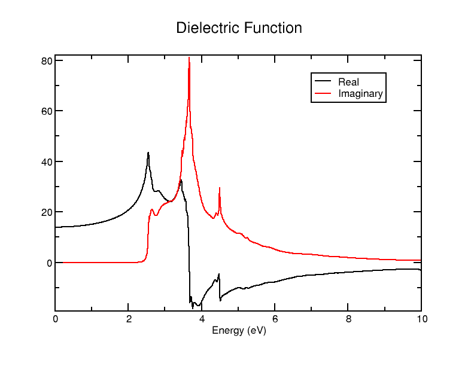
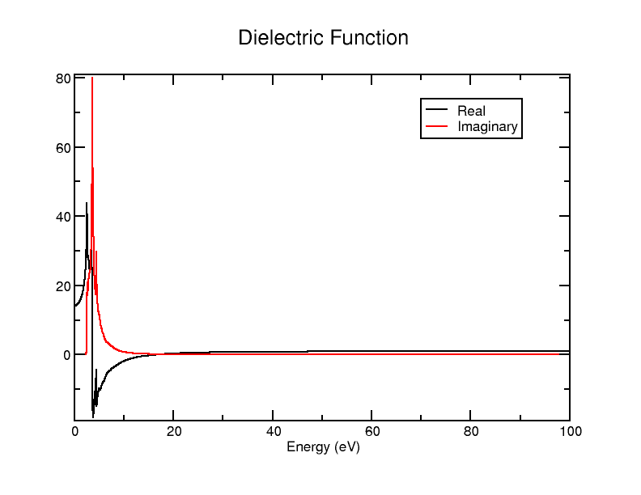
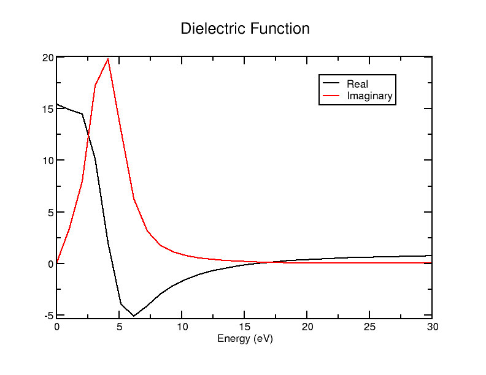
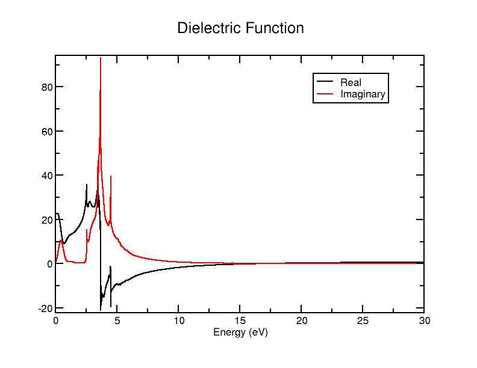
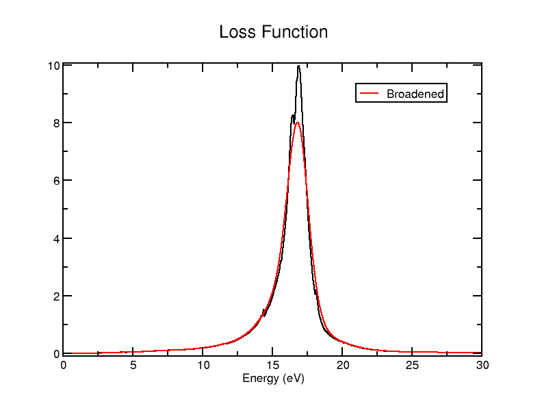

### Optics

In this tutorial, we will use Optados to examine the optical properties of silicon and aluminium.

## Silicon Properties

For Silicon, we will use the input `cell` file

*Si.cell*
```
%BLOCK LATTICE_CART
2.73  2.73 0.00
2.73  0.00 2.73
0.00  2.73 2.73
%ENDBLOCK  LATTICE_CART

%BLOCK POSITIONS_FRAC
Si 0.0     0.0     0.0
Si 0.25    0.25    0.25
%ENDBLOCK POSITIONS_FRAC

SYMMETRY_GENERATE

KPOINTS_MP_GRID 10 10 10  
SPECTRAL_KPOINTS_MP_GRID 14 14 14
```

and the `param` file

*Si.param*
```
TASK                   : SPECTRAL
SPECTRAL_TASK          : OPTICS
CUT_OFF_ENERGY         : 200
IPRINT                 : 2

```
Run Castep as usual. When it is done, run Optados on Si with the Optados input file

<a id="odi"></a>
*Si.odi*
```
# Choose the task to perform
TASK               : optics

# Sample the JDOS at 0.01 eV intervals
JDOS_SPACING       : 0.01

# Calculate the JDOS up to 60eV about the valence band maximum
JDOS_MAX_ENERGY    : 30

# Recalculate the Fermi energy using the new DOS
# (discasrd the CASTEP efermi)
EFERMI             : optados

# Since we're recalculating the Fermi energy we do
# a DOS calculation first.
# Sample the DOS at 0.1 eV intervals
DOS_SPACING        : 0.1

# The broadening used, (also try linear, or fixed)
BROADENING         : adaptive # Default

# The broadening parameter, A, when using adaptive smearing,
# set by eye to be similar to the linear smearing method
ADAPTIVE_SMEARING  : 0.4     # Default

# Specify the geometry to be used in the optics calculation
OPTICS_GEOM        : polycrystalline     # Default

# Include additional broadening for the loss function
OPTICS_LOSSFN_BROADENING : 0.0    # Default

```

After running Optados, we get several output `.dat` and `.agr` files. We will now examine them.

### Epsilon.dat

First let's look at the file containing the (polycrystalline) dielectric function - `Si_epsilon.dat`. The contents of the file look like

```
0.0000000000000000        14.107263205387552        0.0000000000000000     
1.0003334444814937E-002   14.107363765236455        0.0000000000000000     
2.0006668889629875E-002   14.107665455817445        0.0000000000000000     
3.0010003334444812E-002   14.108168310237140        0.0000000000000000    
```

The 1st column corresponds to the energy (of the photon interacting with it), the 2nd is the real component of the dielectric function, and the 3rd is the imaginary component.

The header also contains the results of the sum rule $\int_0^{\omega'} \textrm{Im} \epsilon(\omega) \mathrm{d}\omega = N_\textrm{eff}(\omega')$

`# Result of sum rule: Neff(E) =     7.0939380864459736`

Where $N_\textrm{eff}$ is the effective number of electrons contributing to the absorption process, and is a function of energy.

Let's plot it using xmgrace. Although you could plot the `dat` file (after configuring a bit to get it to plot everything properly), but luckily Optados has also generated an equivalent `agr` file that contains the same data, but also formats the xmgrace graph nicely. So let's use

`xmgrace Si_epsilon.agr`

and get an output looking like

<a id="dielectric_plot"></a>
{width="60%"}

This is a very neat result: it looks just like what you'd expect from the [Debye equations](https://en.wikipedia.org/wiki/Dielectric#Debye_relaxation)

This file gives us all the data necessary for the calculation of any optical property of the cell examined. As we will see in the remainder of the tutorial, it is the basis of the generation of all the other files.

### Absorption

Next let's look at the absorption data. The `dat` file is very similar, this time with 2 columns: the 1st is the energy of the photon, and the 2nd is the absorption coefficient. It doesn't look particularly different, but if you wish to check, the data table should start like

```
0.0000000000000000        0.0000000000000000     
1.0020040080160320E-002   0.0000000000000000  
```

You can plot it with xmgrace the same way as before (again the `agr` file is prepared by Optados). It should look like this

<a id="absorption_graph"></a>
{width="40%"}

Let's examine how this is calculated. The absorption coefficient is calculated as

$$
\alpha(\omega) = \frac{2 \omega \kappa(\omega)}{c}
$$

Where $\omega$ is the energy divided by $\hbar$, $\kappa$ is the imaginary refractive index and $c$ is the speed of light. $\kappa$ can be easily obtained from the real and imaginary dielectric functions, knowing that the complex refractive index is the square root of the complex dielectric function - this leads to the equation

$$
\kappa(\omega) = \sqrt{\frac{1}{2} \left[ \sqrt{\epsilon_1(\omega)^2 + \epsilon_2(\omega)^2} - \epsilon_1(\omega) \right]}
$$

To check that this is really what's going on in the absorption calculation, we can use the Python script

```python
import numpy as np
c = 3e8  
hbar = 6.582119569e-16  
def calculate_property(energy, epsilon_1, epsilon_2):
    omega = energy / hbar  
    kappa = np.sqrt(0.5 * (-epsilon_1 + np.sqrt(epsilon_1**2 + epsilon_2**2)))
    alpha = (2 * omega * kappa) / c  
    return alpha
data = np.loadtxt('Si2_OPTICS_epsilon.dat')

energy = data[:, 0]  
epsilon_1 = data[:, 1]
epsilon_2 = data[:, 2]  
result = calculate_property_coefficient(energy, epsilon_1, epsilon_2)
output_data = np.column_stack((energy, result))
np.savetxt('predicted_abs.dat', output_data, fmt='%e', delimiter=' ')
```

If plot this together with `Si_absorption.dat`, you should get an identical result to [above](Optics.md#absorption_graph).

For the next properties we will calculate, we will also see where they come from using an almost identical Python script: simply change the `calculate_property` function.

<a id="refractive_index"></a>
### Refractive Index

Next we will look at the (real and imaginary) refractive index. This data is found in the `Si_refractive_index.dat` (and `.agr`) files. The file is similar to the previous, this time having 3 columns again - the 1st is energy, the 2nd is the real refractive index and the 3rd is the imaginary refractive index. We have already looked at how to calculate the imaginary refractive index [above](Optics.md#Absorption) (multiply it by some constants and you have the absorption coefficient). The calculation of the real refractive index is very similar, instead becoming

$$
n(\omega) = \sqrt{\frac{1}{2} \left[ \sqrt{\epsilon_1(\omega)^2 + \epsilon_2(\omega)^2} + \epsilon_1(\omega) \right]}
$$

and the accompanying Python script to verify if this is right is also very similar: the function becomes

```python
def calculate_property(energy, epsilon_1, epsilon_2):
    omega = energy / hbar  # Convert energy (eV) to angular frequency (rad/s)
    kappa = np.sqrt(0.5 * (epsilon_1 + np.sqrt(epsilon_1**2 + epsilon_2**2)))
    alpha = (2 * omega * kappa) / c  # Absorption coefficient (1/m)
    return alpha
```
If you're not interested in the Python output, just plot the `Si_refractive_index.agr` file using xmgrace, but if you wish to plot them together it is easiest to use

<a id="batch"></a>
`xmgrace -batch double.bat`

on the batch file

*double.bat*
```
READ BLOCK "predicted_refractive_indices.dat"
BLOCK XY "1:2"
S0 LEGEND "Predicted real"
BLOCK XY "1:3"
S1 LEGEND "Predicted imaginary"

READ BLOCK "Si2_OPTICS_refractive_index.dat"
BLOCK XY "1:2"
S2 LEGEND "Optados real"
BLOCK XY "1:3"
S3 LEGEND "Optados imaginary"

LEGEND 0.9, 0.9
```
This gives a graph that looks like this:

{width="40%"}

Once again, the values derived from the dielectric function dataset are identical, so they overlap - confirming for us how the properties are calculated. You may note that the imaginary refractive index's shape is [identical to that of the absorption](Optics.md#absorption_graph) - as we've seen, it's just that multiplied by a constant.

## Reflectivity

Next we will look at the reflectivity. This can be found in `Si_reflection.dat` (and `.agr` again). The 1st column represents the energy, as usual, while the 2nd is the corresponding reflection coefficient. The reflectivity is calculated using the [Fresnel equations](https://en.wikipedia.org/wiki/Fresnel_equations), using normal incidence and assuming the incoming light ray is coming out of air/vacuum (real and imaginary refractive index n~1~ and n~2~ of the first medium = 1). The imaginary component was also neglected. Under these conditions, the equation for reflectivity becomes

$$
R = \left( \frac{\tilde{n} - 1}{\tilde{n} + 1} \right)^2
$$

Where $\tilde{n}$ is the complex refractive index (real + imaginary part). We can implement this in the Python script more easily by separating it into functions to find the refractive indices (like we did [before](Optics.md#refractive_index)), and then use that to find the reflectivity.

```python
def calculate_refractive_indices(epsilon_1, epsilon_2):
    n = np.sqrt((epsilon_1 + np.sqrt(epsilon_1**2 + epsilon_2**2)) / 2)
    kappa = np.sqrt((-epsilon_1 + np.sqrt(epsilon_1**2 + epsilon_2**2)) / 2)
    return n, kappa
def calculate_property(n, kappa):
    n_complex = n + 1j * kappa
    reflectivity = np.abs((n_complex - 1) / (n_complex + 1))**2
    return reflectivity
```

Once again, we plot the output file of the script along with the `.dat` file and see that they're identical:

{width="40%"}

If you are interested, you could change the Fresnel equation used and appropriately adjust the script to include the imaginary part, see how it behaves coming from a different medium, different angle etc. - there is a lot you could look at in terms of reflectivity.

### Conductivity

Next we will look the optical conductivity of silicon in `Si_conductivity.dat`. The 1st column is the energy, while the 2nd and 3rd columns are the real and imaginary parts of conductivity, both in the SI units Siemens per meter. The complex optical conductivity can be found by [approximating in the high frequency limit](https://en.wikipedia.org/wiki/Optical_conductivity#High_frequency_limit) and rearranging the equation to:


$\sigma_1(\omega) = \epsilon_0 \omega \epsilon_2(\omega)$

$\sigma_2(\omega) = -\epsilon_0 \omega (\epsilon_1(\omega) - \epsilon_\infty)$

where $\sigma_1$ is the real part and $\sigma_2$ is the imaginary. As usual $\epsilon_1$ corresponds to the real dielectric and $\epsilon_2$ to the imaginary. In this calculation, $\epsilon_\infty$ is approximated as 1. This can be implemented in our Python script as

```python
def calculate_conductivity(epsilon_1, epsilon_2, energy):
    omega = energy / hbar  
    sigma_1 = epsilon_0 * omega * epsilon_2  
    sigma_2 = -epsilon_0 * omega * (epsilon_1 - epsilon_inf)
    return sigma_1, sigma_2

```

As in previous cases, make sure all constants are defined and any file/variable names adjusted as you implement it.

Since there are 3 columns, it is easier to plot them together - we can simply repurpose our [previous batch file](Optics.md#batch) - just make sure to change file names as appropriate. The output should look like:

{width="40%"}

### Loss Function

Lastly, we will examine the loss function in `Si_loss_fn.dat`. The 1st column is the energy, while the 2nd is the loss function for that energy. The header of the file shows the results of the two sum rules associated with the loss function:

$\int_0^{\omega'} \textrm{Im} -\frac{1}{\epsilon(\omega)}\omega \mathrm{d}\omega = N_\textrm{eff}$

and

$\int_0^{\omega'} \textrm{Im} -\frac{1}{\epsilon(\omega)}\frac{1}{\omega} \mathrm{d}\omega = \frac{\pi}{2}$

The loss function itself is calculated rather simply from the dielectric: it is simply the imaginary component of the inverse of the complex dielectric:

$\text{Loss}(\omega) = \text{Im}\left(\frac{1}{\epsilon(\omega)}\right)$

This leads to

$\text{Loss}(\omega) = \frac{\epsilon_2(\omega)}{\epsilon_1(\omega)^2 + \epsilon_2(\omega)^2}$

Let's implement this into our Python script by changing the function to

```python
def calculate_property(epsilon_1, epsilon_2):
    loss_function = epsilon_2 / (epsilon_1**2 + epsilon_2**2)
    return loss_function
```

Plotting it together with `Si_loss_fn.dat` on xmgrace gives us the graph

<a id="loss_graph"></a>
{width="40%"}

## Changing Parameters

Now that we know what Optados optics does and how it works, let's try changing some parameters in the [Optados input file](Optics.md#odi) `Si.odi`, and re-running Optados, to see what effects it has.

### JDOS Parameters

First let's have a look at the effect of changing the line `JDOS_MAX_ENERGY : 30`. We'll set it to 10 and 100 and plot `Si_epsilon.agr` using xmgrace. Doing it for 10 gives the graph

{width="30%"}

while 100 gives us

{width="30%"}

You can also compare with the result for [30](Optics.md#dielectric_plot). What you should notice is that all the plots are the same - what this does is change the maximum energy it calculates the optical properties up to. The graphs aren't particularly interesting (you could do a higher max energy calculation and just set `WORLD XMAX 10` to see it up to 10eV for example), but it does affect the results of the sum rules - which are in headers and thus not seen in graphs. Let's try seeing the results for `JDOS_MAX_ENERGY : ` 2, 5, 10, 30 and 100.

In `Si_epsilon.dat` the sum rule results for the different max energies should be around as follows:

| JDOS Max E | Sum Rule Result |
|------------|-----------------|
| 2          | 1.58E-6         |
| 5          | 4.40            |
| 10         | 6.42            |
| 30         | 7.09            |
| 100        | 7.11            |

This tells us that at 2eV barely any electrons contribute to the absorption process, at 5eV over half do, and beyond that slowly increasing amounts do. Most electrons seem to act for energies between 2 and 30eV.

Meanwhile, the results of the 1st and 2nd sum rules in `Si_loss_fn` look rather different:

| JDOS Max E | Sum Rule 1 | Sum Rule 2 |
|------------|------------|------------|
| 2          | 1.58E-6    | 2.18E-5    |
| 5          | 4.25E-3    | 1.54E-2    |
| 10         | 7.07E-2    | 7.58E-2    |
| 30         | 7.08       | 1.46       |
| 100        | 7.10       | 1.46       |

Here the 1st rule seems to shoot up much more drastically and in a different region (between 10 and 30eV), while the 2nd tends towards a different value, and again shoots up faster and in the same region.

Now we'll take a look at the effects of changing the `JDOS_SPACING` value. Let's change `JDOS_SPACING : 0.01` to 1 and 0.001. We'll do this for `JDOS_MAX_ENERGY : 30`.

For 1 the graph looks like

{width="40%"}

while for 0.001 it looks like

{width="40%"}

As we see here, changing `JDOS_SPACING` simply affects the frequency of the sampling: the smaller the value, the smaller the energy intervals at which it examines the dielectric function and thus the smoother the curve. You may note that the graphs look the same as the when we first did it with the default 0.01 [above](Optics.md#dielectric_plot) - 0.01 is sufficient, and increasing the sampling frequency gives us virtually the same results but slower. This is reflected in the sum rule calculations - the higher the spacing, the more rough of an estimate they are, and that typically leads to them being larger, with it not getting much more accurate being 0.01.

| JDOS Spacing | Epsilon Sum | Loss Sum 1 | Loss Sum 2 |
|--------------|-------------|------------|------------|
| 0.001        | 6.73        | 6.72       | 1.50       |
| 0.01         | 6.74        | 6.73       | 1.50       |
| 1            | 8.28        | 7.22       | 1.39       |

### Loss Function Broadening

Additional broadening can be included in the calculation of the loss function.  This is done by setting the keyword `optics_lossfn_broadening` in the `odi` file to a non-zero value. To have a look at what it does, let's set `optics_lossfn_broadening : 1` and rerun Optados. The only files that are different are the `Si_loss_fn.dat` and `.agr` files - they now contain a 3rd column. The 1st is still energy, the 2nd is the unbroadened spectrum (the same result as when we did it [above](Optics.md#loss_graph)), and the 3rd is the broadened spectrum. Plotting thr `agr` file using xmgrace gives us this graph:

{width="40%"}

Broadening it has effectively "smoothed out" the curve, and the `agr` file has the unbroadened results for comparison.
