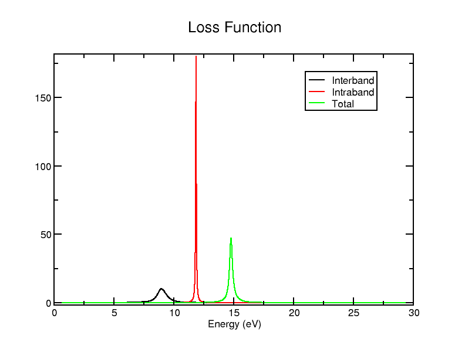

# Optics - Aluminium

In this tutorial, we will have brief look at how to calculate the optical properties of metals, looking at aluminium in particular, and how the results are different from a standard Optados optics calculation. It is highly recommended that you first go through the [previous tutorial](Optics.md), where we go more into depth on it - this tutorial is mostly just highlighting how it is slightly different for metals.

We will use the `cell` file

*Al.cell*
```
%BLOCK LATTICE_CART
       4.050000000000000       0.000000000000000       0.000000000000000
       0.000000000000000       4.050000000000000       0.000000000000000
       0.000000000000000       0.000000000000000       4.050000000000000
%ENDBLOCK LATTICE_CART

%BLOCK POSITIONS_FRAC
  Al   0.0000000000000000   0.0000000000000000   0.0000000000000000
  Al   0.5000000000000000   0.5000000000000000   0.0000000000000000
  Al   0.5000000000000000   0.0000000000000000   0.5000000000000000
  Al   0.0000000000000000   0.5000000000000000   0.5000000000000000
%ENDBLOCK POSITIONS_FRAC

KPOINTS_MP_GRID 15 15 15
SPECTRAL_KPOINTS_MP_GRID 15 15 15

SYMMETRY_GENERATE
```

and `param` file

*Al.param*
```
TASK                   : SPECTRAL
SPECTRAL_TASK          : optics
NEXTRA_BANDS           : 10
```

Run Castep as usual. Then run Optados with the Optados input file

*Al.odi*
```
TASK               : optics

# Sample the JDOS at 0.01 eV intervals
JDOS_SPACING       : 10

# Calculate the JDOS up to 60eV about the valence band maximum
JDOS_MAX_ENERGY    : 30

# Include the intraband term in the calculation of the
# dielectric function
OPTICS_INTRABAND   : true

# Recalculate the Fermi energy using the new DOS
# (discasrd the CASTEP efermi)
EFERMI             : optados

# Since we're recalculating the Fermi energy we do
# a DOS calculation first.
# Sample the DOS at 0.1 eV intervals
DOS_SPACING        : 0.1

# The broadening parameter, A, when using adaptive smearing,
# set by eye to be similar to the linear smearing method
ADAPTIVE_SMEARING  : 0.8  

# The broadening used, (also try linear, or fixed)
BROADENING         : adaptive # Default

# Specify the geometry to be used in the optics calculation
OPTICS_GEOM        : polycrystalline     # Default
```
There is 1 key difference to before: it contains the line `OPTICS_INTRABAND : true`. This is to include the intraband contribution, which is necessary for metals.

We're starting with the high spacing so we get few results (measuring only at 3 energies) - this makes it easier to have a quick look at what's going on. We will use those results for the remainder of the tutorial.

## Dielectric Dat File

The file `Al_epsilon.dat` contains the following data:

```
0.0000000000000000        2.1445746376579851        0.0000000000000000     
  15.000000000000000        1.1673581523361172        1.6007294583641971     
  30.000000000000000       0.66031465886470098       0.39432835642313052     


  0.0000000000000000       -32490.319172606654                            NaN
  15.000000000000000       0.37438389209757406        2.7452531094084771E-003
  30.000000000000000       0.84359371433743857        3.4316159432482577E-004


  0.0000000000000000       -32489.174597968995                            NaN
  15.000000000000000       0.54174204443369112        1.6034747114736059     
  30.000000000000000       0.50390837320213944       0.39467151801745531     
```

You can see here that there are 3 columns like before (energy, real and imaginary dielectric), but there's 3 separate sets of them, separated by a double space. The 1st set corresponds to the interband contribution, the 2nd to the intraband, and the 3rd to the total. Though normally it'd be easiest to visualise this data by plotting the `agr` file on xmgrace, this would only give the interband term - if you're interested in other information you will have to use the `.dat` file.

You may choose to use/plot this data in your preferred method, but this tutorial will give you the necessary files to plot it using xmgrace. Firstly, we will create a new file called `Al_epsilon_sep.dat` file that turns separates the data into columns - we can do that with [this Python script](contrubtions_sep.py). The output file looks like

```
0.0000000000000000           2.1445746376579851           0.0000000000000000      -32490.3191726066543197           0.0000000000000000      -32489.1745979689949309           0.0000000000000000
15.0000000000000000           1.1673581523361172           1.6007294583641971           0.3743838920975741           0.0027452531094085           0.5417420444336911           1.6034747114736059
30.0000000000000000           0.6603146588647010           0.3943283564231305           0.8435937143374386           0.0003431615943248           0.5039083732021394           0.3946715180174553
```

It's exactly the same data except all the data is in separate columns now: 1 is still energy, 2 is interband real, 3 is interband imaginary, 4 is intraband real, 5 is intraband imaginary, 6 is total real and 7 is total imaginary dielectric.

Now let's make a graph of more useful data: rerun Optados with `JDOS_SPACING : 0.01` set instead (to get more data for more meaningful graphs), and rerun the Python script. You could plot it with xmgrace (and using any accompanying batch files as you wish), but it is more convenient to plot it using plotly (and Bokeh to add a bit more functionality) - this is because the values vary greatly.

To replicate this, you may use this [Python script](basic_graph.py) to use plotly to get a basic output, and to get 1 with a bit of extra functionality (such as being able to manually select the range of values to look at) use [this script](inter_graph.py). Make sure you have all the required libraries installed if doing this: pandas and plotly are required for the 1st, and Bokeh is also required for the 2nd. The 1st generates an output HTML file called `interactive_graph.html` and the 2nd generates `interactive_graph_extra.html`. The latter is embedded here for your convenience:

<iframe id="embed_link" width="800" height="400"></iframe>
<script>
document.addEventListener("DOMContentLoaded", function() {
    var basePath = window.location.origin;
    var iframe = document.getElementById("embed_link");
    iframe.src = basePath + "/tutorials/Optics/interactive_graph_extra.html";
});
</script>

Alternatively down the [data](cleaned_data.dat) and [HTML file](interactive_graph_extra.html) and view it on your browser - or just view that HTML link on a new tab.

As loaded, the graph doesn't look great: because the values become extremely high towards 0eV, it just looks like 2 straight lines followed by 0. In the HTML, let's set the y min to -10 and y max to 10. Now we can make some general observations.

- At very low energies, the total dielectric (both real and imaginary) shoot up/down to extremely large values - it seems to settle down around 2eV
- The imaginary components tend towards 0, while the real parts tend towards a non-zero finite value

Try setting x min to 2 (and y min to -50 - just to get no cut-offs): you'll see that the lines are fairly straightforward beyond 2eV. So let's try examine in more detail what is happening between 0 and 2eV. Feel free to drag and (box)-zoom with the widgets provided in the HTML to look at different sections of the graph.

Try looking at the region where energy (x) is between 1.3 and 1.6 - you should see that there is a distinct discontinuity there - while the intraband imaginary term remains close to 0, the interband jumps up (up to around 700) and then goes down - the total is the same. The real part also follows the of shape of the interband contribution, being adjusted slightly by a barely-changing intraband term. Try having a look at other regions in the 0-2eV range to see what else you can find.

## Other files

Running Optados generates the same files as without its contribution, except some of the files are slightly different different. For example, the file `Al_epsilon.agr` only contains the interband term - it only has 2 columns. Similarly to `Al_epsilon.dat`, `Al_loss_fn.dat` contains the interband, intraband and total loss function (though this time the components aren't separated by a double space - you'd have to adjust the Python script used before). Unlike `epsilon`, the `Al_loss_fn.agr` file contains all the terms - you can plot all the loss function data easily using

`xmgrace Al_loss_fn.agr`

The graph should look a bit like

{width="40%"}

For the loss function, you could also include `optics_lossfn_broadening : x` where x is the value of broadening you wish to use: this will generate a 4th column containing the broadened total loss function (again well-included in the `agr` file)

If you change the Optados input file to find the tensor properties - which can be done by changing the line

`OPTICS_GEOM : POLYCRYSTALLINE`

to

`OPTICS_GEOM : TENSOR`

in *Al.odi* - you'll also get all the contributions in the outputted `Al_epsilon.dat` file - so you have 3 parts of 6 components, leading to 18 bits of data in total. Only the dielectric dat output is created.
