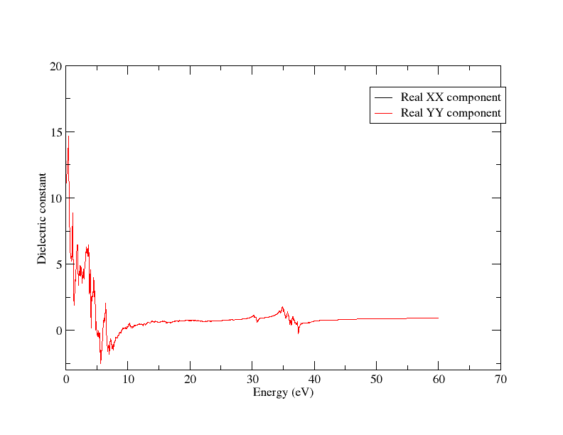
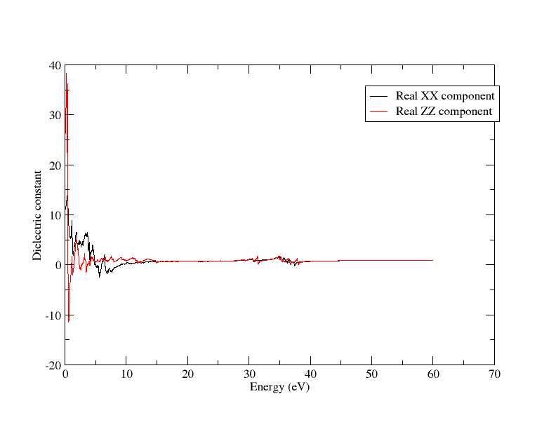
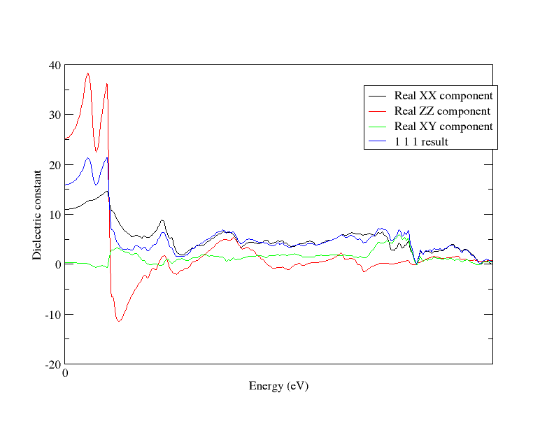
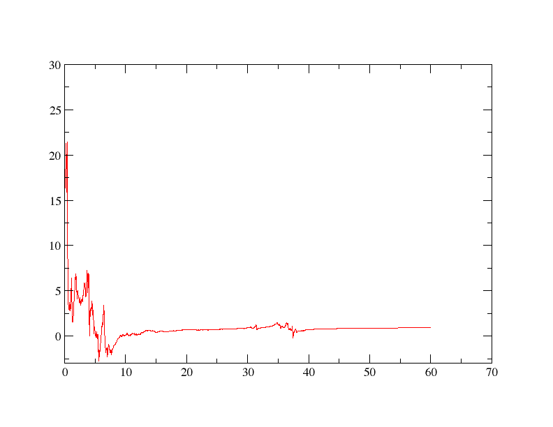
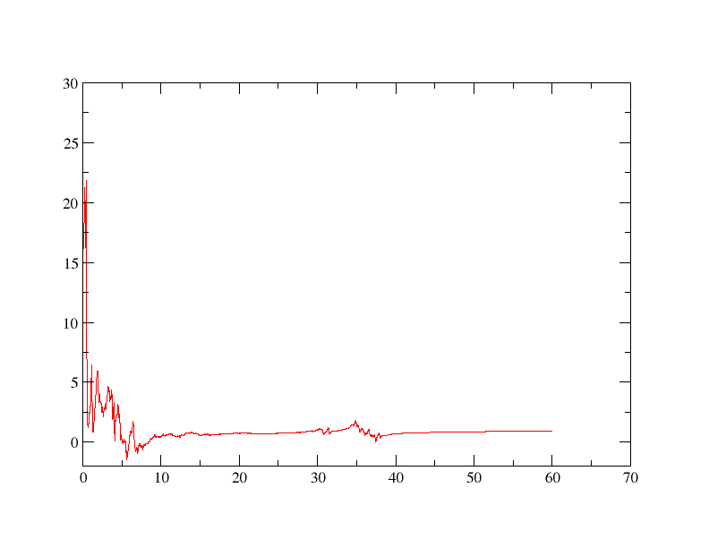

# Optics

Optados is capable of getting numerous optical properties of different structures, all of which depend on the wavelength (energy) of light interacting with it. In this tutorial, we will perform an Optados optics calculation on rutile (TiO~2~) - a birefringent crystal with anisotropic optical properties, examining its single-crystal and polycrystalline (isotropic) properties. Throughout this tutorial, we will be using [xmgrace](https://plasma-gate.weizmann.ac.il/Grace/) to plot everything, but feel free to use your preferred software.

We will use the cell file

*rut.cell*

```
%BLOCK LATTICE_ABC
  4.6257000   4.6257000   2.9806000
 90.0000000  90.0000000  90.0000000
%ENDBLOCK LATTICE_ABC
%BLOCK POSITIONS_FRAC

Ti      0.0000000   0.0000000   0.0000000
O       0.2821000   0.2821000   0.0000000

%ENDBLOCK POSITIONS_FRAC

SYMMETRY_GENERATE

KPOINTS_MP_GRID 10 10 10
SPECTRAL_KPOINTS_MP_GRID 14 14 14
```

This `cell` file was obtained using cif2cell using the structure with the COD ID 1010942, found on the [Crystallography Open Database](www.crystallography.net)

We will first run a castep calculation using the above cell with the `param` file

*rut.param*

```
TASK                   : SPECTRAL
SPECTRAL_TASK          : OPTICS
CUT_OFF_ENERGY         : 200
```

Once that is done, we can perform the optical Optados calculations.

## Demonstrating Birefringence

We will begin by examining the dielectric tensor. We will do this by using the Opdatos input file

*rut.odi*

```
TASK               : optics
JDOS_SPACING       : 0.01
JDOS_MAX_ENERGY    : 60
EFERMI             : optados
DOS_SPACING        : 0.1
BROADENING         : adaptive # Default
ADAPTIVE_SMEARING  : 0.4     # Default
OPTICS_GEOM        : tensor     # Default
OPTICS_LOSSFN_BROADENING : 0.0    # Default
```

The line `TASK : optics` is key here, as that is what tells us to perform an optical calculation. The other crucial line is `OPTICS_GEOM : tensor` - this tells it to calculate the full dielectric tensor of rutile. This produces 2 output files: `rut.odo` and `rut_epsilon.dat` - we are interested in the latter.

The output file starts off looking like

```
# Component            1


  0.0000000000000000        10.985963719914423        0.0000000000000000     
  1.0001666944490749E-002   10.986133776534746        4.5560614006426980E-003
  2.0003333888981498E-002   10.990669467897412        5.9329124271557589E-003
```
The 1st column corresponds to energy (in eV), the 2nd is the real part of the dielectric constant and the 3rd is the imaginary part. The file contains 6 components, each having their own table. This is bothersome to plot, so let's use a Python script to separate it into its components

*separate.py*

```python

input_file = 'rut_epsilon.dat'
def write_to_file(component,lines):
  file_name = "rut_tens" + str(component) + ".dat"
  with open(file_name,"w") as f:
    f.writelines(lines)

with open("rut_tens.dat", "r") as f:
  lines = f.readlines()[::-1]
component_lines = []
component = 6
for line in lines:

  component_lines.append(line)
  if "Componen" in line:

    write_to_file(component,component_lines)
    component -= 1
    component_lines = []
```

!!! note
    It is recommended to copy and do this is in a separate directory - we will be comparing this output to subsequent calculations. In future instructions this will be in the directory "tensors"

We now have 6 files for each component of the 3x3 tensor (keep in mind that it is symmetric ie. $\epsilon_{xy}$ = $\epsilon_{yx}$). `rut_tens1.dat` corresponds to  $\epsilon_{xx}$, 2 and 3 and to yy and zz, while 4, 5 and 6 correspond to xy, xz and yz.

Now that we have all the components, let's start actually looking at the results. First, let's plot the real parts of $\epsilon_{xx}$ and $\epsilon_{yy}$ on the same graph. We can do this by using the batch file

*plot_12_together.bat*
```
READ BLOCK "rut_tens1.dat"

BLOCK xy "1:2"
S0 LEGEND "Real XX component"

READ BLOCK "rut_tens2.dat"

BLOCK xy "1:2"
S1 LEGEND "Real YY component"

XAXIS LABEL "Energy (eV)"
YAXIS LABEL "Dielectric constant"

```

and plotting it with xmgrace via

`xmgrace -batch plot_12_together.bat`

This gives us a graph looking like this:

<a id="1_2_together"></a>


There is only 1 line visible - they (almost) perfectly overlap, meaning that $\epsilon_{xx}$ = $\epsilon_{yy}$. Now let's try comparing $\epsilon_{xx}$ with $\epsilon_{zz}$ - all you have to do is make the 2nd block `rut_tens3.dat` (and change the legend appropriately).



This is a rather interesting result: this seems that the dielectric function in different directions is different - the material is optically anisotropic. Since it is identical in 2 directions, it would be considered birefringent.

## Examining Dielectric Tensor

So now that we have the dielectric function tensor, let's examine how this corresponds to its (anisotropic) optical properties
<a id = "examining"></a>
We will run Optados again (no need to rerun Castep), changing the line

```
OPTICS_GEOM        : tensor    
```

in the `rut.odi` file to the lines

```
OPTICS_GEOM        : polarised     # Default
OPTICS_QDIR : 1 0 0
```

Let's compare the dielectric function output with the $\epsilon_{xx}$ output we got from the tensor. Run

`xmgrace rut_epsilon.dat tensors/rut_tens1.dat`

We will get the same graph as the [1st one](Optics_ani.md#1_2_together). This is no surprise at all: if light is polarised in the xx direction, it'll effectively feel the $\epsilon_{xx}$ dielectric function.

Let's try a more interesting example - change the direction line to

`OPTICS_QDIR : 1 1 1`

Now the result shouldn't align with anything. To demonstrate that let's compare it to $\epsilon_{xx}$, $\epsilon_{zz}$ and $\epsilon_{xy}$, all on the same graph - luckily xmgrace makes it very easy to plot them together. We'll modify the batch file to include all of them -

*compare.bat*
```

READ BLOCK "tensors/rut_tens1.dat"

BLOCK xy "1:2"
S0 LEGEND "Real XX component"

READ BLOCK "tensors/rut_tens3.dat"

BLOCK xy "1:2"

S1 LEGEND "Real ZZ component"


READ BLOCK "tensors/rut_tens4.dat"

BLOCK xy "1:2"
S2 LEGEND "Real XY component"

READ BLOCK "rut_epsilon.dat"

BLOCK xy "1:2"

S3 LEGEND "1 1 1 result"


XAXIS LABEL "Energy (eV)"
YAXIS LABEL "Dielectric constant"

WORLD XMAX 5
```

We have also made the graph smaller (only goes up to 5eV) in the last line to make it easier to see overlaps (or lack of them). This is the kind of output we get:



You can try comparing it to any other value, but you'll find it's completely different. So how is this related to the tensor?

Considering the properties of tensors in general, we know that the value from a tensor in any direction is given by the equation

$$ \epsilon' = \hat{\mathbf{n}}^T \cdot \underline{\mathbf{\epsilon}} \hat{\mathbf{n}} $$

Where $\epsilon'$ is the dielectric constant in the direction of $\hat{\mathbf{n}}$, and $\mathbf{\epsilon}$ is the dielectric matrix.

!!! note
    In this tutorial, a symbol being bold and underlined (like $\underline{\mathbf{\epsilon}}$) shows that it's a matrix, while being just bold (like $\mathbf{n}$) shows that it's a vector.

Let's quickly work through what we'd expect in the (111) direction and compare that with what we get from Optados. To get

$$ \underline{\mathbf{\epsilon}} \hat{\mathbf{n}} $$ we do

$$
\begin{pmatrix}
\epsilon_{xx} & \epsilon_{xy} & \epsilon_{xz} \\
\epsilon_{yx} & \epsilon_{yy} & \epsilon_{yz} \\
\epsilon_{zx} & \epsilon_{zy} & \epsilon_{zz}
\end{pmatrix}
\frac{1}{\sqrt3}
\begin{pmatrix}
1 \\
1 \\
1
\end{pmatrix}
= \frac{1}{\sqrt3} \begin{pmatrix}
\epsilon_{xx} + \epsilon_{xy} + \epsilon_{xz} \\
\epsilon_{yx} + \epsilon_{yy} + \epsilon_{yz} \\
\epsilon_{zx} + \epsilon_{zy} + \epsilon_{zz}
\end{pmatrix}
$$

Then to get the final result we do


$$
\frac{1}{\sqrt3}
\begin{pmatrix}
\epsilon_{xx} + \epsilon_{xy} + \epsilon_{xz} \\
\epsilon_{yx} + \epsilon_{yy} + \epsilon_{yz} \\
\epsilon_{zx} + \epsilon_{zy} + \epsilon_{zz}
\end{pmatrix}
\cdot
\frac{1}{\sqrt3}
\begin{pmatrix}
1 & 1 & 1
\end{pmatrix}
= \frac{1}{3} \bigg((\epsilon_{xx} + \epsilon_{xy} + \epsilon_{xz}) + (\epsilon_{yx} + \epsilon_{yy} + \epsilon_{yz}) + (\epsilon_{zx} + \epsilon_{zy} + \epsilon_{zz}) \bigg)
$$

<a id="final_equation"></a>
$$
= \frac{1}{3} \bigg ( \epsilon_{xx} + \epsilon_{yy} + \epsilon_{zz} + 2(\epsilon_{xy} + \epsilon_{yz} + \epsilon_{zx}) \bigg )
$$

Let's check if this is true using our separated dielectric function tensor files. We will get a function that is equal to the above equation using a Python script, and plot it on the same graph as the case polarised in the (111) direction.

You may use the script

*get_in_direction.py*
```python
import numpy as np

eps = {key: np.loadtxt(f"rut_tens{i}.dat")
       for i, key in enumerate(('xx', 'yy', 'zz', 'xy', 'xz', 'yz'))}
eps_vals = {key: val[:, 1] for key, val in eps.items()}
energies = eps['xx'][:, 0]

eps_111_values = (sum(eps[ind] for ind in ('xx', 'yy', 'zz')) +
                  2*sum(eps[ind] for ind in ('xy', 'xz', 'yz')) / 3

output_data = np.column_stack((energies, eps_111_values))

output_filename = "rut_111_out.dat"
np.savetxt(output_filename, output_data, fmt='% .16e', header="Energy (eV) Effective Epsilon_111")
```

This gives the output of the [above equation](Optics_ani.md#final_equation) acting on the dielectric function tensor we calculate, stored in `rut_111.dat`. Now let's see if the 2 results agree: let's try

` xmgrace rut_epsilon.dat tensors/rut_111_out.dat`

Using `rut_epsilon.dat` from our [last Optados calculation](Optics_ani.md#examining). We should see that the lines almost perfectly overlap:



Now we properly understand what is going on when choosing a certain polarisation direction, and what the dielectric function tensor truly means.

## Isotropic Dielectric Function

There is another case to have a look at: what is the dielectric function when the material is polycrystalline, and thus behaves isotropically? Optados can easily find this by changing the keyword in the `rut.odi` file to


`OPTICS_GEOM        : tensor`

and removing the `OPTICS_QDIR` line (as the direction no longer matters). If you wish to verify how this is being calculated, use the same Python script as above but change the calculation

```python
 eps_111_values = (eps['xx'] + eps['yy'] +  eps['zz'] +
                  2 * eps['xy'] + 2 * eps['xz'] + 2 * eps['yz']) / 3
```

to

```python
for i in range(len(energies)):
    tensor = np.array([
    [eps['xx'][i], eps['xy'][i], eps['xz'][i]],
    [eps['xy'][i], eps['yy'][i], eps['yz'][i]],
    [eps['xz'][i], eps['yz'][i], eps['zz'][i]]
    ])

    eigenvalues = np.linalg.eigvals(tensor)

    iso_value = np.mean(eigenvalues)

    iso_values.append(eps_111_value)
```

and change variable, output file name etc. as appropraite

```python
output_data = np.column_stack((energies, iso_values))

output_filename = "rut_111_eigen.dat"
```

This gives us the average of the eigenvalues of the dielectric matrix for every enegy, giving us the isotropic value. Let's plot them together to see if they're identical:

`xmgrace rut_epsilon.dat tensors/rut_111_eigen.dat`

We get a graph looking like this:



As expected, the 2 lines overlap: this demonstrates that the polycrystalline calculation is effectively the "average" of the dielectric tensor in all directions, which is what we'd expect for a polycrystalline sample, where we can assume that all directions are equally likely.
